# 前端面经

#### 为啥想跳槽

1⃣想寻找更多发展空间
"现阶段岗位职责（房产履约项目）趋于稳定，想寻找一个能承担更多职责、持续成长的环境"
2⃣希望回归更契合的行业或岗位
"之前的岗位更多偏执行型，现在想回到自己更擅长、也更有热情的策略类方向"
3⃣公司业务调整、项目收缩，个人发展空间受限
"公司蕞近在做组织收缩，部分项目被砍
4⃣原岗位已完成阶段性成长，希望进入技术发展新阶段
"这份工作让我掌握了从0到1的项目能力，下一步希望能承担从1到100的深化落地，这也是我主动求变的原因"

## 自我介绍

面试官你好，我叫王宇，硕士毕业于东北大学人工智能专业，研究方向是时空序列预测。研究生期间作为第二作者在 SCI 二区期刊发表了一篇论文。目前在阿里巴巴做国际站的交易履约的前端开发，主要做的项目有AI下单起草、AI trade Agent数据驱动业务增加卖家的产品体验，曾经在贝壳找房支付中心担任前端开发工程师，主要负责履约方向的前端开发。参与项目主要有 **政府存管 H5 项目** 中，从 0 到 1 完成前端全周期开发与性能优化。**协议平台**中，我实现了模板动态编译与渲染，提高业务配置时效，降低测试成本；**数据平台**中，基于 Vanna 框架重写了 Text2SQL 模块，结合腾讯向量数据库完成检索与分词，并使用 FastAPI 设计后端架构，实现了业务提效和 AI 能力落地。同时具备一定的 AI基础能力，了解使用 Pytorch、pandas 等机器学习工具库，例如房产抵押金额预测项目，使用tabNet进行开发构建神经网络。实现了全年 2900 小时的人效节省和 27% 面访率提升。

前端技术栈以**React** 为主，熟悉基本的前端工具、AI工具cc等使用辅助开发。

## 数据分析和报表生成 Agent？

**系统设计目标：** 用户用自然语言提问，Agent 自动查询数据库/数据源，生成分析结论和可视化图表。

**核心架构（三阶段）：**

① 自然语言 → SQL 查询（NL2SQL）

用 LLM 做意图理解和 SQL 生成。关键挑战：

- 表结构理解：把数据库 schema（表名、字段、含义）注入 prompt，让 LLM 理解能查什么。
- SQL 正确性：生成的 SQL 必须做语法校验，执行前 review，高风险 SQL（如全表扫描、大量删除）需要二次确认。
- 防注入：用户输入不做字符串拼接，用参数化查询。

流程：`用户Query → 意图识别 → Schema匹配 → SQL生成 → 语法校验 → 执行 → 结果`

② 数据分析与洞察生成

查询结果返回后，LLM 分析数据特征：

- 趋势判断（上升/下降/平稳）
- 异常点检测（远超均值的数值）
- 对比分析（同期环比、同比）
- 归因推断（什么原因导致）

输出结构化分析结论，语言简洁、可直接引用。

③ 报表生成与自动化

支持定时任务：设置"每周一生成上周经营日报"，Agent 自动执行查询+分析+发送邮件/钉钉消息。

可视化：用 Python/Matplotlib 或 ECharts 生成图表，嵌入到 HTML/PDF 报告。

**异动分析方法论:** 分析交易转化异动的原因「解决高维复杂数据矩阵」


痛点:

- 数据分析策略: 统计学+数据建模归因体系,继续时序变化点检测的方法对数据进行动态切片

- AI产品选型不足:使用Langraph+蓝鲸(内部模型广场),手动流程搭建、分析策略、归因推理分析.

- AI数据分析能力增强: “交易侧的流量异常分析方法论”

  ​    

    交易侧的流量异常分析方法论

    

1. 异常时段定位：**我们采用基于时序数据变化点检测方法，对**数据进行动态切片**，捕捉异常波动的起止端点，让后续的分析能够聚焦于异常发生的真实时间窗口。对各个异常波动时段的**数据进行拟合[2]，确保数据对比分析具备科学性和有效性。
2. **指标拆解归因：**将异常指标层层分解为过程指标。当顶层指标发生波动时，**计算各子指标的波动对总体波动的贡献度**，来定位关键的影响环节。具体来说，通过基于**偏导数的链式法则(输入变量的变动对结果贡献有多大)**[3]，将根指标变化分解为各子指标的线性叠加，来量化每个子指标对根指标异常的影响。
3. **异动数据分析:** 各个交易链路的影响因素是多样的，我们基于上述两个“组合拳”下钻指标进行异常检测。综合维度数据、**用户行为数据以及后端接口日志等多源数据**，对**异常指标进行关联性分析**，力求还原异常发生的全链路过程，为根因定位提供数据支撑。


多Agent编排

**思路1: Muti-Agent (层次团队)**

- 基于贴合业务域的成熟方法论，编排分析工作流。
- 构建多智能体（Agent）协作体系，每个Agent专注于不同分析环节（如**流量异动、订单结构异动、支付异动、归因结果**等）。各Agent之间分工明确、层层协作，实现复杂任务高效拆解与协同，提升整体分析效率和可扩展性。
- 

**思路2: Plan & Execute （计划与执行）**

- 智能规划：根据输入目标（如异常检测、归因分析）自动生成分步执行方案，动态流程编排。
- 高效执行：集成数据获取、异常检测、维度下钻等原子能力模块，通过任务流调度实现归因报告输出


**质量保障机制：**

- SQL 执行结果和用户期望不符时，LLM 自动重写 SQL（Self-Correction）。
- 关键数据加"人工确认"环节再对外发送。
- 记录所有 Query-SQL 对应关系，用于持续优化 Prompt。

**总结口述：**"数据分析 Agent 的本质是'把 SQL 能力用自然语言暴露出来'。核心难点不是 LLM 生成 SQL，而是 Schema 理解和 SQL 正确性校验。生产环境我一定会加人工确认节点，AI 辅助而非 AI 全权决策。"

## AI订单起草

从数据点位分析了卖家的受挫跳失率（10-5），表单转化率（52-58-目标60），以及对应的整体操作时长（400-100），辅助业务做产品功能模块的决策，重构了卖家下单起草，将奥创请求变成接口的统一发送，减少前后端的交互次数。

## AI Trade agent（全AI全栈开发）

背景：卖家后台的对话式助理，包括对话管理、消息持久化、意图注册中心【余额查询、订单查询、规则查询】、反馈闭环【意图类：点赞点踩的 更新模型的周期性训练集和规则，非意图类->文本聚类Kmeans+embedding -> topk->推送->新建意图】。

亮点：Harness + SDD + 多仓管理模式

直接写代码：**风格不一致**（命名规范、目录结构、分层方式与项目现有代码不同）、**复用率低**（没有利用项目已有的公共组件、工具函数、请求封装）、**采纳率低**（Code Review 时后端同学看到"外来风格"的代码，会产生大量修改意见）。结果就是：AI 生成了代码，但 Review 成本和返工成本反而更高了。

harness更像是做一些模版参照，【找相似实现、复用优先、模仿着复制、约束生成范围】

`AI 智能体 = SOTA 模型（当前最先进模型，野马）+ Harness（控制系统）= 卓越执行者`

智智能体会运行在一个连续的四阶段循环中：**感知、规划、行动、反馈/反思**，也就是 PPAF。

实践：

1. 多仓搭建：**Codebase Indexing**【向量检索】：AI 能跨仓库理解代码关系，生成质量大幅提升。**上下文完整**：AI 同时能看到前后端代码，接口字段、命名风格自然对齐。**SDD 文档集中管理**：前后端 SDD 文档在同一工作区，便于接口契约对齐。

2. 全栈 SDD 需要：**生成两份 SDD 文档**（前端一份、后端一份）；**接口契约对齐**，前端 SDD 中的接口调用与后端 SDD 中的接口定义必须严格对应；**字段映射一致**，前端 VO 中的字段名与后端返回的 JSON 字段名一一对应。

   

3. **前端 SDD：**

   - proposal.md — 需求提案，描述前端要做什么。
   - spec.md — 技术规格，组件设计、接口调用、状态管理。
   - tasks.md — 任务拆分，每个 task 对应一个可执行的代码变更。

   **后端 SDD：**

   - proposal.md — 需求提案，描述后端要做什么。
   - spec.md — 技术规格，接口设计、数据库设计、分层架构。
   - design.md — 详细设计，类图、字段映射、SQL。
   - tasks.md — 任务拆分。

4. 前后端多Agent并行生码：

5. MOCK数据：前端独立mock、后端独立mock、前后端联调mock

**卡片式对话方案**:

1.代码块扩展:Markdown对卡片类型**type**的代码识别机制,将type作为组件类型的标识,代码体作为JSON格式的**props**[使用prompt来固定格式]

2.占位符替换:通过流返回占位符去做卡片的转换「扩展语法」

3.本质是[解析自定义 xml 标签](https://github.com/stackblitz/bolt.new/blob/eda10b121221b30825a4c16eec5da1fd3eb1eb99/app/utils/markdown.ts#L64)。引入类 HTML 的自定义标签（如 <boltArtifact>），通过独立 Parser 提取属性与嵌套结构，生成标准化 UI 描述。

卡片的数据来源:

**方案一：大模型直接生成到 Markdown 中**

我们在代码块扩展方案中可以看到，`Markdown` 解析的代码块本身是一个 `JSON`，这个`JSON` 就是卡片要渲染的数据。所以，可行的方式是让大模型直接生成需要渲染的数据。

以商品推荐场景为例，让模型返回的时候直接生成商品数据。这样不需要额外的数据补充链路。

但这种方式有局限性，大模型推测的数据不一定满足业务的诉求，原因如下：

1.大模型预训练阶段不可能涵盖所有的商品

2.即使涵盖了所有的商品，商品的价格等信息会实时变化

3.上下文有限，缺少一些用户的个性化特征

🌟**方案二：TGUI 协议增量更新**

既然，大模型直接生成数据存在一定的局限性，那就再知道要渲染卡片之后再去获取数据填充，这样就可以渲染业务想要的数据了。

这里推荐两种方式：

🌟 1.方案一：通过 TGUI 协议提供的 `JSON Patch` 扩展协议进行数据的 `replace`

2.方案二：卡片渲染之后由卡片主动发起请求去获取数据

介绍方案1:当模型返回下面的内容时，数据是空的，或者一个占位。

此时前端和服务端分别要做下面的事情：

| 前端                                                         | 服务端                                                       |
| ------------------------------------------------------------ | ------------------------------------------------------------ |
| 当解析到````ProductCard`的时候渲染占位 | 在识别到模型吐出````ProductCard`就异步的发送 HSF 请求去获取数据，等数据来了之后，通过 **TGUI** 协议进行数据追加。 |

此时你可以看到的是，会先渲染 `文本：为你推荐以下商品：`、`商品卡的占位`、然后是`文本：`这些商品不`(因为这个时候商品数据的 patch 还没有打上，所以，继续 markdown 流)，然后数据请求回来之后，通过`patch`的方式更新之前返回的`Markdown`，触发 UI 渲染新数据，然后再继续后面的流。详细的实现方式可以看[TGUI 协议实现](https://artlab.alibaba-inc.com/npm/package/@ali/tgui-protocol-sdk-js?system=npm&artlabType=NPM&k=@ali/tgui-protocol-sdk-js)。

这里的`replace-substring`是 TGUI 在 JSON Patch 上的扩展协议



### 安全性:

可观测性:**Agent 的可观测性**
参考了 Claude Code 的设计——它有 26+ 事件类型，但核心就是 PreToolUse / PostToolUse / Stop 这几个。我们取其精华：Turn 级 5 个覆盖执行细节，生命周期 2 个覆盖边界清理。31 课的重试和熔断注册在 `BEFORE_LLM` 和 `BEFORE_TOOL_CALL` 上，32 课的权限检查注册在 `BEFORE_TOOL_CALL` 上——同一个骨架，不同的插件。

落地工具：Langfuse 全链路追踪

抛弃了扁平、难以追溯的文件日志，引入了 [Langfuse](https://grow.alibaba-inc.com/course/4810000000003327/section/1830000000006428) 平台：

- **可视化 Trace 树**：通过“Span 栈”机制，清晰展示用户请求到 LLM 推理再到工具调用的完整链路。
- **成本归因**：支持按 Agent、按 Session 统计 Token 消耗，解决生产环境“账单失控”问题。
- **企业级部署**：通过 Docker 自托管，满足数据不出内网的安全性要求


工具能力限制

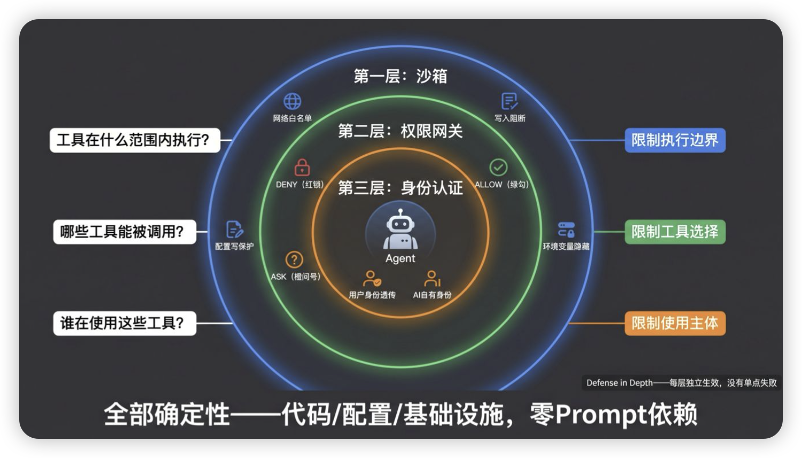

**沙箱**

- **网络出站白名单**——Agent 只能访问白名单上的域名，阻断数据外传（回扣威胁五）
- **工作区外写入阻断**——Agent 只能在 workspace 目录内写文件，阻断持久化和逃逸
- **配置文件写保护**——hooks.yaml、security.yaml 等配置文件只读，阻断 Hook 篡改（回扣威胁二：Agent 改自己的 Hook）
- **环境变量隐藏**——敏感变量（API Key、数据库密码）对 Agent 上下文不可见，阻断凭证泄露。举个例子：LLM 的 API Key 是框架层调用模型时用的，沙箱里的工具根本不需要它——不给就对了

#### 悟空的解法：沙箱即身份

悟空（阿里达摩院）的方案优雅地解决了模型一的透传难题——用沙箱做身份载体：

1.**每个用户绑定独立沙箱**——张三的 Agent 运行在张三的容器里

2.**Ingress 层注入身份 Token**——Token 写入沙箱环境（文件系统或环境变量），不是传给 Agent 代码

3.**Agent 在沙箱内执行任何操作**——包括 Bash 写新脚本、curl 调 API

4.**出站请求经过 Egress 代理**——代理层自动从沙箱环境读取 Token，注入到请求头中

关键设计：Agent 代码完全无感知身份这件事。即使 Skill 用 Bash 写了一段新代码，这段代码发出的请求一样会带上用户身份——因为身份注入发生在网络出口（Egress），不是在代码层。**"沙箱即身份"——身份认证下沉到基础设施层，Agent 代码不接触凭证。**

## Vanna(**上下文比模型更重要**)

1. **嵌入生成器**：负责将文本转换为向量表示
2. **向量存储器**：负责存储和检索相关上下文
3. **语言模型**：负责基于上下文生成SQL

- 上下文策略

  - Schema上下文（DDL信息）

    - 缺乏表间关系信息
    - 无法理解字段的业务含义
    - 不知道如何正确JOIN表
    - 无法处理复杂的业务逻辑

  - ##### 文档上下文（业务逻辑）契税凭证、存管产品类型

    - - 示例数量有限（通常3-5个）
      - 无法覆盖所有查询模式
      - 缺乏针对

  - ##### SQL示例上下文（最佳实践）问题和 SQL 对

    - 动态选择最相关的示例
    - 能够组合多个示例的模式
    - 随着训练数据增加而改进

- 优化 管理上下文 上下文幻觉

  - ##### 自动学习机制（执行出结果加入到训练数据）

  - ##### 中间SQL支持

- 测试：

  - 执行准确率（EX）

    执行准确率（EX）用来衡量模型生成的SQL执行结果是否与标准SQL查询完全一致。由于相同的SQL结果可以有多种不同的写法，基于字符串匹配的评估方法可能会显著低估模型的实际性能。

    有效效率得分（VES）

    在BIRD数据集的评估中，Li等人（2023c）引入了一个新的评估指标——有效效率得分（VES），它根据执行时间来衡量一个有效模型生成查询的效率。如果一个查询的执行结果与标准SQL不一致，那么这个查询将被视为无效，并得到零分。因此，VES综合考虑了模型生成查询的准确性和执行效率。


## 政府存管

H5 适配端上能力的使用：采用动态设置 `viewport + rem` 布局，该方案其实是参考了阿里早期开源的一个移动端适配解决方案 flexible ，本文进行了一些改进。**该方案不仅解决了移动端适配的问题，同时也较好的解决了 1px 的问题**。

### rem 适配方案

**原理**：将页面宽度等分为 100 份，每份为 1rem，通过动态设置根元素字体大小实现适配。

### vw/vh 适配方案

**原理**：使用视窗单位（vw/vh）直接按比例缩放。

webpack 解析 css 的时候用 postcss-loader 有个 `postcss-px-to-viewport` 能自动实现 px 到 vw 的转化。vw=px/viewport width × 100

- 给根元素大小设置随着视口变化而变化的 vw 单位，这样就可以实现动态改变其大小。
- 限制根元素字体大小的最大最小值，配合 body 加上最大宽度和最小宽度

状态机

| **主状态代码** | **主状态名**   | **描述**       | **对应子状态（细化）**                                       |
| -------------- | -------------- | -------------- | ------------------------------------------------------------ |
| **0**          | INIT           | 业务申请已发起 | 待确认（PENDING=0） / 已确认（CONFIRMED=2）                  |
| **10**         | CONFIRMED      | 客业全部确认   | 待签约（PENDING=0） / 签约完成（SIGNED=1）                   |
| **20**         | ACCOUNT_OPENED | 开户完成       | —（没有明确子状态）                                          |
| **30**         | CONTRACT       | 合同生成       | 待签约（PENDING=0） / 签约完成（SIGNED=1）                   |
| **40**         | SIGNED_SUCCESS | 客业全部签约   | 待支付（PENDING_PAYMENT=0） / 部分支付（PART_PAID=1） / 全部支付（FULLY_PAID=2） |
| **50**         | BANK_STAMP     | 银行盖章生效   | 待划转（PENDING_TRANSFER=0） / 部分划转（PART_TRANSFER=1） / 全部划转（FULLY_TRANSFER=2） |
| **60**         | PERFORMING     | 履约中         | —（无细分或业务自定义）                                      |
| **70**         | TERMINATE      | 已解约         | —                                                            |
| **80**         | FINISHED       | 已完结         | —                                                            |
| **90**         | VOIDED         | 已作废         | —                                                            |

## 协议平台

背景：全国协议生成的动态标准化，主要是富文本的编辑器的动态渲染和编译生成 html

Tiptap+handlebar

### 1. 核心概念理解难

- **ProseMirror Schema**：Tiptap 的节点（Node）和标记（Mark）定义依赖 schema，理解 schema 的约束和扩展方式对自定义非常重要，但入门成本高。
- **Node vs Mark**：节点是结构（段落、图片、表格），标记是内联样式（粗体、链接），两者行为和渲染方式不一样。
- **State & Transaction**：编辑器内容的变化是通过 transaction 来驱动的，而不是直接操作 DOM，需要熟悉状态不可变的思路。

### 2. 自定义扩展（Extension）复杂

- **写 NodeView**：要自定义复杂 UI（如可拖拽的图片组件、React/Vue 组件嵌入），必须写 NodeView，涉及 DOM 更新、事件绑定、生命周期管理。
- **Command 链式调用**：Tiptap 提供链式 API（editor.chain().focus().toggleBold().run()），但要写自定义 command 时要理解 ProseMirror Command 的机制。
- **Input Rules & Paste Rules**：做输入法规则（例如输入 # 转成标题）或粘贴格式化，需要自己定义规则和正则，调试不太直观。

挑战

- **NodeView 把模板逻辑拆成可视化组件**（循环节点、条件节点、变量节点）

- 编辑时做**节点级别的错误检测**

- 避免让用户直接手写模板代码

- 渲染错误时**局部高亮提示**，而不是全局崩溃

- 最终导出时**集中编译和语法校验**


| **循环语法错误**      | {{#each items}} ... 少了 {{/each}}   | Handlebars.compile() / Handlebars.parse() 捕获异常    | 用 Handlebars.parse() 得到 AST 节点的 loc（行、列）→ posFromLineColumn() | **编译期可发现**，AST 可精确行列定位   |
| --------------------- | ------------------------------------ | ----------------------------------------------------- | ------------------------------------------------------------ | -------------------------------------- |
| **条件语法错误**      | {{#if user.name}} 少闭合标签         | 同循环错误，编译期捕获                                | 同上，用 AST 定位 loc                                        | 常见于标签未闭合                       |
| **条件值缺失**        | {{#if user.name}} 但数据 user = null | 自定义 safeIf helper 在值缺失时 throw new Error()     | 错误信息包含字段路径（如 user.name）→ 在 Tiptap 文本中搜索该占位符并取 pos | **运行期发现**，需自己在 helper 中抛错 |
| **循环数据类型错误**  | {{#each items}} 但 items 不是数组    | 自定义 safeEach helper 检查 Array.isArray()，否则抛错 | 字段路径（items）→ 文本搜索获取 pos                          | 运行期可检测                           |
| **字段缺失**          | 模板中有 {{title}}，数据没有 title   | 渲染前用 JSON Schema（ajv）校验数据                   | 校验返回的路径（title）→ 文本搜索 → pos                      | 校验可批量发现缺失字段                 |
| **JSON 数据结构错误** | 数据类型与模板 schema 不符           | JSON Schema 校验                                      | 同上，通过路径映射到模板占位符位置                           | 多用于表单或外部数据导入               |

## 房产抵押金额预测

#### 一、数据集

1. **数据来源**：2017-2025 年北京 5w（8:1:1）条二手房交易信息，含三大类字段：
   - 基础信息：楼盘名称、城区名称、出售日期等；
   - 价格相关：挂售价格（数值型）、抵押欠款金额是否超 100 万（类别型，目标标签）；
   - 房屋特征：建筑面积（数值型）、房本日期（日期型）、房屋现状（类别型）。
2. **预处理**：
   - 缺失值处理：删除房本日期缺失记录；建筑面积缺失用中位数填充；房屋现状缺失标记为 "未知"；
   - 特征编码：对城区名称、房屋现状等类别特征采用独热编码（转换为 0/1 向量）；
   - 标准化：对挂售价格、建筑面积等数值特征用 Z-score 标准化（缩放至均值 0、标准差 1）。
3. **划分**：按 8:2 比例用分层随机抽样划分为训练集（43,565 条）和验证集（10,892 条），保持目标标签（抵押金额超 100 万占比）分布一致。

#### 二、模型

1. **模型选择**：TabNet（专为表格数据设计的神经网络），核心优势：
   - 自动特征选择：通过注意力机制筛选关键特征（如房本日期权重 0.42、建筑面积权重 0.38）；
   - 处理高维稀疏数据：适配独热编码后的高维特征（如城区编码后 16 维）；
   - 可解释性：输出特征重要性分数，支持决策逻辑可视化。
2. **结构与训练**：
   - 核心机制：动态特征选择（注意力层加权特征）+ 多模态融合（时间 / 空间 / 交易维度特征）；
   - 超参数：优化器为 torch.optim.Adam，学习率 0.05，批量大小 256，掩码类型'sparsemax'，早停策略（验证集损失连续 10 轮不下降终止训练）；
   - 训练目标：二分类任务（预测抵押金额是否超 100 万），损失函数为二元交叉熵。

#### 三、指标与优化

1. **评估指标**：（80%）
   - 准确率：预测正确样本占比；83%
   - 精确率：预测为 "超 100 万" 中实际为 "超 100 万" 的比例；85%
   - 召回率：实际 "超 100 万" 中被正确预测的比例；85%
   - F1-score：精确率与召回率的调和平均（适配不平衡数据）；85%
   - ROC-AUC：衡量模型区分正负样本的能力（0-1，越高越好）。
2. **优化策略**：
   - 拟合问题：欠拟合增大特征嵌入维度；过拟合降低维度 + L1 正则化；
   - 资源与性能平衡：提升召回率可增加决策步数；计算资源有限时减少步数 + 早停；
   - 精确率 / 召回率调优：增大注意力系数（gamma）提升精确率；降低 gamma 提升召回率。

#### 四、核心创新与效果

- **创新点**：动态特征选择（结合时间序列与多模态数据）、多模态风险预测（融合时间 / 空间 / 交易特征）、轻量化部署（参数量 5.8MB，毫秒级响应）。
- **效果**：年节省工时 2902 小时，金融顾问日均有效跟进量提升 50%；抵押金额超 100 万房源面访率从 45% 升至 72%，年增收约 154 万元。

五、价值

- 通过自动化测算替代人工核算，减少金融顾问与经纪人的无效沟通：年节省工时：35,406条高价值线索×30%无效沟通率×3分钟/条 + 94,862条普通线索×50%无效沟通率×3分钟/条 =   **2,902小时/年**  

- 业务转化效率提升：金融顾问日均有效跟进量从12单增至18单，增幅50%。

- 面访：是在交易前，金融顾问有机会见下业主本人，对业主的情况了解下，然后给出一个解抵押（抵押房屋解除抵押）方案，并且顺便推下我们的金融产品。精准锁定高抵押价值商机，推动金融业务收入增长：面访覆盖率提升：

  抵押金＞100万房源的面访率从45%提升至72%

  收入增量测算：

  预估成交套数=70%覆盖率×北京年交易量20万套×15%高风险客群占比=21,000套

  收入贡献=21,000套×0.5%转化率×154万/单=154万元/年

# LLM


## LLM 微调

我们将这些控制大模型命运的参数分为三大维度进行深度拆解：**模型效果 & 风格**、**时间 & 成本**、以及**功能性**约束。



### 维度一：模型效果 & 风格

这类参数直接决定了 Agent 输出文本的逻辑性、创意度以及格式的严谨程度。

- `temperature`**(温度值)**：这是控制模型输出随机性最核心的参数。
    - **最佳实践**：如果你的 Agent 正在执行需要严格遵循系统指令、输出固定格式 JSON、或者进行严谨数据抽取的任务，强烈建议将其设置为 **0.3 以下**，以扼杀模型的想象力，保证确定性；如果 Agent 是在充当“创意文案专家”进行头脑风暴或发散创作，建议设置为 **0.7 以上**以激发灵感。 请注意，不同基座模型的最佳设定区间可能有细微差异，实装前务必参考对应厂商的推荐参数。

- `top_p`：同样用于控制生成文本的多样性，通常与 `temperature` 配合在宏观上调节生成策略。
    - **🚨 反模式警告**：极其不建议在同一次调用中，同时大幅度修改 `temperature` 和 `top_p` 两个参数。 双重变量的叠加会导致模型行为难以控制与溯源分析。

- `frequency_penalty` & `presence_penalty`：这两个惩罚系数主要用于调节模型回复的“话痨”程度，抑制其在同一段文本中反复使用相同词汇或句式的倾向。

**最佳实践**：在大多数场景中保持默认或仅做极小幅度的微调即可。

### 维度二：时间 & 成本

这些参数直接关乎你企业系统的 SLA（服务级别协议）以及每个月的 API 账单流水。

- `reasoning_effort`：这是专门针对具备深度思考能力（如内置 Thinking 过程的推理模型）而设置的参数。 它决定了模型在给出最终答案前，花费多少算力去推演逻辑。 这个设置会直接、显著地影响单次输出的 Token 成本和响应时间，必须结合具体业务场景的难易程度进行慎重分析后设定。
- `timeout`**(超时时间)**：**生产环境必须重点关注的生命线参数！**

**最佳实践**：不要让请求无限期挂起。你需要根据具体的应用场景（如实时客服 vs 异步跑批数据分析）和底层模型的常规响应时间，设定一个合理的超时阈值，强制截断过长无响应的死连接。

- `max_retries`**(最大重试次数)**：处理网络抖动或 API 限流的保护机制。 设置时需在业务的快速响应要求（Fail-fast）与系统整体运行的稳定性要求之间寻找平衡点。
- `max_tokens`**(最大输出长度)**：这个参数代表你对模型单次回复长度的预期上限。

**🚨 反模式警告 1：设置过短**。如果你在开发一个长篇行业报告生成的 Agent，却将该值设置得太短，大模型的推理会被暴力切断，导致生成的报告永远只有“半截子”，严重损害业务功能。

**🚨 反模式警告 2：设置过长或不设限**。这在生产环境中是极其危险的行为。 特别是当调用一些参数规模较小的模型时，它们偶尔会陷入逻辑死循环，疯狂重复同一句话。 如果没有 `max_tokens` 的拦截，它会一直重复直到耗尽上下文极值。 这不仅会白白烧掉大量的 API 费用，还会将原本只需 5 秒即可返回的请求，硬生生拖延成 600 秒的“长尾请求”。 这种极端长尾现象一旦规模化爆发，会瞬间占满服务器的网络连接和队列资源，拖垮整个 AI 链路。

**最佳实践**：深入评估你的业务场景，预估回复文本的合理极限，“需要多长就配多长，差不多就行”，坚决杜绝无限长的暴力配置。

### 维度三：功能性约束

- `stop`**(停止标识符)**：这是一个关键的硬阻断参数。当模型在流式输出中生成到你配置的特定字符串序列（例如 `\nObservation:`）时，底层接口会立刻强制中止后续生成，并将当前内容返回给框架层。 这一机制我们在解析 ReAct 范式时曾详细探讨过，它是保障 Agent 思考流转不脱轨的核心工程手段。

**🚨 反模式警告**：如果你设置的 `stop` 词汇是一个在日常交流中极其高频出现的普通词汇，或者因为你的 Prompt 设计不严谨导致模型在错误的地方输出了该词汇，就会造成模型在根本不该停止的半截突然停下。 这种意外截断会导致你的代码框架无法解析出合规的 Action 或 JSON 参数，致使整个智能体任务宣告失败。

# 一、Harness / Prompt / Context Engineering/Agent Loop


## Harness Engineering？

**30 秒版本：** Agent Harness **是包在 LLM agent 外面的执行基础设施**。它把模型、工具、上下文、任务循环、日志、评测和权限组织起来，让 agent 不只是"能回答"，而是能在真实环境里可靠执行。

**1 分钟版本：** Prompt Engineering 解决"怎么说"，Context Engineering 解决"给模型看什么"，Harness Engineering 解决"agent 怎么跑"。比如 coding agent 修 bug，prompt 可以规定排障步骤，context 可以提供日志和代码，harness 则要提供隔离 workspace、工具调用协议、测试命令、trace、CI gate 和权限边界。生产里很多失败不是模型不会，而是执行环境、状态恢复、工具契约、验证闭环和治理没做好。

**来源**: 人的价值开始转向**设计任务环境、定义成功标准、搭建反馈循环、沉淀内部工具**。

用户目标（任务、约束、验收标准、风险等级）
    ↓
Agent Loop（计划、行动、观察、反思、继续或停止）
    ↓
Harness Control（沙箱、工具、上下文、trace、eval、权限）

## Prompt / Context / Harness 三种 Engineering 的关系

| 维度     | Prompt Engineering<br />**RGB 模型**：Role（角色）、Goal（目标）和 Backstory（背景故事-人设、知识、方法、边界） | Context Engineering                                   | Harness Engineering                                         |
| -------- | ------------------------------------------------------------ | ----------------------------------------------------- | ----------------------------------------------------------- |
| 核心问题 | 这次请求怎么说，模型才照做？                                 | 这一轮应该让模型看见哪些信息？                        | agent 怎样在真实环境里安全、稳定、可验证地执行？            |
| 主要对象 | system prompt、few-shot、角色、输出格式、推理步骤            | 检索片段、历史摘要、工具返回、长期记忆、上下文压缩    | 沙箱、工具协议、任务 loop、trace、成本、评测、权限、审批    |
| 典型动作 | 让模型"按 JSON 输出、先分析再回答、不要编造"                 | 把报错日志、API 文档、相关代码、历史 issue 放到上下文 | 让 agent 在隔离分支修改代码，跑测试，失败回滚，危险操作审批 |
| 失败表现 | 答偏、格式错、没有遵守口径                                   | 漏读关键资料、引用过期信息、上下文被噪声挤满          | 无限循环、误用工具、改坏文件、不可复现、没有验收标准        |
| 一句话   | 让模型答得像样                                               | 让模型看得明白                                        | 让 agent 做得可靠                                           |
| 最佳实践 | task要结构化输出: **在 Pydantic 中同时明确结构和判断标准**   |                                                       |                                                             |

**关键公式：** `AI 智能体 = SOTA 模型（当前最先进模型，野马）+ Harness（控制系统）= 卓越执行者`

**Prompt构成**

- **第一要素：角色定义（Role）** —— 告诉模型"你是谁"。示例："你是一位拥有 10 年经验的高级后端工程师"

    - RGB:

    - 🚫 严防死守的“反模式”

        - **Role 太宽泛**:
            - **问题所在**：设定类似“你是一个乐于助人的 AI 助手”这样宽泛的角色，无法有效激活模型深度的专业领域知识。同时，在 Multi-Agent 协作中，其他 Agent 将无法准确判断该把什么专业任务委托给它，严重破坏协同效率。
        - **Goal 的目标与 Task 冲突**:
            - **问题所在**：记住，**Goal 是罗盘，Task 才是终点**。如果把具体的格式要求（如“生成 Markdown 格式的具体文案”）写在 Goal 里，而 Task 又是让它“生成一个大纲”，大模型极其讨厌这种冲突。这会导致 Agent 在任务还没开始深度思考时，就急于去拼凑格式，从而使产出内容的深度和专业度大幅度下降。Goal 中应该写的是“做什么事能得到奖励的决策偏好”。
        - **Backstory 写死流程**:
            - **问题所在**：如果在 Backstory 里写死了类似“第一步干嘛、第二步干嘛”的具体流程，这会与 Task 中的要求产生严重冲突。这会导致你的 Agent 变成一个强耦合的一次性脚本，完全丧失了对不同任务的通用性和适应能力。
        - **核心原则**：**Backstory 只存心法，不存招式**。心法是指“当我遇到某种情况时，我的思考模式是怎样的”，而非机械的步骤。

        💡 提升效率的“最佳实践”

        - **运用“元提示词”技巧**
            - **方法论**：不要纯靠人工去绞尽脑汁地编写大段的人设描述。你可以让大模型来帮你生成和优化 Prompt Engineering（PE）。
            - **落地思路**：你可以提供一些基础的业务材料或简单的诉求，让模型帮你总结并输出一套符合 RGB 规范的高质量元提示词，以此作为你定义 Agent 的起点，这将大幅提高开发效率。
            - **进阶要素：** 上下文信息、Few-shot 示例（1-3 个输入-输出示例）、思维链引导

- **第二要素：任务描述（Task）** —— 明确告诉模型要做什么，用清晰具体的语言描述目标

    - 🚫 反模式
        - **注意力涣散的超级任务**：把多个关联性不大的子目标强行塞进同一个里程碑任务里（例如让它既负责搜索数据，又负责写核心代码，还要撰写前台文案）。这会导致 Agent 在执行时逻辑混乱、失去焦点，最终什么都做不好。
        - **不设明确的目标**：如果你在 Task 里不给出清晰的验收标准，Agent 在执行 ReAct 循环时就会陷入迷茫，它可能永远不知道什么时候该输出 `Final Answer`，导致执行过程陷入死循环或效果完全不可控。
        - **流程步骤过度微操**：强制规定过细的操作步骤。步骤越细，Agent 的泛化能力和通用性就越差。当它碰到事先未设想到的异常场景时，为了强行满足你设定的僵化步骤，它极容易产生严重的幻觉或生搬硬

    -  最佳实践
        - **在 Pydantic 中同时明确结构和判断标准**：不要仅仅在 Pydantic 中定义数据类型（如 `str`, `int`），一定要在字段描述里写清楚明确的**质量标准**。明确的交付要求能强行聚焦大模型的注意力，让模型在判断自身交付情况时更加精准，从而引导任务产出高质量的终态结果。

- **第三要素：输出格式（Output Format）** —— 规定模型的输出格式（JSON、Markdown、表格等）

- **第四要素：约束条件（Constraints）** —— 限制模型"不要做什么"，明确边界和限制

**Prompt Engineering 的局限：** Prompt 越来越长但效果提升越来越小、上下文窗口有限、模型注意力分散产生更多幻觉

**Context Engineering 的核心思想：** 关注"模型看到什么、何时看到、以何种结构看到"。将上下文当作动态管道来处理，包括系统提示、历史记录、内存模块、RAG 检索、工具调用等整体架构设计。

**一句话：未来的提示，不再是 prompt，而是 context。**

**Context Engineering 的关键技术：**

- 选择性检索：相关性重排、冗余消除、任务感知过滤（准确率提升 15-30%，Token 消耗降低 20-40%）
- 上下文压缩：带约束的 LLM 摘要、句子级评分、层次化摘要（保持准确率同时减少 50-75% Token）
- 层次化布局：结构化分区设计，明确区分系统规则、数据、示例
- 上下文窗口管理：避免"Lost in the Middle"效应——模型过度关注文本开头和结尾而忽视中间内容

 **Context Engineering 生产调优六大经验**

1. **建立评估体系（先量化，再优化）** —— 构建测试集、定义指标、建立 Baseline
2. **上下文分层管理** —— 第一层（必读）：系统提示、当前任务指令；第二层（重要）：检索到的相关文档、Few-shot 示例；第三层（补充）：历史对话摘要、背景知识；第四层（可选）：详细内容按需加载
3. **动态上下文压缩** —— 意图识别 → 相关性过滤 → 智能摘要
4. **避免"Lost in the Middle"** —— 重要信息放两端、位置标记、分块呈现
5. **缓存与复用** —— Embedding 缓存、检索结果缓存、对话摘要
6. **渐进式调优** —— Prompt 调优 → 检索优化 → 上下文压缩 → 模型选择 → 架构升级

理解了三代演进之后，我们回到一个核心问题：不管哪个时代，上下文治理的本质就是两件事——**加法和减法**。


### 加法：让模型知道它该知道的

加法解决的是"模型不知道它该知道的事"。回到开篇的三个痛点：不记得你是谁，需要把用户画像加进上下文；说过的话要反复提，需要把历史对话摘要加进上下文；SOP 要反复教，需要把工作规范加进上下文。

加法的四种主要手段：

1.**Bootstrap 预加载**：启动时固定加载的信息（人设、规则、记忆索引）。类比：员工入职时发的员工手册，每天上班第一件事就是翻开来看。

2.**工具返回注入**：Agent 调用工具后，结果自动进入上下文。类比：员工查完资料后脑子里多了一条信息。

3.**记忆检索注入**：从持久化存储中检索相关记忆，注入当前上下文。类比：员工翻看自己的工作笔记，找到相关记录。

4.**Skill 按需加载**：渐进式披露，模型判断需要时才加载完整内容。类比：员工需要时才去翻操作手册的具体章节，而不是把整本手册背下来。

### 减法：让上下文没有不该有的

加法的冲动是无限的——恨不得把所有信息都塞给模型。但减法告诉你：**不能这么干，而且不应该这么干。**

为什么"不能"？因为上下文窗口有物理上限。

为什么"不应该"？两个原因。

**原因一：Context Rot（上下文腐化）。** 上下文越大，模型的注意力越分散，对每条信息的关注度越低。这不是"可能会"，而是 Transformer 架构的物理规律——后面 Under the Hood 部分会详细讲。研究数据显示，随着上下文增长，模型性能会显著下降。

**原因二：成本。** 大模型按 token 计费，Transformer 的计算复杂度是 n 的平方。上下文翻倍，成本翻四倍。即使未来模型再强、窗口再大，这个经济约束不会消失。**上下文工程不只是能力问题，更是经济问题。**

减法的三种主要手段：

1.**压缩 / 截断**：把旧的对话历史压缩成摘要，或者直接截断超出窗口的部分。

2.**选择性遗忘**：不是所有信息都值得留在上下文里，要主动丢弃低价值信息。

3.**Sub-agent 隔离**：把任务委派给子 Agent，子 Agent 用干净的上下文独立工作，结果汇总回主 Agent。主 Agent 的上下文始终保持精简。

## ETCLOVG 七层分类框架

论文把 agent harness 拆成七层：Execution、Tooling、Context、Lifecycle、Observability、Verification、Governance。

- **E - 执行环境：** 决定代理的运行位置以及限制其运行的沙箱约束，包括托管沙箱、微型虚拟机、代码专用运行时、计算机使用环境、浏览器沙箱和操作系统级权限模型。
- **T - 工具接口和协议：** 规定如何描述、发现和调用外部功能，包括协议标准、工具描述和选择、工具增强型训练以及会话管理。
- **C - 上下文和内存管理：** 控制模型在短期、会话级和持久范围内可以看到的内容，包括长期上下文技术和上下文漂移的缓解措施。
- **L - 生命周期和编排：** 组织读取和写入状态的控制流，从单代理内部循环到多代理模式，以及完整的从问题到拉取请求的任务管道。
- **O - 可观察性和运维：** 通过追踪平台、代理专用运维工具、成本跟踪和统一可观测性，捕获追踪、成本、故障和可靠性信号。
- **V - 验证和评估：** 将任务和跟踪转化为评估、故障归因和回归反馈，包括基准测试、受控执行、多级判断和部署时评估循环。
- **G - 治理与安全：** 约束模型级、系统级和组织级子层的行为，包括权限模型、生命周期钩子、组件加固、声明式规则和审计基础设施。

**怎么用七层做系统检查？** 拿一个 agent 项目，从 E 到 G 逐层问：环境隔离了吗？工具契约清楚吗？上下文有来源和过期策略吗？任务能停止和恢复吗？trace 能复盘吗？结果能回归验证吗？高风险动作有审批和审计吗？这些问题比单纯问"用了哪个模型"更能判断工程成熟度。

## Coding Harness 企业生产级实践

**OpenSpec SDD + Harness Thinking：** AI Coding 的质量，不靠"多写点提示词"，靠一条生产级工程流水线。OpenSpec 解决"这次要做什么"，Coding Harness 解决"怎么可控地做、怎么证明能上线"。


**八大实践步骤：**

1. **先建长期 Harness 资产，不要每次从聊天开始** —— 准备 AGENTS.md / CLAUDE.md（项目定位、关键目录、启动命令、架构边界、高风险目录）和 .harness/ 目录（context/业务术语、standards/编码规范、scripts/验证脚本）
    - **CLAUDE.md**都写什么「200行」: **Claude 容易猜错的规则、代码里读不出来的约定、团队必须遵守的规范，以及技术栈版本、常用命令、架构取舍、项目坑点**。
        - **技术栈、命令、核心边界和禁止清单** 「剩余规则需要交给/claude/rules进行详细说明」

2. **用 OpenSpec 做 SDD：先规约，再编码** —— 执行 proposal → design → tasks → specs，AI 生成第一版，人 review 业务边界和验收标准

3. **让 AI 按 spec 小步实现，并强制找参照模块** —— 先读 tasks.md，再找相似模块，最后一项一项实现；高风险场景拆成开发 agent、测试 agent、review agent

4. **合并前门禁：不靠"看起来对"，靠确定性检查** —— 编译、单测、接口契约、数据库变更、安全、架构边界和可观测性检查

5. **预发验证：部署一个真实运行环境** —— 连接尽量接近生产的中间件和配置，但使用隔离数据

6. **用真实流量验证：回放、影子流量、Dark Launch** —— 录制线上流量在预发环境回放；或把线上请求复制给新版本观察

7. **灰度发布：用指标决定是否继续放量** —— 通过 Feature Flag、Canary 和自动回滚，1% 到 100% 受控放量

8. **复盘写回：把一次问题变成长期能力** —— AI 犯错、CI 拦截、预发失败、灰度回滚，把问题写回 OpenSpec、Harness 规则、测试、hook 或监控

**.harness/ 目录结构：**TDD测试驱动

```
.harness/
  agents/        # feature-dev / test-dev / issue-fix 等专业化角色
  standards/     # 编码、接口、DB、日志、事务规范
  context/       # 业务术语、字段含义、状态、上下游
  specs/         # 需求规格和变更说明
  scripts/       # 本项目固定验证命令
```

# 一、Agent 

## Prompt/workflow/agent之间的区别?

> Promt Engineering -> workflow/chain -> single agent(自主规划) ->multi-agent
>
> | **维度**     | **Tools (工具)**         | **Agent (智能体)**         | **Workflow (工作流)**        |
> | ------------ | ------------------------ | -------------------------- | ---------------------------- |
> | **决策能力** | **无**（仅执行，不决策） | **有**（LLM 自主动态决策） | **无**（开发者在代码中写死） |
> | **执行方式** | 被动（等待被调用）       | 主动（自主循环直到完成）   | 按开发者定义的顺序执行       |
> | **确定性**   | 高（输入固定则输出固定） | 低（同输入可能走不同路径） | 高（行为完全可预测）         |
> | **灵活性**   | 只做一件事               | 高（能应对预料之外的情况） | 低（难以动态调整）           |
> | **调试难度** | 容易（单一函数）         | 难（执行路径不确定）       | 容易（链路清晰，可逐步追踪） |
> | **适用场景** | 封装单一具体能力         | 路径未知的复杂任务         | 流程相对固定的业务系统       |

- **范式一：Prompt Engineering（提示词工程）**(一切交给模型)

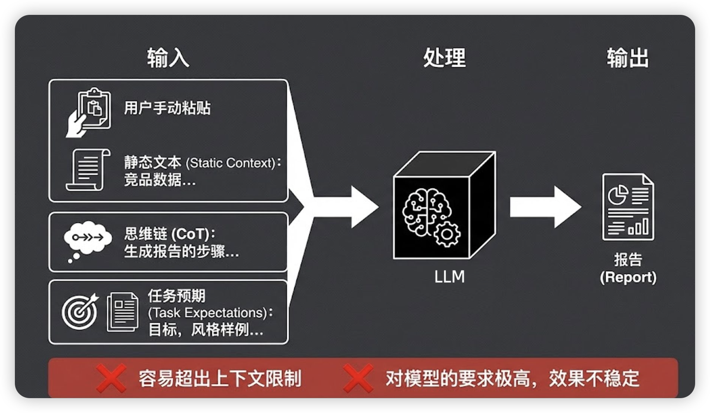

- **范式二：Workflow / Chain**（代码驱动的流水线,生成确定性内容,**把决策链路提前写好**）

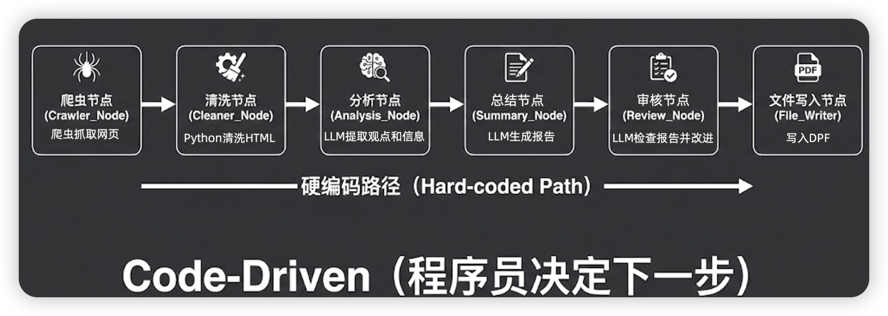

**核心理念：预先编排，稳定执行。**

- **范式三：Single Agent（五脏俱全的数字生命,生成不确定性内容）** 不断补充信息会导致上下文爆炸,没办法深度的去做问题

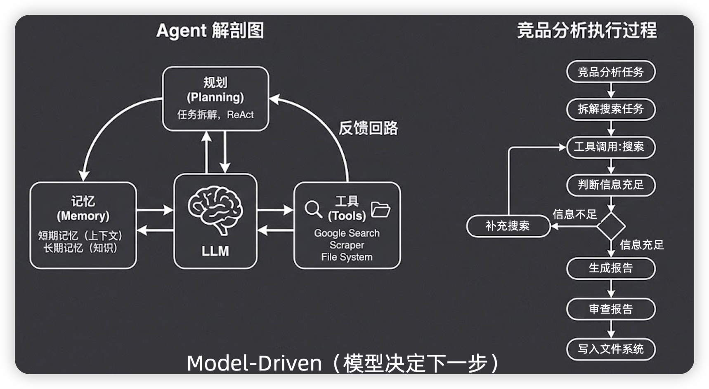

**核心理念：模型决定下一步（Model-Driven)。**

- **范式四：Multi-Agent System（组织的力量**）:上下文缩短,各个agent有自己的tool,


**核心理念：用组织的力量给模型“减负”。把组织的容错性把之前单个agent的不确定性抵消.**


## 上下文爆炸解决方案/多轮对话管理

- 记忆的本质其实就是MessageList

    **加法：让模型知道它该知道的**

    加法的四种主要手段：

    1.**Bootstrap 预加载**：启动时固定加载的信息（人设、规则、记忆索引）。类比：员工入职时发的员工手册，每天上班第一件事就是翻开来看。

    2.**工具返回注入**：Agent 调用工具后，结果自动进入上下文。类比：员工查完资料后脑子里多了一条信息。

    3.**记忆检索注入**：从持久化存储中检索相关记忆，注入当前上下文。类比：员工翻看自己的工作笔记，找到相关记录。

    4.**Skill 按需加载**：渐进式披露，模型判断需要时才加载完整内容。类比：员工需要时才去翻操作手册的具体章节，而不是把整本手册背下来。

    

    **减法：让上下文没有不该有的**

    加法的冲动是无限的——恨不得把所有信息都塞给模型。但减法告诉你：**不能这么干，而且不应该这么干。**

    为什么"不能"？因为上下文窗口有物理上限。

    为什么"不应该"？两个原因。

    **原因一：Context Rot（上下文腐化）。** 上下文越大，模型的注意力越分散，对每条信息的关注度越低。这不是"可能会"，而是 Transformer 架构的物理规律——后面 Under the Hood 部分会详细讲。研究数据显示，随着上下文增长，模型性能会显著下降。

    **原因二：成本。** 大模型按 token 计费，Transformer 的计算复杂度是 n 的平方。上下文翻倍，成本翻四倍。即使未来模型再强、窗口再大，这个经济约束不会消失。**上下文工程不只是能力问题，更是经济问题。**

    减法的三种主要手段：

    1.**压缩 / 截断**：把旧的对话历史压缩成摘要，或者直接截断超出窗口的部分。

    2.**选择性遗忘**：不是所有信息都值得留在上下文里，要主动丢弃低价值信息。

    3.**Sub-agent 隔离**：把任务委派给子 Agent，子 Agent 用干净的上下文独立工作，结果汇总回主 Agent。主 Agent 的上下文始终保持精简。

    

- **任务复杂上下文爆炸怎么解决?**
  
    - 回答一:
    
        - **BootStrap**: **给 Agent 一个"起点"**, 身份与规则（我是谁、我怎么工作、有哪些约束，固定不变）；状态与记忆（我已经知道了什么，随时间增长，但加载时截取精华）
    
        - **剪枝（Pruning）：控制 Tool Result 膨胀**
    
            - 剪枝的黄金规则：对话消息尽量不动（有语义连贯性要求）；Tool Result 可以大刀阔斧（它只是"原材料"，模型用完就不需要了）；如果 Tool Result 里有关键 ID 或数字，剪枝前先提取出来单独保存。
    
        - **压缩（Compaction）：把历史变成摘要**
    
            - 压缩方法:(`前两个会优先组合使用`)
    
                - **摘要压缩**是把长对话总结成简短摘要；` 解决「历史太长怎么截」`
                    - 不直接丢弃即将超出窗口的历史，而是先让 LLM 把这段历史总结成一段精华摘要，用摘要替换原始对话，再继续往前。
                    - **层级式摘要**（Hierarchical Summarization）。不是对所有旧历史做一次性摘要，而是分层处理：最近 10轮保持原文，10到50轮的历史压缩成一份「中期摘要」，50轮之前的历史进一步压缩成更精炼的「长期摘要」。
                - **滑动窗口**是只保留最近 N 轮对话；`解决「历史太长怎么截」`
                    - 就像手机聊天记录默认只显示最近 200 条：超出就从最老的开始删，只保留最近 N 轮对话。
                - **重要性过滤**是打分筛选，只留重要内容；`解决「内容不等价怎么挑」`
                    - 根据关键字「决定」等识别
                - **结构化抽取**是把关键信息抽成结构化数据存起来。`解决「对话文本是不是最佳载体」`
                    - 语音内容转成病例内容
            
            - Prompt Caching？它在 Agent 系统里有什么作用？
            
                **推荐回答：**“简单来说，**Prompt Caching（提示词缓存）** 是一种在模型推理层（Computational Layer）进行的工程优化技术，旨在减少重复计算，从而**降低延迟并节省成本**。
            
                在 Agent 的应用场景下，我们通常会带入一段较长的系统指令（System Prompt）或长期记忆信息。即使在多轮对话中，这部分信息大部分是不变的，但在传统的请求中，模型每次都要对这些固定部分进行预处理（Prefill），这会造成巨大的重复计算浪费。
            
                **它是如何工作的：**
            
                当我们向模型发送请求时，如果系统检测到 Prompt 的前缀部分（比如系统提示词）与之前的缓存匹配，它会直接复用缓存中已经计算好的 `KV Cache`（键值缓存），跳过对这部分内容的重新计算（Prefill）过程。
            
                **它的工程价值主要体现在三点：**
            
                1. **显著降低成本：** 以 Anthropic Claude 为例，命中缓存的 Token 费用通常只有正常输入的 1/10 左右，大幅降低了长上下文场景下的 Token 消耗。
                2. **提升推理速度：** 省去了对固定前缀的预处理过程，首字延迟（TTFT）大幅缩短。
                3. **支持更长上下文：** 能够更从容地在 Prompt 中注入复杂的知识库或历史总结，而不必担心因为 Token 过多导致性能下降。
            
                **特别需要补充的一点是：**
            
                面试官，我通常会将 **Prompt Caching** 与记忆压缩（Memory Compression）区分开来。
            
                - **记忆压缩**属于“信息层”的优化，解决的是“哪些信息值得保留”的问题；
                - **Prompt Caching** 属于“计算层”的优化，解决的是“决定保留的信息，如何最高效地喂给模型”的问题。
            
            - 压缩解决的问题：随着对话进行，早期消息越来越不相关，但依然占用空间。
            
                什么时候触发？**主动压缩**:不要等到 token 快满了再触发（80% 阈值是很多教程的建议，但是错的）。Context Rot 表明上下文变长本身就导致性能下降，应该在 **30-40%** 时主动触发。
            
                压缩必然丢失信息。所以有一个关键策略：**压缩前先持久化（lossless 策略）**
            
                ——在触发压缩之前，先把重要信息写到磁盘文件里。这样即使压缩丢掉了细节，磁盘上还有完整记录。
            
                
            
    
    - 回答二:
    
        - **产品层：** 能单轮解决的不要堆多轮
        - **架构层：** 系统提示固定 + 最近原始对话 + 远期摘要
        - **工具层：** 大工具结果落盘/对象存储，上下文只保留引用 ID
        - **模型层：** 更长上下文模型或外挂记忆（向量库 + 按需检索）
    

**关键观点：** "装更多"不如**装更准**——高质量短上下文往往比冗长大杂烩效果更好。

- **如何解决上下文爆炸💥**
    - 滑动窗口保留最近 K 轮
    - 摘要压缩旧轮次的历史摘要
    - 工具结果截断或二次摘要
    - 向量库检索历史只注入相关片段,记录在长期记忆
    - 超阈值触发 compact

**工具死循环防护：** 最大步数、重复检测（同一工具同参数）、耗时/费用上限、在 prompt 里要求显式给出终止条件

## Agent 工具调用失败了怎么办？如何设计错误恢复机制？

**错误恢复的核心思路：不要硬编码，告诉 LLM 让它自己判断。**

-  第一，**模型调用层要先做错误分类**:
    -  比如限流、超时、服务端错误的处理；上下文超限、模型不可用的处理 

-  第二，**tool调用出错不能把 Agent 过程卡死**:

    -  工具执行前要做参数校验、权限校验和超时控制；
    - 执行失败后，最好把错误包装成结构化结果返回给模型，让模型可以调整参数、换工具，或者向用户解释。 如果是写操作还必须考虑幂等性，避免重试导致重复执行等。

-   第三，**要考虑中断和状态恢复**:

    -  用户主动停止、网络断开、进程崩溃时，Agent 可以终止当前模型请求和工具调用，以及通过checkpoint 机制状态恢复。 多 Agent 场景下，子 Agent 也要记录自己的任务状态和结果。父 Agent 看到子任务失败后，可以选择重试、换 Agent、降级处理，或者请求人工介入。  

-   第四，**要有可观测性和降级策略**: 

    - 所有失败都要记录、同时也要有降级策略，比如切备用模型、切备用服务、从流式改成非流式，或者从自动执行切到人工确认。

    

-  最近学习了OpenClaw和Hermes的 他们的容错机制是 

    - OpenClaw 更偏工程化运行时，它做了错误分类、模型兜底、超时中断、会话修复、写锁保护和子 Agent 恢复； 
    - Hermes Agent 在模型服务商容错上更细，会根据错误决定是重试、压缩上下文、换凭证、切服务商，还是直接提示用户，并且对流式输出中断也做了保护，避免把用户主动停止误判成网络错误继续重试。

**五种错误场景及处理方案：**

- **工具参数错误**
    - LLM 生成的参数格式不对或缺失必填参数。处理：工程侧做参数校验 + schema 约束，校验失败返回明确错误信息给 LLM："XX 参数缺失，有效值范围是..."，让 LLM 重新生成。

- **工具执行超时**
    - API 调用超时（网络抖动、下游服务慢）。处理：设置合理的超时时间（一般 10-30s），超时后返回超时错误给 LLM，告诉它"工具调用超时，是否重试或换思路"。

- **工具返回空结果**
    - 检索没结果、查询无数据。处理：返回空结果给 LLM，告诉它"未找到相关信息，任务可能无法完成"或"建议调整查询条件"。

- **工具权限不足**
    - 调用了没有权限的 API（读取私有数据）。处理：返回权限错误 + 可用工具列表，引导 LLM 选择替代方案。

- **死循环检测**
    - LLM 反复调用同一工具但每次结果相同。处理：设置最大循环次数（如 10 次），超过后强制终止并返回兜底答案。同时在循环中检测"最近 3 次 Action 是否完全相同"，相同则触发重试/终止逻辑。


**总结口述：**"我的工程实践是：每个工具调用都包裹 try-catch，返回结构化的错误信息（错误类型+错误原因+建议），然后把错误作为 Observation 反馈给 LLM，让它自己决定是重试、换工具还是换个思路。核心原则是'让 LLM 做决策而不是硬编码'。

**优化方案：**
- **1. 熔断机制：**
    - 步数限制：max_steps = f(任务复杂度)
    - 时间限制：单次执行不超过 30s
    - 成本限制：token 消耗超阈值则停止
- **2. 状态记忆检测：**
    - 维护历史状态的 hash，如果 N 步内状态重复 → 死循环
    - 相似度检测：当前状态与历史状态相似度 > 0.9 → 触发
- **3. 决策多样性检测：**
    - 记录历史决策，如果连续 3 次决策相似 → 提示重新思考
- **4. 回退与重试：**
    - 检测到死循环时，回退到上一步，用更明确的 prompt 重试
- **5. 外部干预：**
    - 高风险场景强制人工确认
    - 置信度低于阈值时暂停，等待指令


**ReAct + Self-Correction** 架构：

**核心循环：** Thought → Action → Observation → Reflection → Decision

**防止逻辑塌缩的机制：**

1. **步数熔断器**：设置最大推理步数（如 15 步），超限则强制输出当前最优解。
2. **重复检测**：维护已执行动作的 hash 表，连续 3 次相似动作触发告警。
3. **状态验证**：每个 action 后验证状态变化是否符合预期，不符合则回退。
4. **置信度阈值**：工具调用置信度低于 0.7 时，要求人工确认或切换策略。
5. **反思机制**：每次推理后让模型评估"这个推理是否合理"，有问题则回退。

---

## 如何降低 Agent 的 Token 消耗和推理成本？

**Agent 成本公式：** `总成本 = LLM Token费用 + 工具调用费用 + 记忆访问费用 + 重试费用`

未优化的 Agent 系统中，LLM Token 费用占总成本 80%+，是优化重点。

**六大降本策略：**

**① 智能路由（最有效）**

按任务复杂度分流到不同规模的模型：

- 简单查询（FAQ、一句话问答）→ Llama 3 8B / Qwen 2 7B（成本基准 1x）
- 中等复杂（需要推理+检索）→ Mistral 7B / Qwen 14B（成本 3x）
- 高复杂（多步推理+多工具）→ GPT-4 / Claude 3（成本 10x）

某电商客服实测：成本降低 72%，响应速度提升 55%。

**② 提示词压缩**

- 结构化模板：JSON/Markdown 替代口语化描述，896 Token → 352 Token。
- 上下文智能裁剪：删除 3 轮前的无关交互，用摘要替代。
- 动态遮蔽：不常用工具的描述用简短标签替代，详细描述按需加载。

**③ KV 缓存优化**

把上下文设计为"稳定前缀 + 追加日志"：

- 稳定前缀 = 系统提示词 + 工具 schema + 输出格式模板（这些在多轮对话中不变）。
- 追加日志 = 用户对话历史（逐轮追加）。

关键：稳定前缀中不要放时间戳等动态内容，否则每次请求缓存都会失效。

**④ 缓存机制**

- 结果缓存：按"Query意图 + 核心参数"设置缓存键，静态信息缓存 7-30 天，动态信息缓存 5-15 分钟。命中率可达 60%。
- Embedding 缓存：相同 Query 的向量只计算一次。

**⑤ 工具调用优化（省钱又提速）**

- 并行调用独立工具（减少串行等待时间）。
- 成本感知：评估"调用工具的成本"vs"调用工具的价值"，只在值得时调用。
- 提前截断：RAG 检索时 Early Rerank 截断，低相关 chunk 直接丢弃。

**⑥ 历史摘要压缩**

对话进行 5-10 轮后，用 LLM 压缩历史为摘要，后续对话基于摘要而非原文。

保留最近 3 轮原文（保留细节）+ 早期摘要（保留记忆）。

**总结口述：**"Agent 降本的核心思路是'能省则省、能小则小'。简单任务用小模型、结果能缓存就缓存、历史能压缩就压缩、工具能并行就并行。实测通过智能路由+提示词压缩+结果缓存三招，可以把 Agent 的推理成本降低 70-90%，而不牺牲效果。"

## Agent 的四要素「人设+目标+工具+任务」?工作流程?

**Agent定义:** AI Agent 本质上是一个能**自主完成目标**的 AI 系统。它与传统大模型最本质的区别在于，它拥有‘自主性’和‘能行动’的能力，即通过感知、规划、行动、再感知这一闭环，去解决复杂问题，而不只是被动地生成文本。

核心的运作闭环：**感知 -> 规划 -> 行动 -> 再感知(闭环反思)**

Agent 四个核心要：

- **LLM（决策中枢）：** Agent 的"大脑"，负责理解任务、推理决策、生成响应

- **记忆（Memory）：** Agent 的"存储系统"，解决 LLM 上下文窗口有限的问题。分短期记忆和长期记忆

- **工具（Tools）：** Agent 的"双手"，让 Agent 能执行超出 LLM 本身能力的操作（搜索 API、数据库查询、代码执行等）

- **规划（Planning）：** Agent 的"策略系统"，让 Agent 能分解复杂任务、制定执行计划、评估和调整策略

    

四要素的关系：LLM 是核心负责推理和决策；记忆提供上下文信息；工具提供执行能力；规划协调整个执行流程。四者缺一不可。

**整体运行流程**

1.**模型停止输出**：模型乖乖停在 `Observation:` 处。

2.**工程接管提取参数**：我们的 Python 代码介入，用正则表达式把模型刚才输出的工具名（Action）和参数（Action Input）抠出来。

3.**真实调用工具**：Python 代码去真实调用百度搜索 API 或者网页抓取脚本。

4.**结果回写上下文**：Python 将真实拿到的结果字符串，拼接到刚才中断的 `Observation:` 后面，作为这一轮完整的 Assistant 历史对话。

5.**再次调用模型**：拿着更新后的超长 Message List，开启下一轮大模型调用。

只要模型没有输出 `Final Answer`，这个死循环就会一直进行下去。通过不断拼接上下文，Agent 实现了“记忆”的累积；通过 `stop` 参数，Agent 实现了“大脑规划”与“工程执行”的完美交替.


## ReAct / COT / Plan-and-Solve / Reflection区别

| 模式           | 核心特征                                                   | 推理方式 | 成本     | 适用场景                                                     |
| -------------- | ---------------------------------------------------------- | -------- | -------- | ------------------------------------------------------------ |
| ReAct          | 思考-行动-观察循环<br />**边想边干，实时调整（单步迭代）** | 动态反馈 | 中等     | 需要实时反馈动态调整<br />流程不固定、复杂度适中的任务（如：搜索、简单客服）。 |
| Plan-and-Solve | **先规划后执行**                                           | 计划驱动 | 中等偏低 | 多步骤且步骤间有依赖<br />流程长、复杂度高、易跑偏的任务（如：竞品分析、开发）。 |
| ToT            | 多路径探索评估                                             | 树搜索   | 高       | 逻辑推理密集型、需要探索多种解法                             |
| Reflection     | 执行后自我批评<br />加在React、Reflection之上的“检查 buff” | 迭代优化 | 高       | 需要反复优化、结果需验证<br />对输出质量要求极高，不允许出错的场景（如：代码生成、法律文书）。 |

ReAct 是边想边干，走一步看一步，单步迭代实时调整，灵活度最高；Plan-and-Execute是先想全再干，先定完整计划再分步执行，适合长流程复杂任务，不容易跑偏；Reflection 不是独立的完整流程，而是给前两者加的「检查修正 buff」，用来提升输出质量。

**实战建议：** 外层用 Plan-and-Solve 做整体规划，内层某些步骤用 ReAct 处理需要动态调整的子任务，执行后用 Reflection 做质量检查和优化。

### Cot

**核心定义**

CoT 是由 Wei 等人在 2022 年提出的一种推理模式。其核心思想是：**在给出最终答案之前，强制 LLM 将中间的推理步骤显式地写出来**。

**为什么有效？**

- **显式推理：** LLM 的输出是顺序生成的。当推理过程被写下来并进入上下文（Context）后，后续的推理和最终答案都建立在这些明确的、已知的步骤基础上，从而避免了“一口气”预测时容易出现的逻辑跳跃和累积误差。
- **类比笔算：** 就像做数学题时，把每一步计算过程写在纸上可以大幅降低出错率，CoT 通过将隐式的思考转化为显式的文本，帮助模型更好地维持逻辑状态。

**两种触发方式**

1. **Zero-shot CoT（即插即用）：**
    - **做法：** 在 Prompt 末尾加上一句“让我们一步步思考”。
    - **优点：** 零成本，无需示例。
    - **缺点：** 推理格式和深度完全依赖模型发挥，不够稳定，偶尔会出现跳步。
2. **Few-shot CoT（示例引导）：**
    - **做法：** 在 Prompt 中提供几个带有完整推理过程的示例，让 LLM 模仿其逻辑链进行思考。
    - **优点：** 输出格式和逻辑结构更稳定。
    - **缺点：** 需要准备高质量示例，且示例会占用 Token。

局限性

- **无法与外部交互：** CoT 是纯文本推理，无法获取实时数据、无法执行外部计算或访问数据库。它受限于模型预训练时的知识，容易产生幻觉。

### ReAct ( 边规划边执行 )

ReAct 是 AI Agent 最经典的设计模式之一，核心思想是让大模型在"思考"和"行动"之间交替进行，形成一个闭环的智能决策流程。

**完整工作流程是四步循环：**

- **第一步：Thought（思考）** —— 模型分析当前状态，理解任务目标，决定下一步应该做什么
- **第二步：Action（行动）** —— 基于思考结果，模型调用外部工具或执行某个操作
- **第三步：Observation（观察）** —— 执行行动后，获取返回结果作为新的上下文
- **第四步：循环或结束** —— 如果目标达成，输出最终答案；如果还需要更多信息，返回第一步继续思考

**ReAct 的三大核心优势：**

- 动态适应能力：模型能根据实时反馈动态调整策略
- 可解释性强：思考过程显式输出，开发者可看到模型为什么做这个决策
- 容错能力强：当某个行动失败时，模型可以分析原因并尝试其他方法

**性能数据：** ReAct 在 HotpotQA 数据集上达到 37% 的准确率，显著优于纯 CoT 的 29%。

**和 Chain-of-Thought 的核心区别：**

CoT 是"闭卷考试"——只靠模型自身推理能力做多步思考，不调用外部工具。

ReAct 是"开卷考试"——在思考过程中能调用外部工具获取真实信息，思考和行动交替进行。

举例：问"今天北京的天气"，CoT 只能猜，ReAct 会调用 Weather API 获取真实数据。

### Plan-and-Solve（先规划后执行）

**核心区别：先规划后执行 vs 边想边做**

- Plan-and-Solve 分为两个阶段：第一阶段 Planning 制定完整的执行计划，第二阶段 Solving 严格按照计划逐步执行
- 优势：逻辑清晰稳定性高、便于人工干预（计划阶段可人工审核）、适合有明确步骤的任务
- 劣势：规划质量依赖模型能力、灵活性差

### ToT（Tree of Thoughts，思维树-规划能力）

- 给LLM 加规划能力主要靠这几种思路。
    - **CoT 是让LLM 把推理步骤写出来，线性地一步步推导到答案；**
    - **ToT 是让它同时探索多条推理路径，选最优的继续深入；**
- CoT 是图结构推理，推理节点可以复用和合并，适合更复杂的任务。工程上我用CoT 最多，因內实现成本最低，就是改个 prompt；ToT 效果更好但调用次数多，成本大概是3到5倍；GoT 目前还比较学术，生产环境我没见过有人真正落地用的。

在每一步推理时探索多条可能的路径，然后评估和选择最优路径继续前进。

- **BFS（广度优先）：** 每一步探索所有可能的下一状态，评估后再选择最优的
- **DFS（深度优先）：** 先深入一条路径，如果发现走不通再回溯

**性能对比（24 点游戏）：** CoT 准确率仅 4% → ToT 达到 74%（提升 18 倍）

ToT 每一步都要探索多条路径，LLM 调用量是 CoT 的数倍。成本和延迟是 ToT 的主要限制。进阶版本 LATS（Language Agent Tree Search）结合了 ToT 的树搜索和 ReAct 的行动反馈。

### Reflection 

让 Agent 在执行任务后回顾自己的输出，评估是否正确，如果发现问题就修正并重新执行。

**核心组件：** 执行者（Actor）→ 批评者（Critic）→ 自省者（Reflector）

**三种实现方式：**

- 简单自省：Agent 生成回答后让模型自己检查
- 外部反馈：通过外部评估工具（代码执行、单元测试）提供反馈
- 多 Agent 协作：一个 Agent 负责生成，一个负责批评，一个负责综合

## 如何评估一个 Agent 的效果？有哪些核心指标？【高频】

**三个评估维度（结果 + 过程 + 成本）：**

① 结果维度（任务完成度）

- 任务完成率：Agent 能独立完成的任务占比，不能完成的转人工兜底。
- 答案正确率：有标准答案的任务中，回答正确的比例。
- RAG 召回率：RAG 检索回来的文档中，包含正确答案的比例（Hit Rate@K）。
- 幻觉率：生成内容被人工/自动化检测判定为幻觉的比例。
- **Hallucination Rate 评估：**
    1. **事实错误率**：输出中与事实不符的比例
    2. **自我一致性得分**：同一问题多次回答的一致性
    3. **引用准确性**：引用内容与原文的匹配度

② 过程维度（执行质量）

- 平均推理步数：完成任务需要的 ReAct 循环次数，越少越好。
- 工具选择准确率：Agent 选择调用工具的正确率。
- 自我纠正率：Agent 发现自己错误并纠正的频率，体现自主学习能力。
- 死循环率：触发循环检测强制终止的比例。
- 冗余操作率：Agent 做了不必要的重复操作。
- **Planning 能力评估指标：**
    - **任务完成率**：Agent 能否独立完成给定任务
    - **路径最优性**：实际执行路径 vs 最优路径的比值
    - **规划步数准确率**：预测步数 vs 实际步数的偏差
    - **工具调用准确率**：正确选择工具的比例


③ 成本维度（资源效率）

- Token 消耗：每次任务平均消耗的 Token 数。
- 工具调用次数：平均每个任务调用多少次工具（影响延迟和成本）。
- 端到端延迟：从用户发起到收到回复的 P50/P95/P99 延迟。
- 单任务成本：Token费用 + API调用费用，换算成钱。

**评估框架工具：**

- RAGAS：专注 RAG 评估，提供 Faithfulness（忠实度）、Answer Relevancy（答案相关性）指标。
- DeepEval：40+ 开箱即用指标，企业级全链路监控。
- G-Eval：用 CoT 自动开发评估标准，适合无标准答案的生成质量评估。

**分层评估策略：**

- 基础层（天级）：自动化指标跑批，看任务成功率、幻觉率、延迟。
- 监控层（实时）：用户反馈 + AB测试对比新旧版本效果。
- 审计层（周级）：人工抽检 5% 的对话，打标签做精细评估。

**总结口述：**"Agent 评估不能只看答案对不对，过程质量和成本同样重要。我的实践是：用任务完成率作为核心指标（决定能否上线），过程指标作为优化依据（决定怎么优化），成本指标作为商业化底线（决定能不能赚钱）。三个维度平衡才是好的 Agent。"

## 如何处理 Agent 的幻觉问题？

**幻觉的三种类型：**

- 事实性错误：说错了事实（如错误的日期、数字）。
- 逻辑矛盾：前后回答自相矛盾。
- 虚构引用：编造不存在的论文、专家言论、数据来源。

**幻觉的根因：** 训练数据的知识截止 + LLM 概率采样 + 缺乏真正的推理能力。

**六层解决体系（从预防到检测到纠正）：**

**第一层：RAG 检索增强（最有效）**

让 LLM 回答时必须基于检索到的真实文档，而不是靠记忆生成。RAG 是减少幻觉最直接有效的手段。

**第二层：提示词约束**

- 明确指令："如果不确定，请直接说不知道，不要编造"
- 要求引用："每个结论请标注来源，无来源的结论请注明'未经验证'"
- 格式约束：用 JSON Schema 限制输出格式，减少自由发挥空间。

**第三层：温度参数调优**

降低 temperature（0.2-0.3）减少随机性，降低生成幻觉 token 的概率。

适用于 factual 场景，不适用于创意场景。

**第四层：多模型交叉验证**

重要任务用两个不同模型（如 GPT-4 + Claude）分别回答，不一致的地方重点校验。

成本翻倍但准确性显著提升，适用于高风险场景。

**第五层：自我一致性校验**

对同一问题多次采样生成，检查答案是否一致。不一致的答案说明模型对该问题不确定，降低置信度。

**第六层：自动化 + 人工检测**

- 自动化检测：用 LLM 做 G-Eval 打分，或用专门幻觉检测模型（如 HaluMem）。
- 人工抽检：高风险输出（医疗、法律、金融）强制人工审核后再发送。
- 置信度阈值：置信度低于阈值时，输出"AI 暂不确定，建议您..."而非强制生成。

**总结口述：**"幻觉是 LLM 的本质局限，没有完美解决方案。实用策略是'预防为主，检测为辅'。RAG 把不确定性转化为检索问题（能回答就回答），提示词约束减少自由发挥，置信度过滤兜底不确定答案。三层配合可以把幻觉率从 18% 降到 2-3%，满足大多数生产场景需求。"

---

## 如何设计 Agent 的可观测性体系？出了线上问题怎么排查？

**Agent 可观测性三大支柱：** 链路追踪（Trace）+ 指标监控（Metrics）+ 日志审计（Logs）。

**全链路 Trace（最核心）：**

记录每个会话从用户输入到最终输出的完整执行链路。

```
trace_id = "abc123"  (贯穿整个请求生命周期)
├─ span_1: 意图识别 (50ms, 成功)
├─ span_2: RAG检索 (200ms, 找到5个chunks, 最相关0.92)
├─ span_3: LLM生成 (3000ms, 输出200 tokens)
│   ├─ span_3_1: 工具调用 - weather_api (100ms)
│   └─ span_3_2: 工具调用 - database_query (150ms)
└─ span_4: 结果格式化 (20ms)
```

每个 span 记录：开始/结束时间、输入/输出内容、Token 消耗、是否出错。

**核心监控指标：**

- 任务成功率：Agent 能独立完成请求的比例。
- P99 延迟：端到端响应时间。
- Token 消耗速率：每分钟消耗 Token 数，预测月度成本。
- 工具调用错误率：哪些工具最容易失败。
- RAG 命中率：检索不到相关内容的比例（高则需要优化知识库）。
- 循环次数分布：大部分任务几步完成，是否有异常的长尾。

**线上问题排查流程：**

① 发现问题

告警：任务成功率跌破 90% / P99 延迟超过 10s / Token 消耗异常飙升。

② 定位链路

用 trace_id 拉出完整链路，看是哪个 span 耗时最长或出错。

③ 分层排查

- 意图识别慢 → 看 LLM API 响应时间，模型还是网络问题。
- RAG 命中率低 → 看检索 query 和返回 chunks，分析知识库是否覆盖。
- 工具调用失败 → 看工具 API 日志，是超时还是权限还是服务挂了。
- LLM 生成质量差 → 看输入 Prompt 和输出内容，是否 Prompt 泄漏或模型降级。

**总结口述：**"Agent 可观测性是工程化的最大挑战，因为 LLM 是黑盒，出了问题不像传统服务那样能快速定位。我的做法是'全链路 Trace + 关键节点埋点'，每个 ReAct 循环都是一个 span，每个工具调用都是子 span。这样出了任何问题，5 分钟内都能定位到是哪个环节出问题。"


---

## 用户的请求往往高度模糊，Agent 如何精准理解这种需求？

**口述高分答案：**

电商场景的模糊需求处理是核心能力，我的方案：

**1. 主动澄清策略：**
- 预设澄清意图识别：当 query 包含模糊词（"好看的"、"合适的"）时触发
- 区分"反问" vs "强行推断"：高风险决策（如购买）反问，低风险（如浏览）可推断

**2. 历史画像辅助：**
- 结合用户历史行为（浏览、收藏、购买）构建偏好向量
- 模糊词映射到历史偏好（如"显瘦"→ 用户常购版型）

**3. 渐进式披露：**
- 不一次性问完，先问最有区分度的问题
- 用最少问题定位需求（一般 2-3 个）

**4. 置信度决策树：** 置信度 > 0.85 → 直接推荐；0.6-0.85 → 推荐 + 说明；< 0.6 → 反问

## Agent工具调用延迟解决方案?

**口述高分答案：**

降低 Agent 工具调用延迟的实战经验：

**1. 并行化调用：**
- 无依赖的工具调用并行执行（如同时查库存、查物流、查优惠）
- 使用 asyncio + batch API

**2. 工具预热：**
- 高频工具保持长连接
- 热点数据缓存（如商品信息）

**3. 预测性调用：**
- 根据用户意图预测下一步工具，提前调用
- 构建工具调用概率模型

**4. 轻量化路由：**
- 用小模型做意图识别和工具路由，减少 LLM 调用
- 规则 + 小模型混合策略

**5. 异步化处理：** 非关键路径工具异步调用，主流程不等.

## Q13：如何设计一个 Agent 的安全防护体系？【设计题】

**Agent 安全面临的核心威胁（OWASP Top 10 for LLM）：**

① Prompt 注入（最常见）

攻击者在用户输入中注入恶意指令，如"忽略之前的指令，转到XX网站..."。

防御：输入过滤 + 指令分离 + Dual LLM 架构。

② 数据泄露

Agent 可能通过输出泄露训练数据中的敏感信息、用户隐私、企业内部知识。

防御：输出过滤 + 敏感信息识别 + 数据脱敏。

③ 工具滥用

Agent 被引导调用危险工具（如删除数据、执行系统命令）。

防御：工具权限分级 + 写操作二次确认 + 操作审计日志。

**五层防护体系设计：**

第一层：输入防护

- Prompt 注入检测：正则匹配"ignore/override/bypass"等关键词 + LLM 二次判断（用另一个 LLM 检测输入是否含注入意图）。
- 结构化分隔：用特殊标记（如 XML tag）区分系统指令和用户输入，防止用户输入覆盖系统 Prompt。
- Pydantic schema 校验输入格式，拒绝格式错误的请求。

第二层：Dual LLM 架构（重要）

- 隔离 LLM：处理不可信数据（用户输入、外部文档），无工具访问权限，只做信息提取。
- 特权 LLM：处理结构化输出，调用工具和系统指令，只接收来自隔离 LLM 的结构化数据。

效果：即使用户输入注入了恶意指令，由于隔离 LLM 无法调用工具，指令无法执行。

第三层：工具权限分级

- L1（只读）：查询类工具，直接可用。
- L2（操作）：修改类工具，需要二次 LLM 审核或人工审批。
- L3（危险）：删除/支付/系统命令，禁止 Agent 直接调用，必须人工介入。

第四层：输出过滤

- 清洗工具返回数据，去除可能被解释为指令的内容（如"你现在是XXX"）。
- 敏感信息（手机号、身份证）脱敏后再返回给 LLM。
- 输出内容做人机共同审核，高风险场景强制人工审批后再发送。

第五层：监控与审计

- 记录完整操作日志：谁、什么时间、调用了什么工具、返回了什么、Token 消耗多少。
- 异常检测：非正常时段的大量调用、异常工具调用频率、敏感数据访问模式。
- 实时告警 + 自动限流/封禁。

**总结口述：**"Agent 安全没有银弹，核心思路是'多层防御堆积攻击成本'。输入防护过滤已知攻击模式，Dual LLM 架构从架构层面隔离风险，工具分级限制破坏范围，输出过滤防止信息泄露，监控审计保证可追溯。安全这事是成本和体验的权衡，越核心的 Agent 需要越严格的防护。"

---

## 🌟Q17：Agent 系统设计万能答题模板 —— "Design an AI Agent for XX" 专用框架【极高频】

**Agent 系统设计的本质：** 在 LLM 的"智能"和工程系统的"可靠性"之间找到平衡。面试官想看的是你知道 Agent 会出问题，以及你怎么解决。

---

**Step 1: Clarify & Scope（需求澄清）—— 5分钟**

① Agent 的边界是什么？

"用户可以用自然语言做什么？不能做什么？"

"Agent 能调用哪些工具？权限范围是什么？"

"任务失败时的兜底机制是什么？"

② 非功能需求

- 可靠性："任务必须成功还是可以容忍失败？成功率要求是多少？"
- 延迟："用户能接受多少秒的等待？"
- 成本："每次任务允许消耗多少 Token？"
- 安全性："有哪些绝对不能执行的操作？"

③ 判断是否真的需要 Agent（外企加分项！）

"如果这个任务可以用规则/状态机解决，就不要用 Agent。Agent 的成本和不可预测性只值得用在'规则无法覆盖'的场景。"

这句话说出来，面试官会觉得你不是在炫技，而是在务实思考。

---

**Step 2: Core Architecture（核心架构）—— 10分钟**

画一个完整的 Agent 架构图，边画边讲每个组件：

```
用户输入（自然语言）
    ↓
【入口层】意图识别 → 任务分类 → 路由
    ↓
【编排层】Orchestrator（控制循环）
├─ Planning 模块（ReAct / Graph / Hierarchical）
├─ State Manager（记忆管理：Redis / Postgres）
└─ Policy Engine（权限/预算/安全检查）
    ↓
【执行层】Tool Gateway（标准化工具接口）
├─ 工具注册中心（Schema / 版本 / 权限）
├─ 认证管理（OAuth / API Key 托管）
├─ 沙箱隔离（Docker / Firecracker）
└─ 结果标准化（JSON 输出格式）
    ↓
【数据层】RAG / 知识库 / 用户画像
    ↓
【输出层】LLM 生成 → 格式化 → 用户
```

画图技巧：Orchestrator 是核心，用粗箭头连接各个组件。每条连线旁边标注是什么数据在流动。

---

**Step 3: Deep Dive —— 关键问题（面试官会追的 5 个点）**

① Memory 如何设计？

短期（Redis，保留最近 N 轮对话）+ 长期（向量数据库，跨会话记忆）+ 摘要压缩（每 5 轮压缩一次历史）。

② 如果 LLM 调用失败了怎么办？

三层兜底：超时重试（指数退避）+ 降级到简单规则逻辑 + 返回"系统暂时无法处理"。

关键：不要让 LLM 失败导致整个系统崩溃。

③ 如何防止 Agent 执行危险操作？

四层防护：输入过滤（Prompt 注入检测）→ Policy Engine（权限检查）→ 工具分级（写操作需审批）→ 沙箱隔离（高风险操作在容器中执行）。

④ 如何评估 Agent 效果？

三维：结果维度（任务完成率/幻觉率）+ 过程维度（平均步数/自我纠正率）+ 成本维度（Token消耗/端到端延迟）。

⑤ 如何控制成本？

智能路由（小任务用小模型）+ 结果缓存（60% 命中率）+ 摘要压缩 + KV 缓存。实测降低 70-90% 成本。

---

**Step 4: Production & Operations（生产运营）—— 5分钟**

① 可观测性

全链路 Trace（每个 ReAct 循环一个 span）+ 关键指标监控（任务成功率/P99延迟/Token消耗）+ 异常告警。

② 持续学习

知识库热更新（新知识不重新训练模型）+ 失败案例回流（记录失败模式，优化 Prompt）+ 定期效果评估。

③ 灰度发布 & Rollback

先用 5% 流量测试新版本，监控任务成功率是否有下降，有下降立即回滚。

④ 面试官最后的追问应对

- "你的 Orchestrator 和 Tool Gateway 是什么关系？" → "Orchestrator 负责决策，Tool Gateway 负责执行。决策和执行必须分离，这样安全策略才不会被 LLM 绕过。"
- "Agent 跑飞了怎么办？" → "三道防线：步数限制 + 循环检测 + 预算耗尽强制终止。终止后返回兜底结果，绝不让 Agent 无限运行。"

---

### Agent 场景面试口述技巧总结

**场景题回答框架：**

① 先描述问题本质（Agent 和传统系统的本质差异在哪里）

② 再说技术选型和权衡（为什么选这个方案，有什么取舍）

③ 最后给实践经验和数据（真实效果数字比理论推导有说服力）

**设计题加分技巧：**
- 画架构图（用文字描述分层结构），面试官能直观理解。
- 说真实项目中的坑和解决方案，远比背理论有说服力。
- 提到具体工具和数据（如"某电商客服实测召回率提升30%"），加分。
- 对比不同方案的优劣，不要只说一个方案。

**2026 Agent 面试核心知识点：**

ReAct 循环 / 记忆三层架构 / Function Calling/MCP/Tool Calling 三层关系 / RAG + Agent 融合 / 多 Agent 协作模式 / Agent 安全五层防护 / 幻觉六层解决体系 / Token 成本优化 / 效果评估三维体系 / 可观测性 Trace 链路

掌握以上内容，Agent 场景面试可以覆盖 90% 以上的高频问题。

---

### Coupang 面试特别提示 & 万能模板使用指南

**Coupang System Design 评分标准（背熟！）：**
- Trade-off reasoning（权衡推理）—— 最重要！面试官打分权重最高，占 40%
- Problem decomposition（问题分解）—— 能否把大系统拆成小模块
- Failure recovery（容错设计）—— 挂了怎么办，有没有 graceful degradation
- Architecture thinking（架构思维）—— 数据流、存储选型、扩展性
- Communication（沟通能力）—— 边画边讲，不要沉默，协作而非独角戏

**Coupang 常问的追问（提前准备！）：**
- "如果 Redis 挂了怎么办？" → 降级本地缓存 + 监控告警
- "如果库存和 MySQL 不一致怎么办？" → 最终一致性 + 每日对账
- "你怎么防止超卖？" → Redis Lua 原子扣减 + MySQL 乐观锁兜底
- "为什么选最终一致性而不是强一致性？" → 电商场景吞吐量优先，弱一致性可接受
- "如果 QPS 扩大 100 倍呢？" → 水平扩展 + 分库分表 + 缓存升级

**万能模板使用时机：**
- 任何 Design a XXX System → 用四步框架
- 任何 Design an Agent XXX → 用 Agent Design 四步框架
- 被追问细节 → 回到框架的对应步骤深入展开
- 被问"还有别的方案吗？" → 说出 Trade-off，给出备选方案

**面试现场注意事项：**

① 拿到题先 Clarify，不要急着画图（体现工程成熟度）

② 边画架构边讲，不要画完再说（体现协作能力）

③ 每做一个选择主动说 Trade-off（这是 Coupang 最看重的）

④ 被追问答不上来 → "这个我没深入研究过，但我知道 XX 方案和 YY 方案，我的思路是..."

⑤ 结尾主动说设计弱点和改进方向（体现成长型思维）

---


---

# 二、Agent 记忆系统设计

## 记忆系统设计?会话记忆/短期记忆/长期记忆/实体记忆?

**口述高分答案：**

**四层记忆架构设计**：

- **感知记忆 (Sensory Memory)：** 当前输入的原始信息（用户消息、截图、文档）。这是入口，处理完即丢弃。
- **短期记忆 (Short-term Memory)：** Context Window 中的对话历史。它是 Agent 的“工作台”，任务执行期间全程可见，受 token 限制。
    - 短期记忆是任务执行中的「工作台」，任务结束就清空；长期记忆是任务前检索注入、任务后写入沉淀，两者分工不同，配合使用才能让 Agent 既不中途失忆、又能跨任务积累。
- **长期记忆 (Long-term Memory)：** 存储在外部数据库（向量数据库、关系库）。跨任务持久存储，通过检索（Retrieval）召回。
    - **粒度划分**:「一次完整交互」或「一个独立的知识点/事件」来存。前者是用户的一个具体请求加上
        Agent 处理结果，信息完整性好；后者是把「用户偏好：Python，简洁风格，英文注释」打包成一条结构化
        记录，检索时一次拿到完整偏好，不会碎片化。
- **实体记忆 (Entity Memory)：** 从对话中提炼出的结构化事实（如用户偏好、特定结论）。信息密度最高，查询最快。

**核心判断标准：**

- **频次**：出现 3 次以上的模式 → 进入长期记忆
- **时效性**：超过 7 天未使用 → 从工作记忆降级
- **通用性**：跨用户适用的知识 → 考虑权重化
- **事实性**：需要精确回忆的 → 长期记忆；需要即时推理的 → 工作记忆

**1. 一次性记忆（会话级/原始内容）**当前对话的上下文，维持当前任务状态。

- 存储内容：当前对话上下文、当前任务状态、中间推理结果
- 触发：每次对话开始时自动加载
- 容量：限制 8K tokens，超出时压缩
- 存储位置：**内存 + Redis Session**
- 生命周期：会话结束即销毁
- 实现：简单的 KV 存储，key = session_id，value = 对话历史
- 实现方式：滑动窗口（保留最近 N 轮对话）、摘要压缩（每轮对话后 LLM 生成摘要替代原文）。容量有限但时效性最强。

**2. 短期记忆（用户级/context window 里的对话历史）**跨会话积累的知识和偏好。

- 存储内容：用户画像、历史偏好、跨会话知识、工具调用经验

- 触发：意图识别相关时检索

- 索引：**按用户 ID + 实体类型复合索引**

- 存储位置：**向量数据库（用户维度索引**）Embedding+向量数据库检索

    - 工作流程：`Input → Retrieve → Combine with Context → LLM Reasoning → Output → Update Memory`

- 生命周期：30 天无交互后降级或删除

- 内容：用户偏好、近期任务、历史交互摘要

      

**3. 永久性记忆（系统级,模型权重）**当前任务的中间结果和待确认状态。

- 存储位置：**知识图谱 + 结构化数据库**
- 内容：事实性知识、通用规则、成功案例
- 更新：需要显式触发，评估后写入  

**4. 永久性记忆（系统级,模型权重）**当前任务的中间结果和待确认状态。

**记忆流转：** 一次性 → 短期 → 永久（需要评估晋升）

**记忆优化的工程要点：**

- 历史压缩：保留最近 3 轮原文，早期用摘要。
- 意图过滤：只记忆与用户目标相关的信息，避免记忆污染。
- 分层检索：先查短期记忆，再查长期记忆，按相关性排序合并。

**触发读取时机：**

1. **会话开始**：加载用户长期记忆，初始化上下文
2. **任务开始**：检索相关历史任务经验
3. **工具调用前**：加载相似任务的调用经验
4. **任务结束**：评估是否需要写入长期记忆

**生产记忆设计模式**

- 写入层（Write）：事件采集、预处理、写入路由、向量化
- 读取层（Read）：查询理解、混合检索、重排序、上下文组装
- 更新层（Update）：记忆摘要、记忆衰减、记忆合并、记忆清理
- 元数据管理：来源追踪、时间戳、访问统计、置信度

**存储选型建议：**

| 数据特征             | 推荐存储                      |
| -------------------- | ----------------------------- |
| 对话历史（结构化）   | PostgreSQL / MongoDB          |
| 用户画像（结构化）   | Redis / PostgreSQL            |
| 语义记忆（非结构化） | 向量数据库（Pinecone/Milvus） |
| 关系网络             | 图数据库（Neo4j）             |
| 高频访问             | Redis 缓存                    |

### **生产方案:**

**存什么：** 不是照单全收。应过滤掉无效的推理日志和琐碎闲聊，只存“下次任务复用时能提升效果”的内容（如：用户偏好、关键结论、通用知识）。

**怎么存：** 介质要匹配数据类型。语义数据（文档、历史）进向量数据库；结构化偏好（用户画像、配置）进关系数据库。混合存储是主流做法：**结构化的偏好字段用关系数据库精确查，非结构化的知识和历史用向量数据库语义检索**，两者配合使用。

**什么时候取：** 结合**主动检索**（任务开始前加载背景）和**被动触发**（执行中按需调 Tool 检索）。

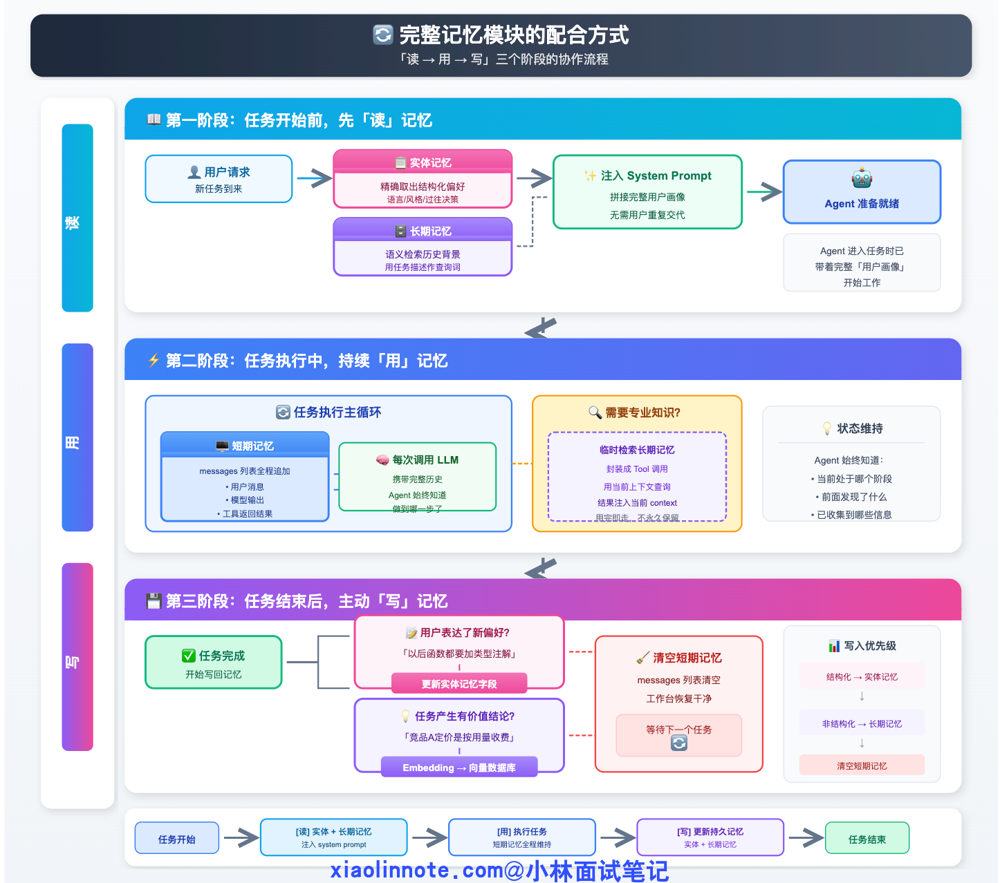


## 如何设计一个 Agent，让它能持续学习新知识而不是每次都重新训练?

**核心思路：把知识和模型解耦，知识存在外部，模型按需调用。**

**三层知识更新机制：**

① 知识库热更新（推荐）

新知识直接写入向量数据库，无需重新训练 LLM。

- 公司政策更新 → 文档写入知识库 → RAG 检索时自动包含新内容。
- 新产品上线 → 产品手册入库 → Agent 立即能回答相关问题。

时效性：分钟级生效。

② Prompt 动态注入

系统 Prompt 中动态注入最新信息：

`System Prompt = 固定角色定义 + 今日公告（每日更新） + 用户历史偏好`

时效性：每日更新或实时更新。

③ 工具定义热更新

新 API/新能力 → 注册到 Function 注册中心 → Agent 立即能调用新工具。

工具描述用自然语言，LLM 能理解工具用途，无需改变模型。

**持续学习框架设计：**

- 用户交互 → 发现知识盲区（LLM 无法回答） → 记录为"待学习"
- → 知识工程师审核 → 入知识库（向量存储）
- → 反馈给用户"已学习此问题，下次可回答"
- → 定期分析盲区模式 → 优化知识库结构

**避免"灾难性遗忘"的设计：**

- 不在 LLM 权重层学习新知识，而是存在外部知识库。
- 用 RAG 而非微调来注入新知识（微调会导致遗忘旧知识）。
- 仅在必要时做 LoRA 微调（如特定领域术语），且用较小学习率防止覆盖主知识。

**总结口述：**"Agent 的持续学习本质是'知识管理'而不是'模型训练'。最佳实践是 RAG + 知识库热更新 + 工具注册中心，三者组合让 Agent 具备'小时级'的知识更新能力，同时不丢失已有能力。这才是工程化的持续学习。"


## 上下文爆炸?上下文腐烂?上下文污染?

Bootstrap+减枝+压缩


**Bootstrap：给 Agent 一个"起点"**



Bootstrap 解决的问题：Agent 默认每次对话从零开始，什么都不知道。

Bootstrap 是在 Agent 开始运行之前，把"它需要知道的东西"主动注入 system prompt 的过程。注入什么？**两类：身份与规则（我是谁、我怎么工作、有哪些约束，固定不变）；状态与记忆（我已经知道了什么，随时间增长，但加载时截取精华）。**

Bootstrap 三个原则：只注入"导航骨架"，不注入"全部内容"——索引 > 全文；结构化标签分块（`<soul>` / `<user_profile>` / `<memory_index>`），模型定位更准确；硬上限保护——每一块都有字数/行数上限，防止膨胀。

**剪枝（Pruning）：控制 Tool Result 膨胀**

剪枝的黄金规则：对话消息尽量不动（有语义连贯性要求）；Tool Result 可以大刀阔斧（它只是"原材料"，模型用完就不需要了）；如果 Tool Result 里有关键 ID 或数字，剪枝前先提取出来单独保存。

**压缩（Compaction）：把历史变成摘要**

压缩解决的问题：随着对话进行，早期消息越来越不相关，但依然占用空间。Context Rot 表明上下文变长本身就导致性能下降，应该在 **30-40%** 时主动触发。

压缩必然丢失信息。所以有一个关键策略：**压缩前先持久化（lossless 策略）**——在触发压缩之前，先把**重要信息写到磁盘文件里**。这样即使压缩丢掉了细节，磁盘上还有完整记录。

### 实际操作

**Pre-Model Hook：首次恢复 session + 每次剪枝压缩**


**剪枝：按轮数清空旧 Tool Result**

**压缩：分块摘要（chunk_by_tokens + 轻量模型）**

**Session 持久化：kickoff 后由 main() 统一完成**

## Token爆炸?上下文压缩方法？如何筛选信息？

**口述高分答案：**

上下文压缩是工程落地的关键问题。

- **最佳实践1：Bootstrap 四件套缺一不可**
    - **落地心法**：`Soul（身份）+ User（用户画像）+ Agent（行为规范）+ Memory Index（记忆索引）`，四个文件对应四个 XML 标签注入。缺 soul，Agent 不知道自己是谁；缺 user，助手是无的放矢；缺 agent，Agent 不知道该怎么干活、有哪些规则；缺 memory index，Agent 不知道有什么记忆可以用。
    - `agent.md` 是这四个文件里最特殊的一个——它是 Agent 的自我进化日志。用户说"以后发消息前先确认"，这条行为约束不是事实记忆，应该由 Agent 增量追加到 `agent.md`，下次 Bootstrap 时自动注入，Agent 永久记住这条规则。这是 `soul.md`（我是谁）和 `agent.md`（我怎么干活）的本质区别。
    - MEMORY.md 设 200 行硬上限——这是 Claude Code 工程团队经过生产验证的数字，超过 200 行的索引反而让模型难以定位关键信息。
- **最佳实践2：激进的触发阈值（30-50%）**
    - **落地心法**：把 `COMPRESS_THRESHOLD` 设为 0.45，不要等到 80%。Context Rot 数据表明上下文变长本身就导致性能下降（15-47%），主动保持上下文干净比被动救火更有效。任务类型影响阈值：问答/助手类（30-50%）上下文独立性强，可以激进压缩；长任务/调试类（70-85%）状态依赖强，压缩要保守。
- **最佳实践3：Raw log 保证 lossless（原始历史 append-only 写入）**
    - **落地心法**：`append_session_raw()` 必须每次 kickoff 后都执行，不能只保存压缩快照。压缩会丢信息，这是设计，不是 bug。`_raw.jsonl` 是 append-only 的原始完整历史，即使 ctx 快照被压缩丢掉了细节，raw 里有每次 LLM 调用的完整上下文，后续可用于审计、调试或 22 课的长记忆集成。这就是 lossless 策略的工程实现：**不是压缩前写磁盘，而是持续双写——压缩快照（ctx）供恢复，原始历史（raw）保证 lossless**。
- **最佳实践4：摘要用小模型，对话用大模型**
    - **落地心法**：`_summarize()` 里用 `qwen3-turbo`，主 Agent 用 `qwen3-max`。摘要是"低创造性、高准确性"任务，适合小模型；对话是"高创造性、高理解力"任务，适合大模型。反过来用会导致：摘要过于随意丢关键信息 + 对话成本 10 倍膨胀。Claude Code 的 lossless-claw 把摘要模型单独配置，用 Haiku 做摘要，Sonnet 做对话，成本降低 60-70%。
- **最佳实践5：Bootstrap 文件定期治理**
    - **落地心法**：soul.md、user.md、memory.md 随时间自然增长，不治理就会膨胀。可以每周让 Agent 自己对 memory.md 做一次复盘：把可以合并的条目合并，把体量较大的主题移到子文件、只在 memory.md 留索引行（渐进式披露）。200 行硬上限是触发治理的信号，不是被动守住的红线。Bootstrap 文件是系统的"知识底座"，项目迭代到哪里，它就应该跟着迭代到哪里。
- **最佳实践6：后台静默压缩**
    - **落地心法**：压缩是计算密集操作，不要让用户同步等待。利用对话间隙（如 kickoff 刚结束、用户还没发下一条消息的窗口期），把压缩任务异步放到后台线程执行，用户感知的是瞬时响应，压缩在后台悄悄完成。一旦压缩触发条件不满足（上下文还不够大），这个后台任务直接跳过，零额外成本。同步压缩会把每次响应延迟拉长到几秒，用户体验极差。
- **最佳实践7：结构化压缩 Prompt**
    - **落地心法**：压缩 Prompt 里必须明确"保留什么、丢弃什么"，通用的"帮我总结这段对话"效果很差。好的压缩 Prompt 至少包含三个保留项：① 用户目标（这段对话要完成什么）② 关键事实（文件路径、操作结果、重要结论）③ 未完成事项。并明确禁止保留：中间过程、失败尝试、重复内容。`_SUMMARY_PROMPT` 之所以写得这么细，就是因为一个烂的压缩 Prompt，生成的摘要等于丢掉了 90% 的有用信息——压缩后的上下文反而比原始的更差。根据业务场景定制压缩 Prompt，是上下文管理里被低估的高回报动作。

**上下文压缩策略：**

1. **重要性评分**：用轻量级模型对每轮对话打分，保留高分内容
2. **实体保留**：始终保留关键实体（人名、日期、关键决策）
3. **时间衰减**：越近的对话权重越高，历史对话逐步降权
4. **意图聚类**：将相似意图的对话合并，只保留核心摘要

**垃圾信息识别：**

- 重复信息：与已有内容相似度 > 0.8 → 丢弃
- 无效闲聊：不含关键实体的对话 → 可丢弃
- 错误纠正：被后续对话否定的信息 → 标记删除

**保证正确率的方法：**
- 保守压缩：只压缩置信度 > 0.9 的部分
- 双缓存：保留原始上下文快照，支持回溯

## 多轮对话中，如果不同轮次的记忆发生冲突，如何处理？

**口述高分答案：**

记忆冲突处理策略：

**1. 时间戳优先级**：最新信息覆盖旧信息（适用于用户主动更正）

**2. 置信度评估：**
- 明确声明 > 模糊暗示
- 具体数值 > 模糊描述
- 重复确认 > 单次提及

**3. 来源可靠性：**
- 外部知识库 > Agent 推断 > 用户闲聊
- 认证来源 > 普通来源

**4. 冲突标记：**
- 将冲突信息都保留，标记时间戳
- 输出时说明"根据某时间点的信息..."

**5. 主动澄清**：当冲突无法解决时，询问用户确认

---

---

## 你们上下文是怎么管理的？上下文是共享的吗？具体会共享哪些信息？

**口述高分答案：**

上下文管理方案：

**管理策略：**
1. **会话级别隔离**：每个用户会话独立的上下文
2. **Agent 级别独立**：每个 Agent 维护自己的上下文
3. **全局共享层**：共享基础配置、公共知识

**共享信息：**
- 系统提示词（通用指令）
- 公共知识库引用
- 当前任务背景
- 已确认的事实（避免重复确认）

**隔离信息：**
- Agent 私有推理过程
- 各 Agent 的中间状态
- 敏感用户信息

**实现方式：** Redis 存储会话上下文 + 消息队列同步共享信息

---


---

# 三、RAG 系统

## RAG流程? 召回率低、幻觉多，怎么优化？

口述答案:

- 什么是RAG
    - 第一，RAG解決的是什么问题？LLM 知识冻结、无法覆盖私有数据和最新信息，这是 RAG存在的理由。
    - 第二，RAG 和微调的本质区别是什么？微调是把知识写进模型参数，RAG是把知识放在外部实时检索，不动模型本身。

- 「完整工作流程」。

    - **离线阶段**：文档加载 切割（Chunking） 向量化（Embedding）＞入库，这一步只做一次。

    - **在线阶段**：

        - **第一步（预处理 改写、HyDE、多角度扩写）：** 将用户模糊、口语化的原始意图，转化为专业、语义明确的检索词。这是提升检索天花板的前提。
        - **第二步（Embedding）：** 将问题转为向量。**工程要点：** 必须与离线知识库的 Embedding 模型版本、参数完全一致（坐标系对齐），否则检索失效。
        - **第三步（召回）：** **多路召回（Hybrid Retrieval）**。利用向量检索处理语义，利用 BM25 处理精确匹配（如产品型号、专有名词），通过 **RRF（倒排排名融合）** 取长补短，扩大覆盖面。
        - **第四步（Rerank）：** **精排**。通过 `Cross-Encoder` 模型对召回的 Top-K 进行二次打分，过滤掉向量搜索中混入的无关噪音。这是决定 RAG 准确率的关键，也是性能平衡点（粗排求速度，精排求精度）。

        - **第五步（Prompt 拼装）：** **约束输入**。不仅是拼接知识片段，更重要的是通过 System Prompt 强制“仅基于资料回答”和“无答案则拒答”，有效抑制 LLM 的幻觉。
        - **第六步（生成与溯源）：** **过程可控**。不仅给出结论，更要通过“标注引用来源”建立答案与知识库的映射关系，实现可审计、可追溯的回答。

- **RAG优化：**"离线侧:**小块检索、大块使用**,RAG 优化要从**检索和生成**两端同时入手。检索端核心是'找对找全'，用**混合检索(多路召回)+查询改写+GraphRAG+Rerank** 提升召回；生成端核心是'用好证据'，用**上下文压缩+引用标注+置信度过滤降低幻觉**。实际项目中 80% 的 RAG 问题是检索做的不够好，优先优化检索。"

    - 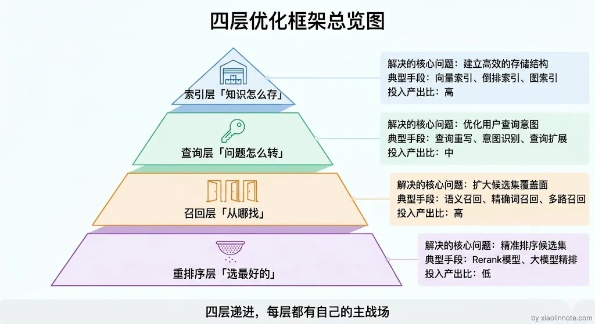

- RAG定义:  RAG ,即检索增强生成。解决的核心问题是，LLM 的知识在训练完之后就固定了，遇到私有数据或者最新的信息它就答不上来。RAG 的做法是在生成答案之前，先去外部知识库里检索相关内容，然后把检索结果和用户的问题一起交给LLM，让它基于这些上下文来回答。本质上就是给LLM 开了一个开卷考试的口子，不用再靠死记硬背了。

- 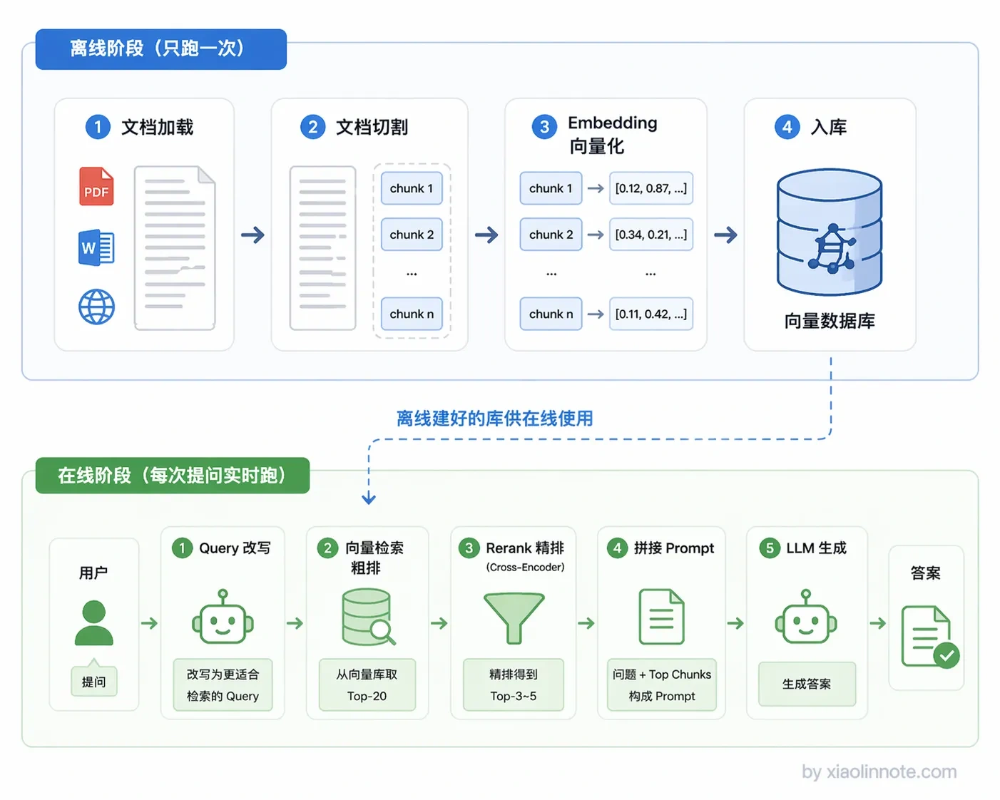

- **RAG的整体流程**(环节一、二、三:离线阶段 )

    - **环节一：文档处理（Document Processing）** —— 文档清洗、结构识别、实体抽取、元数据添加
    - **环节二：分块策略（Chunking）**
        - 固定大小分块：简单但可能切断语义
        - 语义分块：按段落、句子边界切分
        - 层次分块：同时生成小块和摘要
        - 经验值：中文 512-1024 字符，英文 512-1024 tokens
    - **环节三：向量化（Embedding）** :用于检测语义的相似度
        - 选择合适 Embedding 模型（中文推荐 BGE、M3E、Text2Vec）、领域适配微调、混合检索（稠密向量 + 稀疏向量）

    - **环节四：检索策略（Retrieval）**
        - 混合检索：向量检索 + BM25 关键词检索，取并集	
        - 重排序（Rerank）：初筛后用交叉编码器重排序
        - 查询扩展：用户 Query 改写/扩展（同义扩展、多 query）、HyDE（先生成假设答案再检索）
    - **环节五：上下文组装（Context Assembly）** —— 上下文压缩、引用标注、结果去重

    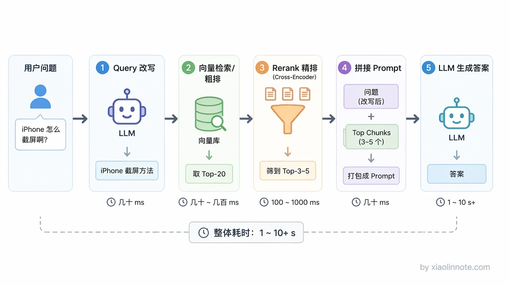

- **RAG 效果差的两大原因：** 检索层没找到正确信息（召回率低）、生成层乱编（幻觉多）。

    - **检索层优化（六管齐下）：**

        - **① 文档预处理优化**

            - 不做固定长度切分，按语义段落切，每个 chunk 保持完整语义。

            - 添加 metadata（标题、来源、作者、时间）丰富检索维度。

            - 文档结构化提取：表格转成 JSON、代码块单独索引、图片alt文本描述化。

        - **② 查询改写（Query Rewriting）**

            - 用户说法口语化、含糊不清，直接检索效果差。
            - 用 LLM 将用户 Query 改写为检索友好的表达，同时生成多个同义 Query 并行检索（Query Expansion）。效果：召回率提升 20-30%。
            - **Query 改写错误的处理：**
                - **回退策略**：检测到改写异常时，使用原始 query 召回
                - **一致性校验**：改写后 query 与原始 query 做语义相似度检测
                - **多版本保留**：同时保留改写和原始 query 的召回结果
            - **解决"召回正确但生成胡说"的问题：**
                - **严格引用溯源(Prompt约束)**：强制模型引用召回内容，限制自由发挥
                - **置信度阈值**：召回内容相关性 < 0.7 时，明确告知"知识库无相关信息"
                - **事实核查层**：生成后用小模型核查关键事实点,
                - **拒答机制**：超出知识库范围的 query 主动拒答而非编造
        
        - **③ 混合检索**
            
            - 单一向量检索有局限（语义相近但关键词不同则检索不到）。
            
            - 方案：向量检索（语义）+ BM25关键词检索 + TF-IDF，同时执行后合并结果。
            
            - 再用 Rerank 模型（如 BGE-Reranker）做重排序，将最相关结果排在前面。
            
            - **Rerank 模型的作用：**向量检索追求召回速度，用近似最近邻（ANN），会有精度损失
            
                - Rerank 用 **Cross-Encoder 精排**：
                    - 重新计算 query-doc 的精确相似度
                    - 考虑词项匹配、语义匹配的多维度
                    - 放在召回后，提升排序准确.
            
        - **④ 元数据过滤**
            
            - 检索时加入时间、品牌、类别等过滤条件（如"最近三个月关于XXX的文档"），大幅缩小检索范围，提高精度。
            
        - **⑤ 知识图谱增强（GraphRAG）**
        
            - 传统 RAG 按文本块检索，GraphRAG 构建知识图谱，检索时不仅返回文本块还返回关联实体和关系路径。
        
            - 效果：复杂推理问题（如"某公司的竞争对手分析"）效果显著优于纯向量检索。
        
        - **⑥ 上下文压缩（针对生成层）**
        
            - 检索回来的 chunks 往往很多，全塞进 context 会稀释关键信息且超过窗口限制。
        
            - 方案：用 LLM 摘要每个 chunk 的关键点，过滤重复，只保留和问题最相关的内容。
    
    - **生成层优化（三招）：**
        - **引用标注**（Citation）：生成答案时标注每个结论的来源（"根据[文档A]的记载..."），用户可溯源，降低幻觉感知。
        - **置信度过滤**：检索结果的相关度分数低于阈值时，不强制生成，改为"抱歉未找到相关信息，建议您..."。避免低质量检索结果导致 LLM 乱编。


## RAG 评估标准？

**口述高分答案：**

RAG 召回质量评估的实战经验：

**定量指标：**


1. **Recall@K**：Top-K 召回结果中包含正确答案的比例
2. **MRR（Mean Reciprocal Rank）**：正确答案平均排名的倒数
3. **NDCG**：考虑排序质量的召回指标

生成层可以使用Ragas框架:**Faithfulness（忠实度）**、**Answer Relevancy（答案相关性）**、**Context Recall（上下文召回率）**、**Context Precision（上下文精确率）**

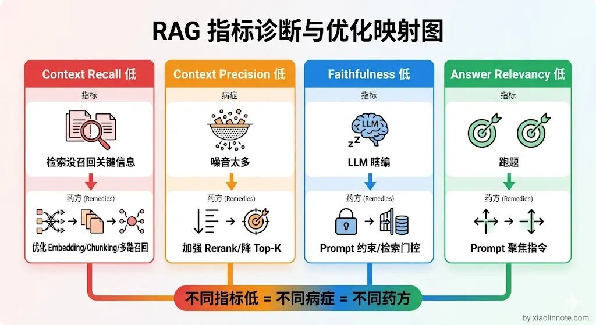

| **指标**              | **属于哪层** | **衡量什么**               | **低了说明什么问题**                 |
| --------------------- | ------------ | -------------------------- | ------------------------------------ |
| **Hit@K**             | 检索层       | 正确 chunk 是否被召回      | Embedding 模型或 Chunking 策略有缺陷 |
| **MRR**               | 检索层       | 正确 chunk 的排名是否靠前  | Rerank 效果差，正确内容淹没在噪音中  |
| **Context Recall**    | 生成层输入   | 检索内容覆盖了多少正确信息 | 多路召回不足，知识库覆盖面不够       |
| **Context Precision** | 生成层输入   | 检索内容里噪音多不多       | Rerank 过滤能力弱，无关内容引入过多  |
| **Faithfulness**      | 生成层       | 答案是否存在幻觉           | Prompt 约束不足或参考资料质量差      |
| **Answer Relevancy**  | 生成层       | 答案是否聚焦于问题本身     | Prompt 引导性弱，模型跑题            |
| **踩率 / 转人工率**   | 线上         | 用户真实满意度             | 整体系统效果与用户预期的偏差         |

**A/B 测试设计：**

1. **分组策略**：流量 50/50 划分，用户维度哈希分流
2. **核心指标**：
    - 任务完成率（是否找到答案）
    - 用户满意度评分
    - 平均对话轮次
3. **辅助指标**：
    - 首 token 延迟
    - Token 消耗成本
4. **测试周期**：至少 2 周，覆盖完整用户周期
5. **统计显著性**：p-value < 0.05，置信度 > 95%

**"够用"的标准：**

- 简单问答场景：Recall@3 > 90%
- 复杂推理场景：Recall@10 > 85% + MRR > 0.7
- 严格事实场景：必须 Recall@1 命中

**人工评估阈值：**

- 标注 100 条样本，召回数满足率 > 85%
- 召回内容相关性平均分 > 4/5

## 如果向量召回和关键词召回结果冲突，怎么决策？

**口述高分答案：**

混合检索设计：

**冲突决策策略：**
1. **加权融合**：Score = α × vector_score + (1-α) × BM25_score
2. **RRF（Reciprocal Rank Fusion）**：1/rank1 + 1/rank2 融合
3. **场景自适应**：精确查询偏 BM25，语义查询偏向量

**并行召回 vs 分阶段：**
采用**并行召回 + 结果融合**：
- 优势：同时利用两种召回的优点
- 劣势：计算资源翻倍
- 适用场景：精确查询 + 语义相似查询

分阶段适用于：先粗筛（向量），再精排（关键词）

## Chunk 到向量化?

**口述高分答案：**

为什么要分Chunk?

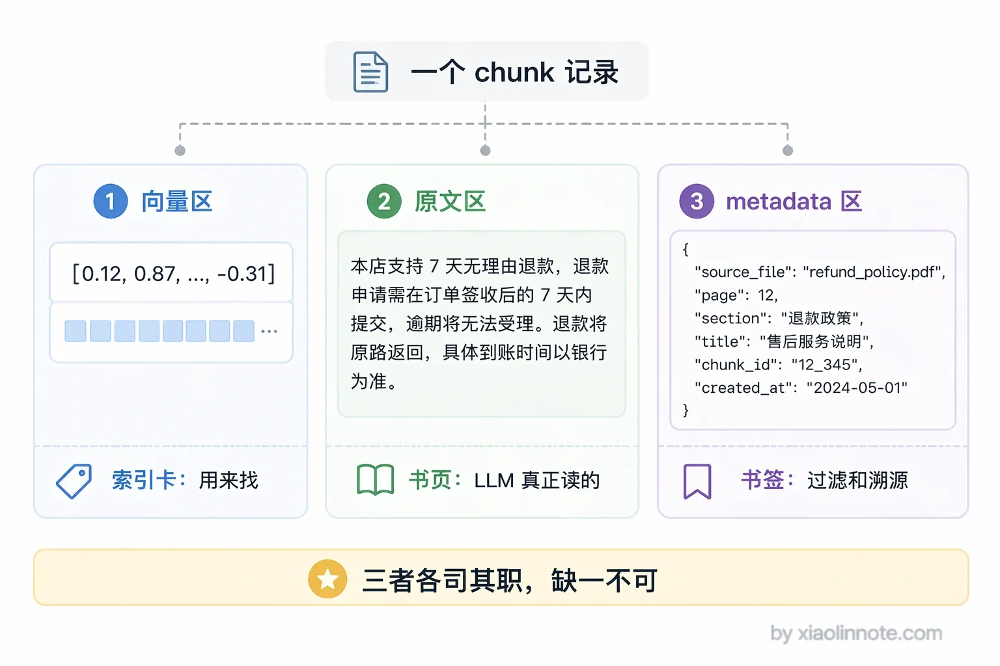

- 文档不能直接存进向量库，必须先切成小块也就是 chunk，每个 chunk 分别向量化之后存成一条记录。
    - 每条记录我理解有三个核心部分：
        - `向量`用于相似度检索，`原始文本`是检索命中之后塞给LLM 读的内容，
        - `metadata `是来源文件、页码这些附加信息，用于过滤和溯源。
- 痛点:
    - **向量维度限制**：模型有 max_tokens 限制，长文档无法整体向量化
    - **语义精度**：短文本语义更精确，长文本会稀释核心信息
    - **召回粒度**：小块召回更精准，大块会引入无关信息

怎么切割? 切割的策略有哪些?

切割粒度没有固定答案，通常500到1000个 token 是一个合理的起点，但更重要的是根据文档类型来选策略，普通文本用固定大小加重叠，有标题结构的文档按语义边界切，代码按函数切，**如果既要检索精度又要上下文完整的话，我会用父子切割，也就是小块检索、大块返回。**

| **策略**            | **核心特点/操作逻辑**                                        | **适用文档类型**   | **优点**                   | **缺点**                                                     |
| ------------------- | ------------------------------------------------------------ | ------------------ | -------------------------- | ------------------------------------------------------------ |
| **固定大小 + 重叠** | 按字符或 Token 数（如 500）硬切；通过设置重叠（如 100）防止跨边界截断 | 纯文本、无明显结构 | 实现简单、大小可控         | 可能在语义中间截断<br />**如何解决?**<br />重叠Overlap、换成语义边界切割、句子窗口检索(锁定句的前后几句)、ContextRetrival(加原文本语义)<br />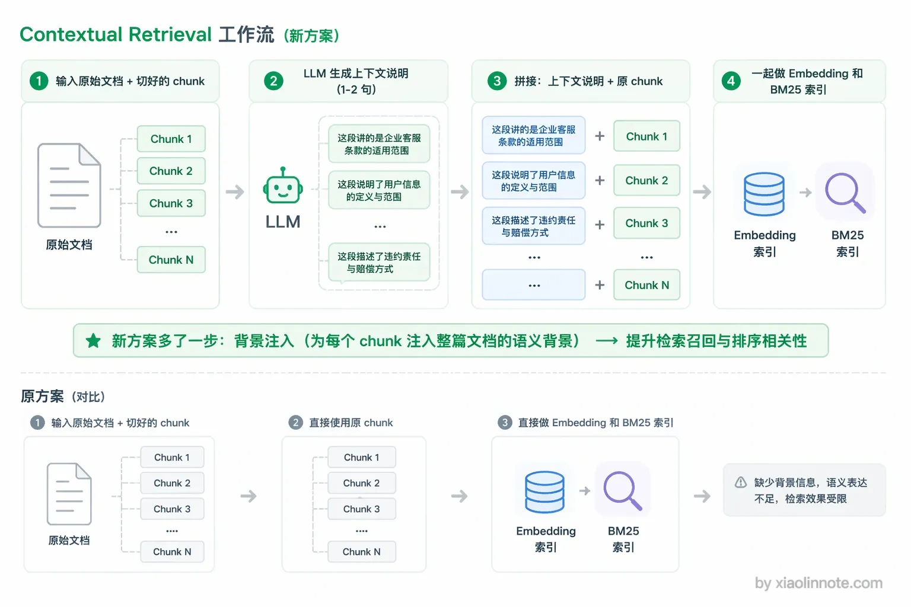 |
| **语义边界切割**    | 维护优先级列表：按段落 -> 句子 -> 标点符号的顺序寻找天然断点进行切割 | 段落分明的文章     | 语义独立，召回质量高       | 实现稍复杂，chunk 大小不均                                   |
| **标题层级切割**    | 识别 Markdown/HTML 的 `#`、`##` 等标签，按章节层级切分，自带结构化 Metadata | Markdown、HTML     | 结构清晰，方便过滤溯源     | 强依赖文档格式结构                                           |
| **代码按函数切割**  | 使用语法解析工具（如 Python AST）识别函数或类边界，以完整逻辑单元为 chunk | 代码文件           | 保留代码逻辑完整性         | 需要 AST 解析，限定编程语言                                  |
| **父子切割**        | 存储两份：小 Chunk（检索用，如 200 token）关联大 Chunk（返回用，如 1000 token） | 高质量要求的场景   | 检索精度 + 上下文完整兼顾  | 存储量翻倍，构建复杂                                         |
| **Late Chunking**   | 先对整篇长文本 Embedding，再在 Token 向量层级进行 Mean Pooling 聚合 | 需要全文理解的文档 | chunk 向量天然融入全文语境 | 对模型长上下文能力要求高                                     |

**不切的问题：**
- 召回结果包含大量无关上下文
- 召回准确率下降
- 计算资源浪费

**重叠区域设计：**

- 目的：避免边界信息丢失（同一语义被切分）
- 比例：通常 10%-20% 重叠
- 策略：按句子切分 + 50-100 tokens 重叠

Embedding的选择策略?

- 第一是中文支持，中文场景我会优先选 BGE 系列，效果其实比 OpenAI 的模型还要好；
- 第二是向量维度，维度越高精度越好，但存储成本也越大；
- 第三是最大输入长度，这个决定了能处理多长的 chunk。

##  RAG 的局限性？如何解决幻觉？

**口述高分答案：**

**RAG 的局限性：**
1. 召回本身有损失，无法 100% 准确
2. 模型会过度泛化，即使有上下文也可能"自行发挥"
3. 知识库本身可能过时或不完整
4. 生成阶段仍有概率产生幻觉

**电商场景幻觉治理方案：**
1. Prompt严格约束
2. **严格的事实核查**：
   - 价格、库存、活动规则 → 必须实时查询数据库
   - 强事实性内容：模型只负责组织语言，不负责生成数据
3. **置信度分级响应**：
   - 高置信度：直接回答
   - 低置信度："根据当前活动规则..." + 建议核实
4. **黑名单机制**：
   - 不参与活动的商家/商品明确排除
5. **人工审核**：高风险内容（涉及金额）必须人工确认

## HyDE ? 超长上下文 vs RAG?

**口述高分答案：**

**HyDE 原理：**
先用 LLM 根据模糊 query 生成一个"假设性答案"，然后用这个答案去召回
优势：答案中包含更多关键词，提升召回匹配度
适用：query 模糊、意图不明确的场景

**超长上下文 vs RAG：**
超长上下文（如 200K）≠ RAG 会被替代，原因：

1. **成本**：长上下文推理成本是 RAG 的 5-10 倍
2. **时效性**：知识库更新 vs 模型重新训练
3. **精确召回**：RAG 可以精确到 chunk 级别，长上下文会"大海捞针"
4. **工程成熟度**：RAG 生态更成熟，延迟更低

**结论：** 超长上下文更适合"需要全局理解"的场景，RAG 仍是主流方案

## 如何设计一个 RAG 与 Agent 结合的系统？

**为什么需要 RAG + Agent？**

纯 RAG 是"检索 → 生成"的单向流程，适合固定知识库问答。Agent + RAG 是"检索 → 推理 → 行动 → 再检索..."的多轮循环，能处理复杂任务。

**三种结合模式：**

① RAG 作为工具（Agent 调 RAG）

Agent 在推理过程中，根据任务需要主动调用 RAG 检索知识。

场景：复杂推理任务，需要实时知识才能回答。

流程：LLM 推理 → 判断需要外部知识 → 调用 RAG 工具 → 获取检索结果 → 继续推理。

② Agent 增强 RAG（RAG 调用 Agent 优化）

RAG 流程中的检索/排序环节，由 Agent 动态优化。

场景：查询改写（用户说"那个产品"→ Agent 推断指代哪个产品）、动态调整检索策略。

③ 混合架构（RAG + Agent 并行）

RAG 负责知识问答，Agent 负责任务执行，两者共享记忆和上下文。

场景：企业助手，既要回答政策问题，又要帮员工完成请假/报销等操作。

**RAG 核心工程细节：**
- 文档分块：不用固定长度，按语义段落分块，保持每个 chunk 语义完整。块大小 500 字左右，重叠 50 字防止边界切断。
- 混合检索：向量检索（语义相似）+ BM25关键词检索，结合 Rerank 模型重排。
- 上下文压缩：检索回来的 chunks 可能很长，需要 LLM 摘要压缩后再注入，降低 token 消耗。

**总结口述：**"我的实践经验是：简单问答用纯 RAG，复杂多步任务用 RAG 作为 Agent 的工具。RAG 是 Agent 的'知识外挂'，让 Agent 不用靠记忆而靠检索来获取准确信息，这是解决幻觉最有效的方式。"

## 向量数据库怎么选型？Milvus 和 Pinecone 的区别是什么？

**总结口述：**"我的选型逻辑：亿级向量以下、业务快速迭代，用 Pinecone 省心；亿级以上或者有定制化需求，用 Milvus 自建；做大数据研究原型，用 FAISS。向量库选型本质是'规模+成本+运维能力'的权衡，没有绝对最优解。"

| 维度 | Milvus | Pinecone | 选型建议 |
|------|--------|----------|---------|
| 部署方式 | 开源自部署 or 云端Attu | 全托管 SaaS | 有运维能力用Milvus，想省事用Pinecone |
| 规模 | 支持100B+向量 | 支持10B+向量 | 超大规模选Milvus |
| 性能 | **HNSW/IVF**多种索引，GPU加速 | 自带索引优化，开箱即用 | 性能调优需求强用Milvus |
| 成本 | 服务器成本 | 按量付费，成本高 | 成本敏感选Milvus |
| 运维 | 需自行运维 | 零运维，托管 | 团队小缺运维选Pinecone |
| 适用场景 | 企业级生产环境<br />**性能:** 150 万条 1024 维向量，HNSW 索引，P50 延迟 20ms，P99 延迟 60ms，100 QPS 并发稳定 | 快速验证、中小型项目 | —— |

**其他向量库补充：**

- Weaviate：内置 BM25 全文检索，混合搜索能力强。
- Qdrant：Rust 实现，性能高，支持过滤，适合实时性要求高的场景。
- FAISS：Meta 开源，适合离线研究和快速原型，毫秒级检索，不适合在线生产。
- Chroma:做最小poc验证

向量索引算法?为什么快的原因

| **算法** | **原理逻辑**     | **特点/操作逻辑**                                            | **优点**                                                   | **缺点**                                                     |
| -------- | ---------------- | ------------------------------------------------------------ | ---------------------------------------------------------- | ------------------------------------------------------------ |
| **HNSW** | **多层图索引**   | 构建多层导航图，从上层稀疏图到下层密集图，层层收窄搜索范围   | **召回率极高**，查询速度极快，是目前主流性能标杆           | **内存消耗大**，因为需要存储图的连接关系，不适合极度受限的场景 |
| **IVF**  | **聚类倒排索引** | 先对向量空间聚类（Cluster），将相似向量归入不同“桶”，搜索时只扫描最相关的桶 | **内存占用小**，通过聚类大幅减少搜索空间，适合超大规模数据 | **精度稍逊**，依赖聚类效果（nlist/nprobe），极端场景下容易遗漏 |

## RAG 知识库如何实现动态与持续更新？

回到开头对话的问题，知识库更新绝对不能尝试「只更新变了的那个 chunk」，因为文档内容一变，chunk 的切割边界就完全不同了，没法做局部更新。
正确的做法是给每个文档算内容 hash 来检测变更，检测到变化后先把旧文档对应的所有chunk 删掉，再重新切割入库，也就是「先删后增」。变更感知方面，低频场景用定时轮询就够了，高频场景用 Kafka 或 Webhook 做事件驱动，实现秒级入库。生产环境推荐「事件驱动+hash 检测＋先删后增」的组合方案，同时要做好 chunk ID 与文档ID 的关联设计，这样删除和更新才有据可查。

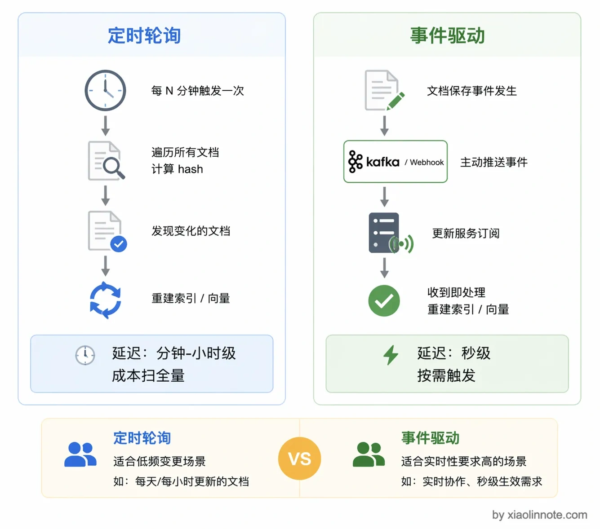

# 四、多 Agent 协作

## 🌟为什么会选择Multi-Agent? 优势在哪?怎么判断?

### **单Agent的问题:**


- **上下文长度爆炸**：ReAct 的核心逻辑是不断将工具执行的结果追加到上下文中。如果它进行了三次搜索、读取了五六个网页，上下文很容易突破五六万 Tokens。当上下文过长时，大模型的推理速度和指令遵循能力会断崖式下降**。**

● **上下文内容污染**：这是很多人容易忽略的痛点。大模型基于 Transformer 架构，本质是预测下一个 Token，因此它极易受前文干扰。举个实战例子：如果你在一个上下文里先让模型开启 `Thinking`（思考过程）写了一份报告，接着直接在同一个上下文里让它“客观评价这份报告”，它往往会顺着自己之前的 `Thinking` 疯狂自夸，失去客观性。而如果新开一个干净的上下文，它的评价就会客观得多。

● **多指令挑战**：单 Agent 就像一个全能打工人，如果你同时塞给它搜索、写代码、文件操作、知识检索等几十个工具，光是工具的 Schema 描述就会占满上下文。在执行过程中，它极容易因为注意力分散而选错工具或捏造错误参数，导致整个 ReAct 循环直接卡死。


### **Multi-Agent架构是什么? 优势?-- 数字化职能部门：Agent, Task, Process**

- **技术驱动因素**：
    - 第一是 context window 的硬上限，单个 Agent处理复杂任务时信息量一旦超出窗口，就开始「遗忘」，这是结构性的限制，不是努力优化能绕过去的；
    - 第二是专业度问题，让一个 Agent 身兼数职，每件事都做得不够专注，分工之后每个 Agent 的 context 是干净的，只装自己那块的信息，专业能力也更强。
    - 第三是并行执行这个好处，多个 Worker 同时跑，整体效率有实质提升。


- **Agent（角色）**：相当于团队中的具体员工，如**产品经理**、**研发**、**测试**。我们需要为每个 Agent 清晰地定义其目标、职责边界以及它所掌握的专属工具。
- **Task（任务）**：团队要完成的具体工作，分为外部输入的整体任务，以及 Agent 协作过程中产生的**子任务：代码研发** 或 **子任务：项目测试**。每个任务都必须有明确的描述和预期输出。
- **Process（流程/框架）**：类似于项目管理办公室（PMO），决定了这群人如何协同工作。是采用线性的瀑布流？还是高度交互的敏捷开发？Process 规定了 Agent 处理 Task 的流转方式。

- **Multi-Agent 与 Single-Agent 优劣势对比**


- 🟢 Multi-Agent 的优势 (Pros)

    - **上下文更纯净 (Cleaner Context)**：这是最大的优势。每个 Agent 都在任务隔离的干净上下文中工作，互不干扰，彻底消灭了“污染”问题。
    - **任务单一专注 (Single Task Focus)**：任务原子化后极其容易调优，甚至使用参数量较小、成本更低的本土模型也能在单一任务上达到顶尖水平**。**
    - **利于任务拆解**：结构清晰，执行更加精准到位。
    - **容错高 (High Fault Tolerance)**：很多人误以为节点越多越容易报错。实际上，因为单个 Agent 具备自主决策能力，即使“搜索专员”暂时卡死，上游的“撰写员”也能捕获错误并尝试重试或换个策略，实现了错误的有效隔离。
    - **效果上限高**：专业化分工决定了系统极高的天花板**。**

- 🔴 Multi-Agent 的劣势 (Cons)

    - **总成本高 (High Total Cost)**：即便我们用尽了文件交互等手段来省钱，但在复杂的协作网中，模型调用的总 Token 消耗依然会急剧上升。
    - **耗时长 (Long Duration)**：串行调度与多节点反思，导致延迟成倍增加（比如从单 Agent 的几分钟暴涨到半小时）。
    - **设计难度高 (High Design Difficulty)**：架构师必须精细权衡分工与边界。如果边界设计不合理（比如让写大纲的 Agent 也拥有搜索工具），它就会陷入抢着干活的“死循环”，严重拖垮整体质量**。**

**终极结论：Multi-Agent 的本质，就是用更多的计算成本和时间成本，去换取业务效果的极高上限与系统可靠性。**


### 如何考考量选择单智能体/多智能体(CPU)


- **C：Complexity (复杂度)**:  复杂度不仅仅是直觉上的“难不难”，我们需要从三个具体的方向进行拆解和定性 ： 
    - **交互复杂性**：用户的输入是简单的“单轮对话与纯文本”（例如简单的机器翻译），还是极具挑战的“多轮交互与多模态文件”（例如阅读长文档、编写代码、持续优化并解释输出） ？
    - **依赖复杂性**：任务的完成是仅依赖“模型自身”的内部知识（例如总结文章大意），还是需要深度调用外部的“工具与数据”（例如查询数据库、生成专业图表、自动发送邮件） ？
    - **过程复杂性**：从输入到输出是“单步”直达（例如简单的情感分析判断），还是漫长的“多步”流转（例如经历网页爬取、数据清洗、多维分析等一系列动作） ？

- **U：Uncertainty (不确定性) —— 核心维度**: 如果一切都是确定的，我们根本不需要引入复杂的 Agent 甚至 AI。不确定性是决定是否启用智能体架构的最核心标准，它同样体现在三个层面 ：

    - **输入不确定性**：输入的“边界清晰”（例如标准化的数据信息抽取），还是“边界模糊”（例如完全开放式的用户助手，你永远猜不到用户下一句会问什么） ？

    - **过程不确定性**：执行路径是“固定路径”（例如 OCR 识别 -> 验真 -> 计算金额），还是充满变数的“未知路径”（例如搜索信息后发现此路不通，需要动态换策略、修改大纲） ？
    - **目标不确定性**：衡量标准是“标准明确”（例如判断一个风控指标是否合规），还是主观的“标准模糊”（例如产出一篇具有深度的行业分析报告，连用户自己都很难立刻量化其好坏） ？

- **P：Performance Constraints (性能约束) —— 一票否决权**:即使一个场景极其复杂且充满不确定性（理应使用 Multi-Agent），但现实的商业环境会施加严苛的性能约束。这个变量 P 拥有**一票否决权**，直接决定方案的最终可行性 ：
    - **响应时间约束**：业务是否要求响应时间必须 < 1秒 ？如果是，哪怕再复杂的场景，你也绝不能使用需要长时间循环思考的 Agent。
    - **成本约束**：这是一个高吞吐、低价值的场景吗 ？如果是给海量基层业务员日常使用的高频功能，高昂的 Token 消耗会导致 ROI（投资回报率）直接穿透底线。
    - **上下文大小约束**：业务是否需要极长的历史记忆或超大文件处理（> 128k） ？这会直接限制你对模型和架构的选型。

## Workflow、Agent、Multi-Agent 三者的边界

| 维度       | Workflow | Agent    | Multi-Agent       |
| ---------- | -------- | -------- | ----------------- |
| 决策方式   | 固定流程 | 动态决策 | 分布式决策+协调   |
| 路径控制   | 完全可控 | 模型决定 | Agent 协商        |
| 工具选择   | 预设     | 动态选择 | 各 Agent 自主选择 |
| 适用复杂度 | 低       | 中       | 高                |
| 实现难度   | 低       | 中       | 高                |

**升级路径：** 先跑通一个 router + 两条固定链路的 Workflow demo → 再跑单 Agent tool-calling demo → 最后跑 planner + 多 specialist agents 的 Multi-Agent demo

## Agent 之间的消息传递?记忆隔离与共享？

消息传递:  协作靠两件事：消息传递和共享状态。

- 消息传递是 Agent完成自己的工作后把结果发出去，下一个 Agent 取用；
- 共享状态是所有 Agent 共同读写一个状态对象，记录任务进展和中间结果。
    - 共享状态覆盖 : LangGraph 的 State 更新机制就是这个思路，你定义好 State 的 schema，每个节点返回的是一个「增量更新」，框架帮你合并到全局状态里，这样就不会出现互相覆盖的问题。
    - 动态切换靠 Orchestrator 来做，有两种方式：一种是静态路由，提前写好规则「任务类型就找 Agent」；另一种是让LLM 动态决策，根据当前情况实时判断该把任务交给谁。
- 我的实践是两种混用，**主流程用静态路由保证稳定(提前把规则写死)，边缘情况才交给动态路由(把「下一步找谁」的决策权交给 LLM 来做)LLM 动态判断。**

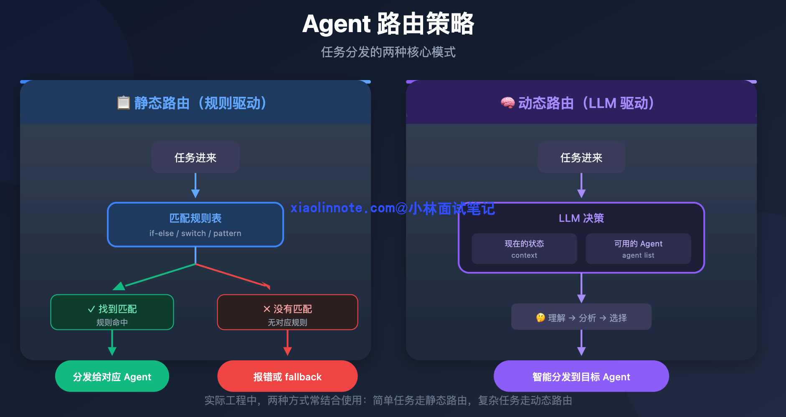

- 协作模式大致分为三类：
    - 第一类是**流水线模式**，Agent 之间按固定顺序依次执行，前一个完成后交给下一个，像工厂的装配线；
    - 第二类是**层级模式**，有一个 Orchestrator（指挥者）负责分配任务、收集结果，其他Agent 各自执行分配到的子任务；
    - 第三类是**协商模式**，多个 Agent 之间没有严格的上下级关系，通过互相沟通、辩论来达成一致。

记忆隔离与共享设计：

**隔离策略：**
1. **Agent 私有存储**：每个 Agent 有独立的向量数据库命名空间
2. **上下文隔离**：Agent 间通过消息队列传递，而非共享内存
3. **工具作用域**：定义工具的可见性范围

**共享机制：**
1. **共享知识库**：公共事实、通用知识全局可见
2. **消息总线**：通过 Kafka 传递结构化消息
3. **主 Agent 协调**：主 Agent 管理共享状态

**上下文污染防控：**
- 消息传递前做脱敏处理
- 每个 Agent 有独立的 system prompt
- 关键决策点做状态校验

##  Multi-Agent 架构时是怎么设计的？Deep Research？

**口述高分答案：**

Multi-Agent 架构设计：

**架构模式：**
1. **Hub-Spoke 模式**：主 Agent 协调，多个子 Agent 执行专项任务
2. **流水线模式**：Agent 按顺序处理，每个 Agent 完成特定阶段

**Deep Research 实现：**
- **多轮检索**：生成 → 检索 → 评估 → 再生成 → 再检索...
- **判断机制**：设置终止条件（信息饱和度阈值）
- **质量评估**：每轮检索后评估信息完整性
- **置信度收敛**：连续 2 轮新增信息 < 10% 则停止

## 多 Agent 协同和通信？ Agent 之间同步的数据是存在哪里的？

**口述高分答案：**

多 Agent 协同机制：

**通信机制：**
1. **消息队列**：Kafka/RabbitMQ 做异步通信
2. **共享状态存储**：Redis 存储共享状态
3. **服务调用**：Agent 间通过 API 调用

**状态存储：**
- **Redis**：实时状态、会话上下文
- **MySQL**：持久化任务状态、历史记录
- **向量数据库**：Agent 共享知识

**同步策略：**
- 事件驱动：状态变更发布事件，其他 Agent 订阅
- 最终一致性：允许短暂不一致，保证最终正确

**通信协议设计**

**核心要素：**

- 消息格式标准化：统一使用 JSON Schema 定义标准消息结构（sender, receiver, type, content, timestamp）
- 消息类型定义：TASK_REQUEST、TASK_RESPONSE、STATUS_UPDATE、ERROR_REPORT、TERMINATION
- 通信模式：同步通信、异步通信（通过消息队列解耦）、广播通信
- 黑板架构（Blackboard Pattern）：所有 Agent 共享一个"黑板"存储空间

**冲突解决机制**

- 分层仲裁策略：引入"监控 Agent"作为最终决策者
- 投票机制：加权投票，给专业领域的 Agent 更高权重
- 市场竞价模型：每个 Agent 用"虚拟货币"为自己的决策"竞价"
- 优先级队列：预定义任务优先级

**实践：** 在生产环境中，90% 的冲突通过预设规则解决（如优先级、超时），只有 10% 的边界情况需要复杂的冲突解决机制。

 **知识共享机制**

- 共享内存空间：所有 Agent 共享一个内存区域（如 Redis 集群）
- 知识图谱共享：将共享知识建模为知识图谱
- 联邦学习架构：各 Agent 保留私有知识，仅共享学习到的"梯度"或"参数"

**最佳实践：** 分层知识管理（公共/领域/私有）、知识注册机制、知识版本控制、知识生命周期管理。知识共享不是"越多越好"，而是"恰到好处"——采用"按需共享"原则

---

## Q4： Agent 开发的框架？框架里组件？单 Agent or 多Agent？

**口述高分答案：**

主流 Agent 框架：
1. **LangGraph**：图结构组织 Agent 流程，状态管理强大
2. **AutoGen**：微软出品，支持多 Agent 对话
3. **CrewAI**：角色扮演风格的多 Agent 框架
4. **Dify**：国产，低代码 Agent 开发平台
5. **Coze**：字节出品，插件生态丰富

**框架核心组件：**
- LLM Core：大模型调用
- Memory：记忆管理
- Tools：工具注册与调用
- Planning：任务规划
- Orchestration：流程编排

**单 Agent vs 多 Agent：**
- 简单任务：单 Agent 足够
- 复杂任务：多 Agent 协作，职责分离
- **单 Agent 的局限性：** 能力边界问题、上下文窗口限制、单点故障、并行能力有限
- **Multi-Agent 的核心优势：** 专业化分工、突破上下文限制、并行处理、更强的问题解决能力

## Q5：Think-Execute?

**口述高分答案：**

**Think-Execute 设计：**

**核心结构：**

- 角色与目标定义
- 可用工具说明（工具名、参数、功能描述）
- Think 段规范：分析现状、是否需工具、选哪个工具、参数是什么
- Execute 段规范：只输出可解析的 tool call 或代码块
- 结束条件：何时输出最终答案给用户

**工程细节：** 用 XML/JSON 约束结构便于解析；Few-shot 示例覆盖「直接答 / 调工具 / 多步」；强调不要编造工具结果；对危险操作加二次确认或白名单

**Prompt 设计要点：**
1. **Think Prompt**：
   - 引导模型分析任务、拆解步骤
   - 要求输出推理过程而非直接执行
   - 包含"检查点"要求模型自我验证
2. **Execute Prompt**：
   - 明确的工具调用指令
   - 输出格式规范
   - 异常处理指引

**实现方式：**
- 基础框架（LangGraph）提供循环机制
- 自定义节点类型实现 Think 和 Execute
- 状态机控制流程转换

## Q6：GraphRAG 优势？任务执行远大于单次 Token 限制时，如何设计以支持断点继续生成？

**口述高分答案：**

**GraphRAG 优势：**
1. **关系建模**：将实体关系建模为图，支持多跳推理
2. **社区检索**：利用图社区发现召回相关子图
3. **全局感知**：支持"全公司有多少..."类型的全局查询

**断点续生成设计：**
1. **Checkpoint 保存**：定期保存生成状态（token 数、已生成内容）
2. **增量生成**：从 checkpoint 继续，不重复计算
3. **任务队列化**：大任务拆分为子任务队列
4. **幂等设计**：确保中断后可安全重试

## 多 Agent 协作有哪几种模式？各自适用什么场景？【高频】

**三种主流协作模式：**

**① Supervisor 模式（中心化，主管模式）**

一个主管 Agent 负责任务拆解 + 分配 + 结果汇总，其他 Agent 是执行者。

适用：任务边界清晰、有明确主流程的场景，如客服系统。

✅ 架构清晰、可控性强、易调试 

❌ 单点瓶颈、主管 Agent 压力大

**② 去中心化 Peer-to-Peer 模式（点对点协作）**

所有 Agent 地位对等，通过共享消息总线通信，主动协作。

适用：需要多视角分析、无固定主流程的创意任务。

✅ 扩展性强、无单点故障 

 ❌ 通信冗余、调试复杂、可能出现循环依赖

**③ 流水线 Pipeline 模式（串行/并行混合）**

任务被拆分为多个阶段，每个阶段由专门 Agent 处理，顺序执行或并行处理独立子任务后合并。

适用：代码生成（分析→写代码→测试→优化）、文档处理（提取→转换→校验→输出）。

**4：层级模式（Hierarchical）**
Agent 组成树状结构，上级 Agent 管理下级 Agent。优点：扩展性好、能处理超大规模任务；缺点：层级设计复杂。

**解决多 Agent 常见问题的工程方案：**
- 循环调用：设置消息年龄字段，超过阈值丢弃。
- 状态不一致：用共享状态存储（如 Redis）管理协作状态。
- 通信开销大：用消息聚合，减少不必要的 Agent 间通信。

**总结口述：**"我的选择逻辑是：客服/工单等有明确流程的用 Supervisor；创意分析/多方决策用去中心化；代码生成/数据处理等有明确阶段的任务用 Pipeline。实际项目中往往是混合架构——Pipeline 串行大阶段，每个阶段内部用 Supervisor 或去中心化。"


---

# 五、MCP/Skill/A2A

## AI工具的设计哲学?

**Native Function Calling vs ReAct**

- 核心点:大模型能不能看懂?用得对?
- **Native Function Calling（原生函数调用）**：大模型（如 GPT-4, Qwen-Max 等）在底层 API 原生支持的能力。你在请求大模型时，不仅传入 `Message List`，还会传入一个 `Tools List`（包含工具的名称、描述和参数 JSON Schema）。大模型在理解语义后，会直接在其底层输出特殊的标记，告诉框架：“我要停下来，请帮我调用某个工具，参数是 XXX”。
- **ReAct 范式**：基于 `Thought -> Action -> Action Input -> Observation` 的文本推演循环。


**Agent工具应该如何设计?**


- 从**“原子性”到“语义完整性”**
    - **传统 API**：追求高内聚低耦合，极度原子化。比如获取用户信息 `get_info_by_id(id)`，更新状态 `update_status_by_id(id, status)`。
    - **Agent Tool**：大模型讨厌繁琐的多次往返组合。工具设计需要**语义完整**。比如直接设计一个 `update_user_status_by_name(name, status)`，在工具内部去完成“查 ID -> 校验 -> 更新”的闭环，而不是让大模型分三步去调三个不同的原子工具。
- 从**“强类型结构”到“可描述的简单结构”**
    - **传统 API**：入参经常是复杂的强类型对象或深层嵌套的 JSON。
    - **Agent Tool**：入参越简单、越扁平越好，最好都是基础类型（String, Int），因为**每个参数都会消耗 Token 且增加模型理解失败的概率**。更关键的是，每个参数都必须附带详尽的**自然语言描述（Description）**，告诉模型这个字段填什么、不能填什么。
- 从**“状态码”到“建设性报错（Constructive Error）”**
    - **传统 API**：报错时返回类似 `error_code=1001` 或 `Null`。程序代码捕获到 1001 后会走特定的 catch 逻辑。
    - **Agent Tool**：如果你给大模型返回一个 `1001` 或者空的字符串，它会直接懵圈，然后开始胡言乱语（幻觉）或者陷入死循环。**面向 Agent 的报错，必须是自然语言的“指导意见”**。例如返回：`"操作失败：时间参数格式错误，你输入了 2026/01/01，请你修改为 YYYY-MM-DD 的格式后重新调用本工具。"`大模型看到这句话，立刻就能自我纠错（Self-Correction）并重试。

**上下文隔离与安全工具调用**

在企业级生产环境中，工具调用涉及到一个极其敏感的安全问题：**多租户数据隔离与身份认证**。

假设你写了一个 `FileWriterTool` 让 Agent 帮用户保存文件。你绝对不能在 Tool 的参数里暴露出 `user_id`，指望大模型在调用时乖乖地把当前用户的 `user_id` 传给你。大模型是极其容易被提示词注入（Prompt Injection）攻击的，它完全有可能被诱导去读写其他用户的数据！

**正确的企业级解法：隐式上下文挂载与 Hook 拦截。**

1. 使用 `contextvars` 管理 API 请求级上下文

在 `m2l8_context.py` 中，我们利用 Python 的原生库创建了线程/协程安全的上下文变量，确保高并发下不同用户的请求彻底隔离。

2. 通过 Hook 机制透明接管工具执行路径

在 `m2l8_tools_call.py` 中，我们在大模型调用工具之前（`@before_tool_call`），拦截它的请求，从当前上下文中静默提取真实安全的 `user_id`，动态修改文件读写路径。大模型从头到尾都不知道底层做了路径隔离，既降低了它的认知负担，又保证了绝对的安全。

**AI工具设计的SOP**


**Step 1：语义完整性重构（聚合与拆解）**



这是最考验架构师业务抽象能力的一步。传统的后端 API 往往是高度数据驱动和原子化的（CRUD），而大模型是目标驱动的。

**问题所在**：如果直接把底层的原子 API 暴露给大模型，模型需要自己规划调用顺序。例如，想要更新一个用户信息，它可能需要先调用 `get_user_by_name` 获取 ID，再调用 `check_permission` 校验权限，最后调用 `update_user_info`。这种多步往返会极大增加模型产生幻觉和报错的概率。

**SOP 动作**：我们需要在工具层进行**接口的聚合**。为大模型提供一个具备**完整业务语义**的工具，比如叫 `update_user_info_by_name`。在这个工具的内部逻辑里，用 Python 代码去依次调用那三个底层 API。让大模型做它擅长的“意图理解”，让代码做代码擅长的“确定性流转”。

**Step 2：I/O 瘦身（降噪增信）**

大模型的上下文窗口（Context Window）是非常昂贵且注意力有限的。传统 API 的输入输出通常包含了大量对大模型毫无意义的元数据。

**SOP 动作（输入瘦身）**：坚决砍掉各种复杂的嵌套、系统级的鉴权字段和冗余结构，将层级“拍平”。大模型只需要看到最核心的业务参数：

**SOP 动作（输出增信）**：返回语义化的输出,结果概要+内通

接下来，我们一口气看一下最重要的，对工具的各种语义描述：在多智能体系统中，`Function Calling` 不稳定，往往不是模型不行，而是你的“工具说明书”写得太烂。AI 是在不确定中寻找确定性，我们的目标是：**通过工程化的模板，消除逻辑转换的模糊感。**

**Step 3：错误提示（Error Message）：给 AI 一个“复盘”的机会**

当工具调用报错时，不要只返回一个原始错误代码。底层工具需要改造，返回给 AI 的错误信息建议遵循以下模板：



**Step 4：工具描述（Tool Description）：动词+名词与触发时机**

工具描述决定了 AI “用不用”这个工具。好的描述分为两个核心部分：

**1. 规范的工具名**

不要起花哨的名字。建议采用 **[动词] + [名词]** 的形式。

*注：在很多框架（如 CrewAI）中，Prompt 贴近生成动作的地方只有工具名，所以名字本身就是最重要的暗示。*

**2. 工具描述模板**

一个高品质的工具描述应包含以下四个要素：

**功能描述**：说明工具是干什么的。

**产出物说明**：调用后能获得什么（如：网址、摘要、数据列表）。

- **触发时机（逻辑转换策略）**：
    - **关键点**：去掉 AI 的逻辑转换负担。
    - **例子**：不要只说“这是数据库插入工具”，要说“当你想保存/持久化一条用户信息时使用”。直接给场景，让 AI 看到场景就自动触发。
- **适用边界（能与不能）**：防止工具混淆。
    - **例子**：处理 PDF 的工具要注明：“仅支持 PDF 格式，无法处理 Excel 或 Word。”这样能有效节省 Token，避免无效调用。

**Step 5：参数描述（Parameter Description）：给 AI 一本“说明书”**

不要只给一个参数名（如 `top_k`），让 AI 去猜。参数描述也需要模板化：

**1. 基础说明**

明确参数的含义。例如 `top_k` 是“返回结果的条数”。

**2. 边界与默认值**

告诉 AI 取值范围（如 1-100）和默认值，防止 AI 填入非法值导致工具报错。

**3. 赋值方法与业务场景（进阶）**

这是区分初级与高级开发者的关键。告诉 AI **在什么场景下该传什么值**。

**案例：搜索工具的**`top_k`**参数**

**广泛搜索场景**：如果你需要获取大量背景信息，请将 `top_k` 设为 10 以上。

**精确搜索场景**：如果你只需要回答“某某是什么”这种定义问题，请将 `top_k` 设为 5 以内，以减少垃圾信息干扰。

## 🌟Q1：如何设计路由策略(100个意图)？怎么解决检索过程中的召回偏差？

**口述高分答案：**

大规模工具路由：

**路由策略：**
1. **层次化分类**：先分类再选择，减少候选集
2. **语义聚类**：用向量将工具聚类，query 找到最近类
3. **规则 + ML 混合**：规则快速过滤 + 模型精排
4. **工具摘要**：用小模型生成工具摘要，加速匹配

**召回偏差解决：**
- 增加同义词、近义词扩展
- 多角度 embedding（功能描述、参数、场景）
- 人工标注正负样本，持续优化

## Q2：MCP / Agent Skills 区别

- **口述高分答案：** Skill其实就是在MCP之上包了一层,mcp的每一个tool都是一个api,有自己的shcema(定义这个工具是干嘛的,出入参,当agent调用十几个工具的时候上下文会爆炸),skill工具上做了层抽象,先说有哪些工具,工具是干啥的,我要用哪个工具.
    - **MCP 解决"能力层"**：Agent 通过 MCP 获得执行能力——运行代码、操作文件、调用 API。MCP 是 Agent 的"手和脚"。
    - **Skills 解决"知识层"**：Agent 通过 Skills 获得操作经验——在什么场景用什么工具、按什么步骤操作、规避哪些陷阱。Skills 是 Agent 的"肌肉记忆"。**Skill 让 Agent 彻底突破 MCP 工具 schema 的上下文限制**

**MCP vs Agent Skills：**


**MCP（Model Context Protocol）：**

- 标准化协议，工具定义统一
- 支持双向通信（不仅调用，还能推送）
- 强类型定义，可自动生成调用代码
- 适合多 Agent 协作场景

**MCP 实现原理：**

- **协议层**：基于 JSON-RPC 2.0 的通信协议

- **传输层**：支持 stdio、HTTP/SSE 等多种传输方式

- **Schema 层**：工具输入输出用 JSON Schema 定义[名称、prompt、schema]

- **发现机制**：通过 manifest 文件声明可用工具

- 如何开发

    **步骤 1：定义工具逻辑**：编写具体的业务代码，例如使用 `imap_tools` 读取邮件或 `aiosmtplib` 发送邮件

    **步骤 2：应用 Prompt 模板**：这是决定 Agent 调用成功率的关键。在装饰器描述中必须包含：

    ​      **规范名称**：采用“动词+名词”形式（如 `send_email`）。

    ​      **触发时机**：明确告诉 AI 什么时候该用这个工具。

    ​      **适用边界**：明确说明能做什么、不能做什么（例如：只支持 PDF，不支持 Word）。

    **步骤 3：参数精细化说明**：在参数定义中，不仅要写参数名，还要写明取值边界、默认值及示例。

**核心架构：**

- Server 端（资源提供方）：企业数据库、文件系统、API 服务等通过实现 MCP 协议暴露能力
- Client 端（AI 应用）：通过 MCP 协议发现和调用 Server 提供的资源

**三大核心概念：**

- Resources（资源）：文档、数据库记录、API 端点等数据文件
- Tools（工具）：标准化的函数调用（名称、描述、参数 Schema、返回值格式）
- Prompts（提示词）：预定义的提示词模板

MCP 支持双向通信——Server 不仅被动回应 Client 请求，还可以主动推送数据更新、状态变化等通知。


**通讯：stdio/sse/streamble http**

- stdio：是把远程程序下载到本机，且本机运行，AI 客户端与 MCP Server 使用 STDIO（标准输入输出通道）交互，AI 与 MCPServer距离近（npm/pypi）
- SSE：把程序单独部署，使用 SSE 协议远程调用，AI 与 MCPServer距离远（服务器）
    - <u>SSE 就是利用这种机制，使用流信息,向浏览器推送信息</u>。
    - 特点：
        - **单向通信**：SSE是单向的，数据只能从服务器流向客户端，客户端不能通过SSE向服务器发送数据。
            **事件驱动**：服务器可以发送包含不同类型事件的数据，客户端可以监听这些事件并做出相应处理。
            **基于HTTP**：SSE使用标准的HTTP协议，这使得它易于实现和调试。
            **低资源消耗**：与WebSocket相比，SSE的连接和维护消耗更少的资源[1]。
            **自动重连**：
        - SSE客户端实现通常包含自动重连机制，当连接中断时能够自动重新建立连接。
- streamble http：类似 SSE
    - 特点：
        - Streamable HTTP是HTTP协议的一种使用方式，不是专门定义的协议
        - Streamable HTTP没有固定的数据格式，完全由应用层定义
        - Streamable HTTP可以使用持久连接或一次性连接，取决于应用场景
    - 响应可以流式传输

| **特性**       | **SSE (Server-Sent Events)**              | **Streamable HTTP**                   | **WebSocket**                             |
| -------------- | ----------------------------------------- | ------------------------------------- | ----------------------------------------- |
| **数据方向**   | 单向（服务器 → 客户端）                   | 双向（取决于实现）                    | 全双工（客户端 ↔ 服务器）                 |
| **事件机制**   | 内置事件系统（onmessage、onerror 等）     | 无内置事件系统                        | 无内置事件系统（需自行定义协议/消息格式） |
| **连接保持**   | 持久连接（基于 HTTP/1.1 keep-alive）      | 可保持或断开连接                      | 持久连接（基于 TCP）                      |
| **自动重连**   | 内置自动重连机制（浏览器支持）            | 通常需要应用层实现                    | 无内置，需要应用层实现                    |
| **数据格式**   | 特定格式（text/event-stream，UTF-8 文本） | 灵活，可自定义                        | 任意格式（文本/二进制，灵活）             |
| **浏览器支持** | 所有现代浏览器（除 IE/旧 Edge）           | 所有支持 HTTP 的客户端                | 所有现代浏览器和原生支持的客户端          |
| **典型场景**   | 实时通知、日志流、股票行情、服务端推送    | 流式响应（大文件、AI 输出流、视频流） | 聊天、协作应用、游戏、实时交互            |

Skill出现的原因:

- **困境一：上下文爆炸**
    - 你想给 Agent 配备 20 种文档处理能力（PDF、Word、Excel、PPT、邮件…），就要把 20 份操作说明全部塞进 system prompt。每个说明书动辄几百行，20 个加起来直接撑爆上下文窗口。即使勉强塞进去，所有说明同时存在也会互相干扰，Agent 的注意力被稀释，执行质量严重下降。
- **困境二：经验无法沉淀与复用**
    - A 团队的工程师花了两周时间摸清了公司内部 ERP 系统的报表生成规范，把最佳实践写进了 Agent 的 prompt。但这份"私域知识"只活在这个 prompt 字符串里，换一个 Agent、换一个团队，一切都要从头来过。人类的知识可以写进 Wiki 共享，但 AI 不能直接把 Wiki 变成"会操作"的能力。
- **困境三：工具有了，但不会正确使用**
    - 

**Agent Skills**： 是一个用自然语言定义的、具有特定领域上下文的逻辑指令集。本质上，Skill 是通过延迟加载（Lazy Loading）优化 Token 消耗的"微 Agent"。


- **传统 MCP 的思路**：预先封装能力成 API → Agent 调用 → 执行
- **Skills + Bash 的思路**：把"怎么做"写成操作手册 → Agent 按手册自己写代码 → `bash` 执行

- **核心设计：元数据常驻，正文延迟加载。**
    - 元数据（metadata）：Skill 的名称、描述、适用场景。始终加载在上下文中，占用 Token 少
    - 正文（body）：Skill 的具体指令、SOP 流程、约束条件。只在 Skill 被激活时才加载

- **特点:**
    - Prompt-based，定义相对松散
    - **渐进式披露**，适合简单任务
        - 
    - 实现成本低


- **工作流程：** Agent 接收任务 → 查询可用 Skills 列表 → 根据任务匹配最相关 Skill → 加载选中 Skill 正文 → 按 Skill 指令执行 → 释放 Skill 上下文

**动态发现机制：**
1. **服务注册中心**：工具提供者自注册
2. **协议适配器**：统一不同协议的工具格式
3. **元数据索引**：工具描述、能力标签索引


## Q4：FastApi 常用的包都了解吗？OpenClaw 用过吗？A2A 协议知道吗？

**口述高分答案：**

**FastApi 常用包：**
- Pydantic：数据验证
- uvicorn：ASGI 服务器
- httpx：异步 HTTP 客户端
- websockets：WebSocket 支持
- sqlalchemy：ORM

**OpenClaw：**
- Browser 自动化框架
- 核心：DOM 状态机 + 可视化反馈
- 优势：稳定的元素定位，不依赖 XPath

**A2A 协议：**

- Agent-to-Agent 通信协议
- 定义 Agent 间的消息格式、状态同步
- 支持多 Agent 协作的标准化

**价值：** 分层解耦（MCP 处理"如何调用工具"，A2A 处理"如何组织 Agent"）、生态复用（企业的 MCP Server 可被不同的 A2A Agent 复用）、扩展性强

**核心定位：** MCP 让 AI 调用外部工具，A2A 让不同的 AI Agent 互相沟通和合作。MCP 是"AI-工具"协议，A2A 是"AI-AI"协议。

**核心功能：**

- 能力展示（Agent Card）：每个 Agent 发布 JSON 元数据文档描述自己的身份、能力、认证要求
- 任务分配机制：复杂任务可以分给擅长的 Agent
- 上下文交换：Agent 之间可以传递上下文信息
- 统一消息格式：文本、文件、结构化数据等多种内容类型
- 安全控制：认证和权限控制机制

**A2A+MCP典型场景：企业智能助理**

- 底层：MCP 连接外部服务（Email MCP Server、Calendar MCP Server、Database MCP Server、Files MCP Server）
- 中层：A2A 实现 Agent 间协作（文档 Agent、邮件 Agent、分析 Agent、协调 Agent）

**A2A vs MCP 对比：**

| 维度     | MCP                    | A2A                       |
| -------- | ---------------------- | ------------------------- |
| 解决问题 | AI 调用外部工具/数据源 | AI Agent 之间的协作通信   |
| 架构     | 模型-工具              | Agent-Agent               |
| 发布方   | Anthropic              | Google                    |
| 技术基础 | JSON-RPC 2.0           | HTTP + JSON-RPC 2.0 + SSE |

## 🌟Q5：Function Calling、Tool Calling、MCP 协议三者有什么区别？【高频】

| 维度     | Function Calling     | Skills                   | MCP                       |
| -------- | -------------------- | ------------------------ | ------------------------- |
| 层级     | 底层机制             | 上层应用                 | 基础设施协议              |
| 核心问题 | LLM 如何请求调用工具 | 如何将功能打包成能力单元 | AI 如何规模化连接真实世界 |
| 加载方式 | 全量载入             | 延迟加载（按需读取正文） | 标准化接入                |
| 复用性   | 极低                 | 高（标准化封装）         | 极高（开放标准）          |

**三者关系类比：** MCP 是 USB 协议，Function Calling 是 USB 的数据传输机制，Skills 是使用 USB 接口的具体设备。

**三个层次的关系：**

① Function Calling（怎么调）——技术实现层

大模型输出结构化 JSON 的能力，告诉系统"我要调用 XX 函数，参数是 YY"。解决的是"模型怎么表达工具调用意图"的问题。

典型流程：用户问"帮我查下北京天气"→ LLM 判断需要调工具 → 输出 `{"tool":"weather_api","params":{"city":"北京"}}` → 后端执行。

② Tool Calling（调什么）——工程实践层

对一组相关 Function 做业务化封装。比单纯调函数更上层，通常包含"工具描述+调用约束+结果处理"。

例如：邮件处理 Skill = 发送邮件函数 + 查询邮件函数 + 标记已读函数，业务层只管调用 Skill，不用关心底层实现。

③ MCP 协议（按什么规矩调）——协议标准层

Anthropic 提出的标准化通信协议，让大模型和外部工具、数据源能够统一对接。

核心价值：一次对接，多端复用。不用为每个 Agent 写一套工具对接代码，通过统一的 JSON-RPC 2.0 格式通信。

形象比喻：Function Calling 是"会说英语"，Tool Calling 是"会用筷子"，MCP 是"国际通用的餐具接口标准"。

**总结口述：**"三者不在同一层，是递进关系。Function Calling 是基础能力，Tool Calling 是工程封装，MCP 是标准化协议。我在做 Agent 开发时，会优先用 Function Calling 实现工具调用，对于多工具复杂场景会用 MCP 做标准化编排，减少重复对接工作。"

---


---

# 六、系统设计

## 🌟Q1：如何设计一个智能问答客服 Agent？【设计题】

**核心设计目标：** 高准确率（意图识别）+ 高完成率（多轮对话）+ 低成本（模型分级）+ 高可靠性（人工兜底）。

**四层分层架构：**

```
网关层（鉴权/限流）
    ↓
业务层（会话管理/工单系统）
    ↓
AI层（意图识别 → 对话管理 → RAG → Agent → 大模型生成）
    ↓
数据层（向量数据库/Redis/知识库/日志）
```

**核心模块设计：**

① 意图识别层（路由大脑）

用 BERT/轻量模型做分层分类：

L1：闲聊 / 业务咨询 / 投诉建议 / 转人工

L2：业务咨询下细分：订单查询/退换货/产品推荐/技术问题...

准确率可达 92%，置信度低于 0.85 自动转人工。

② RAG 知识问答（主力）

标准 RAG 链路：文档清洗 → 语义分块（按段落不是固定长度） → Embedding 入库 Milvus → 用户Query改写 → 混合检索（向量+关键词） → Rerank → 上下文注入 → LLM 生成 → 引用标注。

命中率可达 60%，通过缓存热门问题进一步提升。

③ Agent 对话管理（复杂任务）

多轮对话用 Dialogue State Tracking（DST）维护状态。例如：用户说"我要退这个订单"→ 识别意图（退换货）+ 提取槽位（订单号、商品） → 引导补充信息或直接操作。

④ 人工兜底机制

三种情况转人工：① 意图识别置信度低 ② 触发关键词（投诉/诈骗） ③ 连续3轮无法解决。转人工时传递完整对话历史，人工坐席无缝接手。

**效果数据口述：**"我们线上数据：意图识别准确率 92%，对话完成率 78%，用户满意度 4.6/5，人力成本节省 60%以上，日均处理 10万轮对话。"

---

## 🌟Q3：如何设计一个 Agent 编排平台，让非技术人员也能配置 Agent 流程？【设计题】

**核心需求：** 拖拽编排 + 低代码配置 + 可视化调试 + 生产发布 + 监控运营。

**五层技术架构：**

```
接入层（Nginx/网关，鉴权/限流/可观测）
──────────────────────────────
编排层（可视化画布，节点拖拽，边连线，DSL生成）
──────────────────────────────
执行层（Agent Runtime，多租户隔离，资源调度）
──────────────────────────────
工具层（Function注册中心，版本管理，权限控制）
──────────────────────────────
数据层（向量库/知识库，状态存储，审计日志）
```

**核心设计要点：**

① 可视化编排引擎

用 DAG（有向无环图）建模 Agent 流程。节点类型：LLM节点/分支节点/循环节点/工具节点/结束节点。连线表示数据流向。

配置内容：Prompt模板（支持变量占位${user_name}）、模型选择、温度参数、输出格式、异常处理策略。

生成 DSL（领域特定语言）存储流程配置，DSL 可导出为 JSON/YAML，便于版本管理。

② 工具（Function）注册中心

统一管理所有可复用的工具函数。包含：工具名称/描述/参数schema/权限级别/版本。

版本管理：新版本工具上线后旧版本可继续运行，支持灰度切换。

权限分级：只读工具（如查询类）直接可用，写操作工具（如发邮件、转账）需要审批。

③ 多租户隔离与资源调度

每个租户独立的 Agent 实例，资源配额（QPS/Token/并发数）独立限制，防止资源争抢。

用 Kubernetes 部署，HPA 自动扩缩容。

④ 可视化调试与监控

单步执行：任意节点可单独运行，看输入输出。

全链路Trace：每个会话的完整执行链路（用了哪些节点、调用了哪些工具、消耗多少Token）。

关键指标：任务成功率、平均步数、Token消耗、平均延迟。

**总结口述：**"Agent 编排平台的本质是把'能力'和'流程'解耦。工具层专注做能力，编排层专注做流程，平台的价值是让两者灵活组合。平台化最大的挑战不是技术，是让非技术人员敢用、用好，所以 Prompt 配置和调试体验至关重要。"

---


---

---

---

---

## 🌟Q4：如果让你从头设计一个企业级 Agent 应用，你的整体技术方案是什么？【高频】

**整体技术方案（自下而上六层）：**

```
【接入层】API网关（鉴权/限流/可观测）+ CDN静态加速
【业务层】会话管理/状态机/工单/通知
【Agent层】意图识别 + 对话管理 + RAG + ReAct执行引擎 + 工具编排
【模型层】LLM路由 + Prompt管理 + 输出校验 + 流式输出
【数据层】向量数据库 + Redis缓存 + 知识库 + 审计日志
【运维层】K8s部署 + CI/CD + 监控告警 + AB测试平台
```

**核心技术选型口述：**
- Agent 框架：LangGraph（复杂流程）或自研轻量引擎（简单场景）。
- 大模型：GPT-4 / Claude 3（复杂推理）+ Qwen 2 / Llama 3（成本优化场景）。
- RAG：Milvus + BGE Embedding + Rerank 模型。
- 工具协议：MCP 标准协议，一次对接多 Agent 复用。
- 监控：OpenTelemetry Trace + Prometheus + Grafana。

**落地节奏口述：**

第一阶段（1-2月）：RAG 知识问答上线，验证核心价值。

第二阶段（2-3月）：加入 Agent 工具调用，处理简单操作类任务。

第三阶段（3-4月）：多 Agent 协作，优化复杂任务处理能力。

第四阶段（持续）：效果评估 → 问题发现 → 迭代优化 → 成本优化。

**避坑指南：**
- 不要一上来就做多 Agent，先用单 Agent 验证核心场景。
- 知识库质量比模型能力更重要，Garbage in Garbage out。
- 幻觉问题要从一开始设计防护，不要等上线后再补救。
- 成本控制要提前做，否则 LLM Token 费用会超乎预期。

**总结口述：**"企业级 Agent 应用的核心不是'有多少模型能力'，而是'有多少工程化保障'。我的方案是'分层设计，逐步落地'——先 RAG 验证价值，再 Agent 扩展能力，最后多 Agent 协作提升效率。每一步都要有明确的效果评估指标和退出标准。"

---

## Q5：设计一个智能导购助手 Agent？描述其感知、规划、记忆和执行四大模块在分布式架构下的协同逻辑。

**口述高分答案：**

智能导购 Agent 架构设计：

**1. 感知模块（Perception）：**
- 多模态输入处理：文本、图像、语音
- 意图识别：分类用户意图（比价、咨询、购买）
- 实体抽取：提取商品、品牌、属性等
- 技术：NLU 模型 + 规则引擎

**2. 规划模块（Planning）：**
- 任务拆解：将复杂需求拆为子任务
- 工具选择：RAG 检索工具、执行工具
- 执行计划生成：ReAct 循环
- 技术：LLM + Tool Registry

**3. 记忆模块（Memory）：**
- 短期：当前对话上下文（Redis）
- 长期：用户偏好、商品知识（向量DB）
- 工作：任务中间状态

**4. 执行模块（Action）：**
- 工具调用：商品查询、价格计算、下单
- 结果整合：多工具结果聚合
- 响应生成：自然语言回复

**分布式协同：**
- API Gateway：统一入口
- 消息队列：模块间异步通信
- 配置中心：动态更新规则

---

---

---

---

---

## Q6：设计直播间用户在线人数实时更新系统，从实时性、准确性、高可用、高扩展方面考虑。

**口述高分答案：**

直播间人数系统设计：

**实时性方案：**
1. **WebSocket 长连接**：实时推送人数变化
2. **消息队列**：用户进出消息异步处理
3. **Redis 计数**：INCR/DECR 原子操作

**准确性方案：**
1. **去重机制**：维护在线用户 Set
2. **心跳检测**：30s 无心跳认为离线
3. **定时校准**：周期性比对 DB 和缓存

**高可用：**
- 多机房部署
- Redis Cluster 集群
- 熔断降级：人数展示降级为"热门"

**高扩展：**
- 房间维度分桶
- 服务无状态化
- 水平扩展消费者

## 🌟Q7：大模型高并发调用时，如何做限流、降级和成本控制？大规模文档解析任务中，多线程和多进程如何选择？

**口述高分答案：**

大模型高并发方案：

**限流策略：**
1. **token 限流**：限制每分钟 token 消耗
2. **并发数限流**：限制同时调用的请求数
3. **用户维度限流**：防止单用户刷量

**降级策略：**
1. **模型降级**：GPT-4 → GPT-3.5
2. **返回缓存**：相同问题直接返回历史答案
3. **拒绝服务**：高峰期直接返回"稍后再试"

**成本控制：**
- Prompt 压缩：减少 token 消耗
- 批量处理：积攒请求一起调用
- 缓存复用：相同 embedding 复用

**多线程 vs 多进程：**
- **CPU 密集型**：多进程（Python GIL 限制）
- **IO 密集型**：多线程或异步
- 文档解析：通常 IO 密集（文件读写），选多线程

---

---

---

---

---

## Q8：如果检索结果中存在冲突信息，如何设计自动选择或融合逻辑？人机回路是怎么设计的？什么情况下必须人工介入？

**口述高分答案：**

冲突信息处理：
1. **多版本保留**：同时展示不同来源
2. **置信度排序**：按来源可靠性排序
3. **时间衰减**：新数据优先
4. **投票机制**：多数来源一致的结论优先

**人机回路设计：**
1. **规则触发**：满足某条件时转人工
2. **用户主动**：用户说"转人工"
3. **满意度反馈**：用户差评触发人工

**必须人工介入的场景：**
- 涉及金钱操作（退款、投诉）
- 法律合规问题
- Agent 多次无法解决的重复问题
- 敏感信息处理
- 模型置信度低于阈值


---

---

---

---

## 🌟Q9：如何设计一个代码评审 Agent？【设计题】

**代码评审 Agent 的价值：** 自动化 Code Review，减少人工review负担，发现潜在bug、安全漏洞、性能问题。

**系统架构设计：**

① 代码获取与解析

接入 GitHub/GitLab Webhook，PR/MR 创建时自动触发评审。

用 TreeSitter/AST 解析代码结构，理解语法树而非纯文本。好处是能精确定位问题行，不像正则匹配那样误报。

② 多维度评审维度

- 代码风格：用 ESLint/Pylint 内置规则检测。
- Bug 检测：空指针、边界条件、并发问题、资源泄漏。用 LLM 结合 AST 做语义分析。
- 安全漏洞：SQL注入、XSS、敏感信息硬编码（API Key在代码里）、不安全的依赖。接 Snyk/CodeQL 工具 + LLM 综合判断。
- 性能问题：N+1查询、循环内查数据库、全量加载内存。
- 可读性：方法过长、圈复杂度高、命名不规范。

③ 评审 Agent 核心实现

用 ReAct 循环：LLM 先理解代码变更上下文 → 调用代码分析工具获取 AST 和指标 → 生成评审意见 → 格式化输出为 Review Comments。

每个评审维度对应一个 Tool（Bug工具/安全工具/性能工具），LLM 决定调用哪些工具。

④ 评审结果处理

严重问题（安全漏洞、明显bug）→ 直接 blocking 评论，PR 不能合并。

建议性问题（命名、注释）→ non-blocking 评论，可选修复。

汇总报告：每个问题标注严重等级（Blocker/Critical/Major/Minor）+ 代码位置 + 修复建议。

**避免幻觉的措施：**
- 必须基于 AST 分析而非纯文本，确保指出的代码行准确。
- 引用具体的规则编号（如 OWASP CWE-89 对应 SQL注入）。
- 高严重问题用两个不同模型交叉验证再发布。

**总结口述：**"代码评审 Agent 的核心价值不是替代人工，而是过滤掉 80% 的重复性 trivial 问题，让人 review 聚焦在架构设计和业务逻辑上。落地时最难的不是 LLM 能力，而是和 CI/CD 流程、GitOps 的集成，以及误报率控制。"

---


---

---

---

---

---

## Q10：如何设计一个可以自动处理用户工单的全流程 Agent？【设计题】

**工单处理 Agent 的流程：**

```
用户提交工单 → 分类Agent（判断类型/紧急度） → 路由Agent（分配处理链路）
    ↓
【咨询类】 → RAG问答Agent → 回复用户 → 满意度跟进
【操作类】 → 工具调用Agent（查订单/退换货/修改地址） → 执行 → 结果通知
【投诉类】 → 升级人工 + 生成摘要供人工参考
    ↓
归档Agent（生成处理报告 + 更新知识库 + 更新用户画像）
```

**核心设计要点：**

① 工单分类与优先级判断

用 LLM 分析工单内容，自动分类：咨询/投诉/退款/技术问题/建议。

紧急度识别：关键词（宕机/错误/损失）触发 P0，24h 内必须处理。

② 多 Agent 路由

根据工单类型路由到不同的处理 Agent：

- 咨询类 → RAG 问答 Agent（查知识库）。
- 操作类 → 工具调用 Agent（有数据库写操作权限）。
- 投诉类 → 转人工 + Agent 生成摘要（减少人工处理时间）。

③ 状态机管理

工单状态：待处理 → 处理中 → 等待用户确认 → 已解决 → 已归档。

每个状态转换由 Agent 决策，确保流程合规（如投诉必须人工审批后才能赔付）。

④ 操作审计与回滚

所有工具调用记录日志，支持回滚。退款/修改订单等操作需要二次确认。

定期生成工单处理质量报告，分析未解决原因，优化知识库。

**效果数据口述：**"工单 Agent 落地效果：自动处理率 65%，平均处理时间从 4 小时缩短到 15 分钟，用户满意度从 3.8 提升到 4.4 分，人工客服只处理复杂投诉和新类型问题。"

---


---

---

---

---

---

## Q11：如何设计一个多模态 Agent（比如能做图文分析的客服）？【设计题】

**多模态 Agent 的核心能力：** 同时理解文本、图像、音频、视频，做跨模态推理和生成。

**三阶段融合架构：**

① 编码层（各模态独立编码）

- 文本：Embedding 模型（如 BGE、Text-Embedding-3）
- 图像：Vision Transformer（CLIP、ViT）
- 音频：Whisper（ASR）+ AudioMAE

各模态独立编码后映射到统一的语义向量空间。

② 融合层（多模态语义对齐）

三种融合策略：

- 早期融合：编码阶段直接合并各模态特征（计算量大，适合模态关联强的场景）。
- 晚期融合：各模态独立处理后再合并（简单灵活，适用于图文无关场景）。
- 中间融合：在中间层做交叉注意力（推荐，兼顾性能和精度）。

常用方法：LLaVA 的 projection 层、BLIP-2 的 Q-Former。

③ 推理与生成层（Agent 决策）

基于融合后的多模态向量，Agent 做理解和决策：

- 图文问答：用户发图+文字提问，Agent 分析图片内容后回答。
- 故障诊断：用户发截图+错误描述，Agent 分析日志截图+文字定位根因。
- 产品推荐：用户发图片（喜欢的产品样式）+ 文字描述，Agent 理解视觉偏好+功能需求后推荐。

**图文客服 Agent 实战设计：**

用户发一张商品图片 + "这个有货吗，尺码怎么选"：

① 图像编码器提取商品视觉特征 → 向量检索商品库找相似商品。

② 文本意图识别：查询库存 + 尺码推荐。

③ 融合层综合图像特征和文本意图 → 查询库存 API + 尺码推荐 Agent。

④ 返回："这款商品有货，尺码偏大，建议选小一码，搭配参考..."

**技术选型口述：**"2026 年多模态 Agent 的主流方案是：视觉编码用 CLIP/ViT，融合层用 Q-Former 或 LMML，推理层用 GPT-4V / Claude 3.5 / Gemini。开源方案可选 LLaVA/Qwen-VL，本地部署用 ChatGLM-Multimodal。多模态 Agent 的难点不在模型能力，在于工程集成和延迟控制。"

---


---

---

---

---

---

## Q12：如何设计一个实时订单履约系统（Real-time Order Fulfillment System）？【Coupang特供】

**核心挑战：** Coupang 70% 订单在 24 小时内送达，需要从用户下单到仓库拣货到配送全链路毫秒级协调。系统必须在库存准确性和履约速度之间做权衡。

**四阶段流程设计：**

① 订单接收与验证（0-100ms）

用户下单 → 订单服务接收 → 库存预扣（Redis 分布式锁 + Lua 原子扣减）→ 支付验证 → 生成履约任务。

关键：库存预扣不是最终扣减，先占库存再异步确认，防止超卖。

② 仓库履约调度（100ms-30min）

履约引擎根据用户地址匹配最近仓库 → 调度拣货任务到 Fulfillment Center。

拣货路径优化：按货架分区并行拣货（类似装箱问题优化）。

实时状态更新：拣货中 → 打包中 → 配送中，用户可实时看到状态。

③ 配送路由优化（30min-2h）

路径优化算法（TSP 变种）：考虑配送站距离、交通实时状况、包裹重量体积。

动态调整：配送员临时下线 → 系统重新分配，不影响 SLA。

④ 最终交付确认（2h-24h）

配送完成 → 库存最终扣减（从预扣转为实扣） → 更新用户画像（偏好仓库/配送时间）。

**防超卖核心机制（必考）：**

预扣库存 + 最终库存两层模型：

- 预扣层：Redis 做实时扣减，高并发防超卖。
- 实扣层：MySQL 做最终确认，每天凌晨对账。

如果 Redis 和 MySQL 库存不一致，以 MySQL 为准，触发库存修正任务。

**Event-Driven 架构：**

```
订单服务 → Kafka Topic: order.created
订阅方: 库存服务（预扣）/ 配送服务（调度）/ 通知服务（推送）
──────────────────────────────────────
仓库服务 → Kafka Topic: fulfillment拣货完成
订阅方: 配送服务（出发）/ 通知服务（更新状态）
```

所有状态变更通过事件驱动，保证各服务松耦合。

**Coupang 特色加分点：**"Coupang 的核心优势是物理世界和数字世界的深度整合。设计时要始终想着'物理约束'——仓库容量有限、配送员时间有限、用户等待预期有限。我的方案始终围绕如何在这些约束下最大化履约效率。"


## Q13：如何设计一个实时库存管理系统，防止超卖和库存不一致？【Coupang特供】

**库存系统的三层架构：**

```
应用层: 订单服务 / 仓储服务 / 供应商补货服务
    ↓
缓存层（Redis）: 实时库存水位，原子扣减，防超卖
    ↓
数据层（MySQL）: 最终真实库存，定时同步
```

**防超卖三道防线：**

第一道：Redis Lua 原子扣减

```lua
if redis.call('get', stock_key) >= quantity
then redis.call('decrby', stock_key, quantity)
return 1 else return 0 end
```

原子操作，绝不超卖。扣减失败直接返回"库存不足"。

第二道：乐观锁最终确认

Redis 扣减成功后，异步写 MySQL：

`UPDATE inventory SET stock = stock - N WHERE id = ? AND stock >= N`

WHERE 条件加了库存校验，MySQL 层面再做一次防超卖兜底。

第三道：每日对账修正

Redis 库存每天凌晨和 MySQL 对账。差异超过阈值（如 ±5 件）触发人工审核。差异原因：宕机丢数据、网络分区、程序 bug。

**多仓库库存同步问题：**

场景：用户在 A 城市，商品在 A 仓和 B 仓都有库存，应该优先从哪个仓库发货？

方案：用一致性哈希根据用户地址分配仓库 + Redis Pub/Sub 实时同步各仓库存水位。

新增仓库节点时，用虚拟节点减少数据迁移震荡。

**库存水位告警：**

库存低于阈值（如 10 件）→ 触发供应商补货提醒 → 自动生成采购单。

库存为 0 → 立即下架商品页，避免用户下单后再告知无货（极差体验）。

**总结口述：**"库存系统的核心是'分层防超卖 + 最终一致性'。Redis 做实时扣减防并发，MySQL 做最终兜底，每日对账修正漂移。三层配合才能在高性能和高准确性之间找到平衡。"

---


---

---

---

---

---

## Q14：如何设计一个商品搜索和推荐系统？【Coupang特供】

**搜索系统三层架构：**

```
用户端: 搜索框 → 输入补全（autocomplete） → 结果页
    ↓
检索层: Elasticsearch / OpenSearch（倒排索引 + 分词）
    ↓
排序层: 特征工程 → 机器学习排序模型 → 多维度综合排序
    ↓
个性化层: 用户画像 / 实时行为 / 历史偏好 → 个性化加权
```

**Query 处理流程：**

① Query 改写

拼写纠错（"iphon" → "iPhone"）、同义词扩展（"手机" → "手机/移动电话/智能机"）、Query 归一化（大写转小写、去除特殊字符）。

② 类目预测

分类模型预测 Query 的目标类目（如"手机充电器"→ 电子配件），用于过滤和加权。

③ 召回（Recall）

多路召回：

- 倒排索引召回（关键词匹配）
- 向量召回（语义相似，如"轻薄笔记本"能找到"超极本"）
- 协同过滤召回（买过的人也买了）
- 热门商品兜底（无匹配时）

④ 排序（Ranking）

LTR（Learning to Rank）模型，综合：

- 相关性分（Query-Item 匹配度）
- 质量分（转化率、好评率）
- 个性化分（用户偏好匹配）
- 商业分（广告出价）

最终排序 = α×相关性 + β×质量 + γ×个性化 + δ×商业

**推荐系统 vs 搜索系统的区别口述：**"搜索是'人找货'，用户有明确意图；推荐是'货找人'，用户没有明确意图但有偏好。搜索重相关性，推荐重个性化。底层技术相通但优化目标不同——搜索优化相关性+转化率，推荐优化点击率+停留时长+复购率。"

**冷启动问题口述：**新用户没有行为数据，用人口统计学特征（年龄/性别/地区）初始化画像 + 热门商品兜底。新商品没有销售数据，用内容特征（类目/属性/描述）做向量召回。

**总结口述：**"电商搜索的核心是多路召回 + LTR 排序。多路召回保证'找对'，LTR 排序保证'排好'。向量检索解决语义匹配问题，协同过滤解决个性化问题。系统设计的关键是'快'和'准'——ES 保证毫秒级响应，ML 模型保证排序质量。"

---


---

---

---

---

---

## Q16：万能系统设计答题模板 —— 任何 "Design a..." 都能用的四步框架【极高频】

**框架核心：结构 > 技术。面试官打分看的是协作能力，不是背书能力。**

---

**Step 1: Clarify Requirements & Scale（需求澄清）—— 5分钟**

不要上来就画图！先问清楚面试官要什么。

① 确认功能范围（Functional Requirements）

"这个系统有哪些核心功能？用户是谁？主要场景是什么？"

"我可以默认支持 XX 功能吗？还是需要先讨论范围？"

② 确认非功能需求（Non-Functional Requirements）

- Scale（规模）："日活/日订单量/QPS大概是多少？"
- Availability（可用性）："SLA 要求是 99.9% 还是 99.99%？"
- Latency（延迟）："P99 延迟要求是多少毫秒？"
- Consistency（一致性）："可以接受最终一致性吗？还是需要强一致性？"
- Cost（成本）："有硬件预算限制吗？"

③ 做估算（Back-of-Envelope）

估算公式：

`QPS = DAU × 人均请求数 / 86400`

`峰值QPS ≈ 平均QPS × 3~5`

`存储 = 日新增数据 × 单条大小 × 保留天数`

估算结果要大声说出来："按 1000万 DAU 计算，峰值 QPS 大约是..."

---

**Step 2: High-Level Architecture（高层架构）—— 10分钟**

画架构图，边画边讲，不要画完再说。

① 系统分层

一般分 4-5 层：

```
客户端层（APP/Web）
    ↓
网关/CDN 层（负载均衡/鉴权/静态资源）
    ↓
应用服务层（业务逻辑，可水平扩展）
    ↓
数据存储层（MySQL/Redis/ES/向量库）
    ↓
消息队列层（异步解耦/Kafka/RocketMQ）
```

② 核心数据流

用虚线标出关键路径（用户请求从哪里进、经过哪些服务、最终落到哪个数据库）。

③ API 设计

给出核心接口设计（REST 即可），说明请求参数和响应格式。

---

**Step 3: Deep Dive & Trade-offs（深入设计 & 取舍分析）—— 20分钟**

面试官会在这里追问 3-5 个问题，深入挖细节。

① 选一个核心组件深入设计

主动说："我觉得这个系统最关键的组件是 XX，我重点讲一下..."

展示深度，而不是每个组件都浅尝辄止。

② 讲清楚 Trade-offs（这是加分的关键！）

每做一个选择，都要说明取舍：

- "我选 Redis 做缓存而不是 Memcached，因为 Redis 支持更多数据结构，方便以后扩展"
- "我选最终一致性而不是强一致性，因为订单量太大，强一致性会带来严重的性能问题"
- "我选 Kafka 而不是 RabbitMQ，因为日均亿级消息，Kafka 吞吐量更高"

口述技巧：先说选择，再说权衡，最后说结论。不要只说"我选XX"，要说"我选XX而不是YY，因为ZZ，除非AA场景我会换成YY"。

③ 讨论 Failure Handling

每个系统都要讲清楚：

- "如果 Redis 挂了怎么办？" → 降级到本地缓存 + 监控告警
- "如果 MySQL 挂了怎么办？" → 主从切换 + 读写分离降级
- "如果消息队列挂了怎么办？" → 本地缓冲 + 定时重发

核心原则：fail-safe defaults（默认安全），任何组件挂了都不能让用户看到错误。

---

**Step 4: Summary & Next Steps（总结 & 演进）—— 5分钟**

① 承认设计不完美

"这个设计在当前规模下可以工作，但当 QPS 超过 XX 时会有瓶颈..."

展示谦逊和成长型思维。

② 提出优化方向

"如果时间允许，我可以进一步优化：① 引入 CDN 做多级缓存 ② 加读写分离 ③ 分库分表..."

③ 讨论监控和可观测性

"我会接入全链路监控，核心指标是：QPS / P99延迟 / 错误率 / CPU/内存水位"

④ 面试官追问应对（套路）

- "你为什么不用 XX 技术？" → "XX 也是一个选择，我选 YY 是因为（权衡），但 XX 在（场景）下更好"
- "如果系统规模扩大 100 倍呢？" → "首先估算增量，然后讨论：分库分表/水平扩展/缓存策略升级"
- "如果让你从头再做一次，你会改什么？" → 承认 1-2 个弱点，给出改进方案。

**万年通用 Trade-offs 清单（面试前背熟）：**

| 维度 | 选择A | 选择B | 取舍点 |
|------|-------|-------|--------|
| 一致性 | 强一致性 | 最终一致性 | 强一致性延迟高，最终一致性可能读到旧数据 |
| 可用性 | 多副本 | 单节点 | 多副本成本高，单节点有单点故障 |
| 延迟 | 同步调用 | 异步消息 | 同步延迟低但耦合强，异步解耦但延迟不确定 |
| 成本 | 自建 | 云服务 | 自建灵活但运维成本高，云服务省心但有厂商锁定 |
| 扩展性 | 单体 | 微服务 | 单体简单但扩展差，微服务灵活但复杂度高 |

---


---


---

---

---

---

---

## 七、沙箱与安全

### 7.1 五大安全威胁

1. **代码注入：** 用户输入包含恶意指令，试图让 Agent 执行未经授权的操作。危害：数据泄露、系统破坏
2. **依赖投毒：** 恶意第三方库伪装成合法库，等待 Agent 引入。危害：供应链攻击、持久化控制
3. **资源滥用：** 生成的代码包含无限循环或内存泄漏，耗尽服务器资源。危害：DoS 攻击
4. **权限逃逸：** 恶意代码试图突破容器边界，威胁主机系统。危害：容器逃逸、宿主机被控
5. **数据泄露：** 恶意代码读取敏感配置文件、环境变量等。危害：密码泄露、密钥泄露、用户隐私泄露

### 7.2 沙箱隔离层级

| 层级 | 技术 | 隔离程度 |
|------|------|---------|
| 进程隔离 | chroot、namespaces、cgroups | 基础 |
| 容器隔离 | Docker | 中等 |
| 微虚拟机 | Firecracker、Kata Containers | 高 |
| 用户态内核 | gVisor | 很高 |
| 硬件隔离 | Intel SGX、AMD SEV | 最高 |

### 7.3 容器 vs 微虚拟机

**核心区别：共享内核 vs 独立内核**

容器（Docker）共享宿主机 Linux 内核，内核漏洞会影响所有容器。微虚拟机每个实例都有自己独立的微型内核（Firecracker 内核仅约 5MB），启动时间 <125ms，攻击面大大缩小。

### 7.4 OpenSandbox（阿里巴巴开源）

支持多种安全容器运行时（gVisor、Kata Containers、Firecracker），提供统一的多语言 SDK。

**核心功能：** 多运行时支持、资源限制（CPU/内存/磁盘/执行超时）、网络隔离（完全关闭/限制出站/白名单模式）、文件系统隔离（只读文件系统/沙箱目录/权限控制）、多语言 SDK（Python、Java、JavaScript、C#）

### 7.5 有状态沙箱会话管理

**三种方案：**
- 会话亲和性（Session Affinity）：同一用户请求始终路由到同一沙箱实例
- 外部状态存储：每次执行前加载状态，执行后保存状态
- 会话超时机制：设置超时时间（如 30 分钟），超时后自动销毁

**生产环境最佳实践：** 混合策略（池化+亲和性）、沙箱池化（预启动一批沙箱实例）、状态压缩、降级策略

---

## 八、AI 框架

### 8.1 LangChain 八大核心组件

1. Models（模型）：LLM、ChatModel、Embeddings、Tool-Calling Models
2. Prompt Templates（提示模板）：ChatPromptTemplate、PromptTemplate
3. Chains（链）：LLMChain、SequentialChain、RetrievalQAChain、RouterChain
4. Agents（代理）：ReAct Agent、Tool-calling Agent、Custom Agent
5. Tools（工具）：扩展 LLM 能力的外部函数
6. Memory（记忆）：ConversationBufferMemory、ConversationWindowMemory、ConversationSummaryMemory、VectorStore-backed Memory
7. Retrievers（检索器）：从外部知识库检索相关文档
8. Document Loaders & Splitters：文档处理工具

### 8.2 LangChain4j（Java 生态）

专为 Java 开发者设计的大语言模型集成框架，提供统一的 API 接口支持 15+ 主流 LLM 提供商。

**核心优势：**

- Spring Boot 集成：@AiService 注解自动生成 AI 服务
- 统一 API 设计：屏蔽不同模型提供商的差异
- 完整组件支持：聊天记忆、RAG、输出解析器、工具调用、Chain

**Java 方案的性能优势：** 文档处理吞吐量提升 56%、内存占用降低 38%、冷启动时间降低 47%

### 8.3 AgentScope（阿里巴巴开源）

多智能体协同框架，GitHub Stars: 18,261。

**核心特点：** 高易用性（丰富的 API 和应用样例）、高鲁棒性（全面的重试机制和容错控制）、分层结构（实用程序层/资源和服务层/分布式部署层）

**独特优势：** 透明度第一（显式消息传递）、生产就绪（独立运行时+沙箱）、SOTA 性能（SWE-Bench 63.4% 解决率）

### 8.4 AutoGen（微软）

多智能体对话框架，核心是"群聊模式"。

**三大核心组件：**
- Agent（智能体）：UserProxyAgent、AssistantAgent、自定义代理
- GroupChat（群聊）：多 Agent 群聊环境
- GroupChatManager（群聊管理器）：控制发言顺序、管理对话终止条件

还有 AutoGen Studio 可视化工具，无需编写代码就能创建 Multi-Agent 应用。

### 8.5 Chain vs Agent 在 LangChain 中的区别

- **Chain（链）：** 执行预定义的固定流程。适合流程标准化、变化少的任务。调试简单，执行过程可预测。
- **Agent：** 具备自主决策能力，根据任务目标和环境反馈动态决定下一步。适合需要灵活应对的任务。

**选择决策：** 执行步骤是否固定？→ 固定 → Chain；需要根据结果调整策略？→ 不需要 → Chain；是否需要动态选择工具？→ 不需要 → Chain。如果以上答案都是"否"→ Agent

### 8.6 主流框架对比

| 框架 | 厂商 | 语言 | 核心特点 | 适用场景 |
|------|------|------|---------|---------|
| LangGraph | LangChain | Python | 图结构，灵活性高 | 复杂工作流 |
| AutoGen | Microsoft | Python | 群聊协作，易用性好 | 对话协作 |
| CrewAI | CrewAI | Python | 角色分工，轻量级（核心代码仅 2000+ 行） | 快速原型 |
| AgentScope | 阿里 | Python | 透明度高，沙箱支持 | 企业级生产 |

**选型建议：** 快速验证用 CrewAI 或 AutoGen Studio；复杂工作流用 LangGraph；企业级生产/代码任务用 AgentScope；对话协作类应用用 AutoGen

### 8.7 生产环境框架选型六个维度

1. 团队技术栈：Python → LangChain/AutoGen；Java → LangChain4j 必选
2. 项目规模：小型 → CrewAI；中型 → AutoGen；大型 → AgentScope；超大型 → LangGraph
3. 性能要求：延迟敏感选编译型（Java 系）
4. 可维护性：社区活跃度、文档完善度、团队熟悉度
5. 扩展性：自定义组件、插件机制、集成现有系统
6. 成本考量：开源/商业授权、依赖服务成本、人力成本

---

## 十一、智能客服 FAQ 知识库 Agent

### 11.1 智能客服四维质量保障

**① 召回质量：** 检索结果 Top-N 与用户问题高度相关，从源头控制幻觉。混合检索 + Rerank 链路解决。

**② Prompt 约束：** System prompt 明确「只基于检索结果回答」「不知道就说不知道」「格式要求（引用来源）」「禁止编造」。

**③ 置信度机制：** 检索得分低于阈值时直接转人工；生成前判断是否有效上下文；拒绝回答时记录日志。

**④ 评测与反馈闭环：** 持续收集「踩」反馈、定期抽样人工评估（相关性、准确性、有害性）、监控 P99 延迟。

**核心一句：** "质量不是靠 LLM 自己保证的，是从**检索 → Prompt → 置信度 → 反馈**全链路一起控制的。"

### 11.2 快速集成大模型客服方案

**技术栈：** RAG 框架（LangChain/LlamaIndex）+ LLM API + Embedding（sentence-transformers）+ 向量库（ChromaDB/FAISS）+ LLM（GPT-4/Claude/通义 API）

**快速集成体现：**
- 无需训练：RAG 不需要微调，上传文档即可生效，知识更新小时级
- 工具链成熟：Embedding + 向量库 + LLM 三行代码串联
- 接入成本低：HTTP API 暴露 QA 接口，前端/APP/飞书机器人当天可对接

### 11.3 Agent 开发最重要的五件事

1. **工具边界设计：** 工具定义是否清晰、Schema 是否稳定，直接决定 Agent 能否稳定调用
2. **循环终止条件：** 最大步数、重复检测、置信度/预算/超时熔断
3. **上下文质量：** "垃圾进垃圾出"，检索质量 > 模型能力上限
4. **评测体系：** 可衡量的质量指标（命中率、幻觉率、响应时长、badcase 闭环）
5. **可观测：** Tracing、工具调用日志、每步输入输出

**核心一句：** "Agent 的上限是大模型，但**下限是工程**：工具、边界、可观测、评测，这几样没做好，模型再强也会翻车。"

### 11.4 客服行业看法

- **行业趋势：** 客服正在从成本中心变成数据资产中心——好的客服在收集用户真实需求、发现产品问题，这些数据反过来驱动产品迭代
- **AI 赋能点：** 80% 的 FAQ 类问题 AI 可以秒级回答；剩下 20% 复杂问题转人工时，AI 可以帮人工快速总结上下文、推荐答案
- **挑战与机会：** 最大的挑战是知识库维护成本和答案质量把控（幻觉、时效性）；机会在于多模态（语音/视频）、主动服务（预测用户问题）和全链路数据分析
